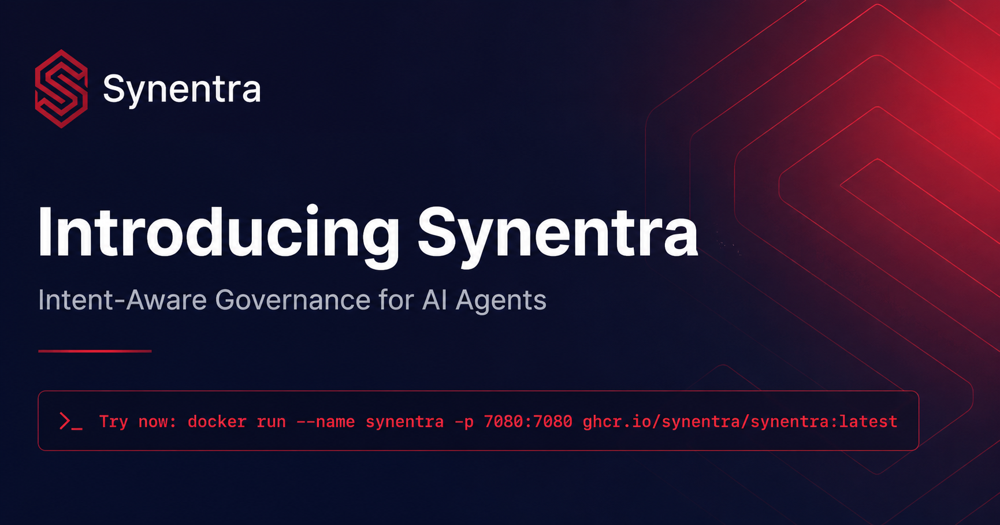
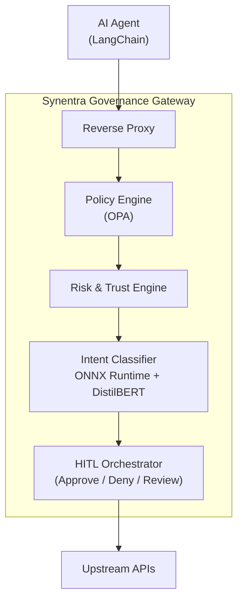

In 2026, autonomous AI agents are reshaping the enterprise. They answer customer questions, update CRM records, query internal knowledge bases, and even trigger financial transactions—all without a human directly driving every click. This shift promises incredible efficiency, but it also introduces a governance nightmare: how do you secure, audit, and trust software that can reason, plan, and act on its own? Traditional API gateways, built for deterministic, human-initiated traffic, are simply not up to the task. That’s why we built **Synentra**, an open-source, intent-aware governance layer purpose-built for the age of AI agents.

<!--truncate-->

---

## The AI Agent Explosion (and Why It’s Scary)

Enterprises are deploying autonomous agents at an accelerating pace. Gartner predicts that by 2028, 33% of enterprise software applications will include agentic AI, up from less than 1% in 2024. These agents use large language models (LLMs) to interpret natural language goals, break them into steps, and call internal or external APIs to get things done. Frameworks like LangChain, CrewAI, and the Model Context Protocol (MCP) make it trivially easy to connect an LLM to your databases, payment systems, and HR platforms.

But here’s the catch: **you cannot fully control what an autonomous agent will do**. Even with extensive prompt engineering, guardrails, and output parsers, a few uncomfortable truths remain:

- **Prompt injection** can completely subvert an agent’s intended behavior. According to the [OWASP Top 10 for LLM Applications](https://owasp.org/www-project-top-10-for-large-language-model-applications/), prompt injection is the number one security risk.
- **Model drift**—when the underlying model is updated or fine-tuned—can alter an agent’s decision-making in subtle, dangerous ways.
- **Emergent autonomy** means agents chain together multiple API calls. A seemingly harmless request can turn into a cascade of high-risk operations.
- **Volume and speed** are an order of magnitude higher than human traffic; a single agent might generate thousands of API requests per minute, overwhelming traditional rate-limiters and anomaly detectors.

The result is a massive governance gap. Most organizations today rely on API gateways that authenticate, rate-limit, and route based on static rules. These tools have no awareness of *what the request actually means*. They can’t distinguish a “check order status” call from a “refund $5,000” call if both hit the same endpoint. For AI agent security, that’s a recipe for disaster.

---

## What is Synentra?

Synentra is an **open-source (Apache 2.0) intent-aware governance gateway** built from the ground up for autonomous AI agents. It sits transparently between your agents and your APIs, intercepting every request and making real-time security decisions based on four dimensions:

1. **Who** the agent is (identity, authentication)
2. **What** the agent is trying to do (semantic intent)
3. **How** trustworthy the agent is (dynamic trust and risk scoring)
4. **What** your organizational policies allow (OPA-based policy enforcement)

Think of Synentra as a security guard who not only checks your ID badge but also understands your stated purpose, evaluates the context, and escalates anything suspicious to a human supervisor. This combination of intent-based governance and human-in-the-loop (HITL) control is what makes secure autonomous agents possible at enterprise scale.

---

## The Problem: Traditional Gateways Are Blind to Intent

To understand why Synentra is necessary, let’s walk through a realistic scenario. Your company operates a customer support AI agent named “SupportBot” that helps users with order inquiries. It exposes a REST endpoint `/api/orders` that can retrieve order statuses, update shipping addresses, or initiate refunds—different actions driven by the JSON payload.

### What a Traditional API Gateway Sees

With a standard gateway (Kong, NGINX, AWS API Gateway), you can enforce:

- ✅ Authentication via JWT or API key
- ✅ Rate limiting (e.g., 100 requests per minute per agent)
- ✅ Basic authorization (agent role vs. admin role)
- ✅ Request size limits and logging

But here’s what it completely misses:

- ❌ That a request payload `{"action":"shipping_address"}` is actually a read of personally identifiable information (PII), while the agent is only supposed to do order status checks.
- ❌ That a request payload `{"action":"refund","amount":500}` is a high-risk financial operation that should require explicit human approval.
- ❌ That SupportBot has been exhibiting unusual behavior for the last hour—making ten times its normal number of shipping address requests, possibly due to a prompt injection attack.
- ❌ That even though the agent is authenticated, its current intent violates a semantic policy that says “customer support agents must never modify customer financial data.”

Traditional gateways treat all `/api/orders` POST requests equally. For AI agent security, that’s like trusting every visitor who swipes a valid badge, regardless of whether they’re carrying a package or a weapon.

### How Synentra Reads the Request

Synentra, on the other hand, semantically classifies every request at runtime:

```yaml
Agent Request:
  Identity: support-agent-03
  Endpoint: /api/orders
  Payload: { "customer_id": "12345", "action": "shipping_address" }
  Intent: SHIPPING_ADDRESS_QUERY  # Classified by a local ONNX model
  Risk Score: 72/100               # Elevated because this agent rarely accesses PII
  Trust Score: 85/100              # Agent is generally trustworthy
  Decision: APPROVED with full audit logging
```

For a high-risk refund:

```yaml
Agent Request:
  Identity: support-agent-03
  Endpoint: /api/orders
  Payload: { "customer_id": "12345", "action": "refund", "amount": 500 }
  Intent: REFUND_REQUEST
  Risk Score: 95/100               # Financial operation, high amount
  Trust Score: 85/100
  Decision: HITL_ESCALATION        # Pause agent, send to human for approval
```

The key is that Synentra **understands intent**—the *purpose* behind the API call—and couples it with dynamic risk and trust signals. This enables governance policies that are expressive, adaptable, and impossible to implement with static ACLs.

---

## Core Capabilities: Inside the Synentra Engine

Synentra’s feature set is designed to address the unique challenges of autonomous agents without introducing prohibitive latency or operational complexity.

### 1. Privacy-Preserving Intent Classification

At the heart of Synentra is a lightweight **DistilBERT** model fine-tuned for classifying the intent of API requests. It runs locally inside the gateway using **ONNX Runtime**, which means:

- **No external AI API calls**—all inference happens on your infrastructure, keeping payload data private.
- **Low, predictable latency**—typically 2–5 milliseconds per classification, even under high throughput.
- **Explainable results**—each classification comes with a confidence score and the tokens that contributed most, aiding auditing and debugging.

### 2. Semantic Policy Enforcement with OPA

Synentra gives you two flexible options for defining and evaluating governance policies:

- **Built‑in Policy Service** – a fast, zero‑dependency engine driven by JSON‑based rules. Ideal for teams that want to get started quickly without managing an external OPA deployment.
- **External OPA Integration** – connect Synentra to an existing Open Policy Agent server. Write policies in [Rego](https://www.openpolicyagent.org/docs/latest/policy-language/) to leverage the full power of OPA’s policy language and ecosystem.

Both engines accept the same decision context (agent identity, intent, risk/trust scores) and return `allow`, `deny`, or `hitl` decisions within milliseconds. Because OPA is a proven, CNCF-graduated project, you inherit its extensive ecosystem, including policy testing frameworks and management tools.

### 3. Human-in-the-Loop (HITL) Orchestration

Not every decision can be automated safely. Synentra includes a first-class HITL system that pauses an agent mid-execution when a request is deemed too risky, then alerts a human operator for review.

The flow works like this:

1. The policy engine returns a `HITL` decision.
2. Synentra places the agent’s request into a persistent queue and returns a `202 Accepted` to the agent, effectively suspending its workflow.
3. A webhook fires to your notification system (Slack, PagerDuty, custom dashboard) with a link to the approval interface.
4. The human operator sees the full context: agent identity, the exact request payload, the classified intent, risk/trust scores, and a natural language explanation of why it was escalated.
5. The operator can approve, deny, or modify the request. Synentra then either forwards it to the upstream API or returns a denial to the agent.

This isn’t just a stopgap; it’s a **continuous learning loop**. Every human decision feeds back into the agent’s trust score and can be used to refine future policy thresholds. For example, if a particular type of refund is routinely approved, you might later automate it.

### 4. Dynamic Agent Trust and Risk Scoring

Not all agents are created equal. A newly deployed prototype should be treated with more suspicion than a battle-tested production agent. Synentra maintains a **trust score** for each agent identity, recalculated in near-real-time based on:

- Historical policy compliance (number of denials vs. approvals)
- Average risk score of past requests
- Age and version of the agent’s runtime configuration
- Human approval/denial patterns (overrides become signals)

Concurrently, each individual request receives a **risk score** computed from:

- The classified intent and its inherent danger level (e.g., `REFUND_REQUEST` > `STATUS_QUERY`)
- Anomaly detection on payload fields (amount, customer segment, frequency)
- Contextual signals like time of day, geolocation, or device fingerprint

These two scores work together. A highly trusted agent making a moderately risky request might be automatically approved; the same request from a low-trust agent could be escalated. The scoring engine is modular—you can plug in your own machine learning models or rule-based heuristics.

### 5. Complete Observability and Audit Trail

You can’t govern what you can’t see. Synentra emits structured logs and metrics for every single decision, including the full request context (with sensitive fields redacted), the classified intent, policy evaluation trace, and final outcome. All data is instrumented with **OpenTelemetry**, so it slots directly into your existing Grafana, Datadog, or Splunk dashboards.

A sample audit event:

```json
{
  "timestamp": "2026-07-01T10:30:00Z",
  "agent_id": "support-agent-03",
  "request_id": "req_abc123",
  "method": "POST",
  "endpoint": "/api/orders",
  "intent": { "name": "REFUND_REQUEST", "confidence": 0.94 },
  "risk_score": 95,
  "trust_score": 85,
  "policy_decision": "HITL",
  "response": { "status": 202, "body": "Escalated for approval" },
  "trace_id": "trace_xyz789"
}
```

With this level of visibility, compliance teams can demonstrate exactly why a particular decision was made, and security operations can retroactively hunt for adversarial prompt injections that slipped past other defenses.

---

## Architecture: How Synentra Fits

Synentra is deployed as a lightweight reverse proxy that you place in front of your sensitive APIs. The architecture is deliberately simple and cloud-native:



- **Reverse Proxy**: Built on ASP.NET Core’s YARP, it handles TLS termination, authentication, and request routing.
- **Policy Engine**: An embedded OPA instance evaluates Rego policies with the full decision context.
- **Risk & Trust Engine**: A combination of heuristic rules and an optional ML model that scores risk and updates trust.
- **Intent Classifier**: An ONNX Runtime wrapper loads a fine-tuned DistilBERT model. A Redis cache stores recent classifications to further reduce latency.
- **HITL Orchestrator**: Manages the life cycle of escalations, including a REST API for human interaction and webhooks for notifications.

---

## Key Differentiators

| Capability                       | Traditional Gateway | Synentra |
| -------------------------------- | ------------------- | -------- |
| Authentication                   | ✅                  | ✅      |
| Rate Limiting                    | ✅                  | ✅      |
| JWT Validation                   | ✅                  | ✅      |
| Semantic Intent Classification   | ❌                  | ✅      |
| Intent-Based Governance          | ❌                  | ✅      |
| Risk Scoring                     | ❌                  | ✅      |
| Agent Trust Scoring              | ❌                  | ✅      |
| Human-in-the-Loop                | ❌                  | ✅      |
| Open Source (Apache 2.0)         | Varies               | ✅      |

Traditional gateways remain excellent infrastructure components.

Synentra complements them by introducing semantic governance specifically for AI workloads.

---

## Use Cases: Where Synentra Shines

**Enterprise AI Assistants**: Employees increasingly use natural language chatbots to query CRM, ERP, and HR systems. Synentra ensures that a “show me my team’s salaries” request isn’t actually a “give everyone a 20% raise” call, even if the underlying APIs are the same.

**Autonomous Research Agents**: Data science teams build agents that pull from dozens of internal data lakes and external APIs. Synentra prevents the agent from exfiltrating sensitive data by detecting intent patterns like “export” or “download full table” and either blocking or requiring approval.

**Customer-Facing Bots**: When a support bot handles PII or payment information, Synentra provides an additional shield. Even if the LLM is tricked into issuing a refund, the intent-aware governance step catches it before the transaction is committed.

**MCP (Model Context Protocol) Servers**: If you expose tools or data sources via MCP, you can front them with Synentra to enforce access policies based on the higher-level intent of the calling agent, not just raw tool invocation.

In each scenario, the goal is the same: **enable the speed and autonomy of AI agents while maintaining the control and compliance your business demands**.

---

## Getting Started in Minutes

Synentra is designed to be immediately testable. Run it locally with a single Docker command:

```bash
docker run --name synentra -p 7080:7080 ghcr.io/synentra/synentra:latest
```

For complete Docker initialization instructions, refer to the [Get started](../docs/getting-started) documentation.

For **Production mode**, you need to configure security settings correctly and define the `TokenIssuer` configuration to enable Synentra authentication and token issuance. Refer to the [Security Configuration](../docs/configuration/security#token-issuance) documentation for more details.

---

## Join the Community

Governance for autonomous agents is a challenge we must solve together. Here’s how to get involved:

- ⭐ **Star the repo** on [GitHub](https://github.com/synentra/synentra)
- 📖 **Read the docs** at [synentra.io/docs](https://synentra.io/docs)
- 💬 **Join the conversation** on [Discord](https://discord.gg/synentra)
- 🐛 **Report bugs** or submit pull requests
- 🚀 **Contributing code** (every contribution counts), documentation, or ideas

---

## Conclusion

The era of autonomous AI agents demands a new kind of security fabric—one that understands intent, adapts to trust, and keeps humans in the loop when it matters most. Synentra provides that fabric, open source and production-ready. Install it today and take the first step toward confident, secure agent adoption.

---

## References

1. OWASP Foundation. *OWASP Top 10 for Large Language Model Applications.* https://owasp.org/www-project-top-10-for-large-language-model-applications/
2. National Institute of Standards and Technology (NIST). *AI Risk Management Framework (AI RMF 1.0).* https://www.nist.gov/itl/ai-risk-management-framework
3. Open Policy Agent Documentation. https://www.openpolicyagent.org/
4. ONNX Runtime Documentation. https://onnxruntime.ai/
5. Microsoft Research. *DistilBERT: A distilled version of BERT.* https://arxiv.org/abs/1910.01108