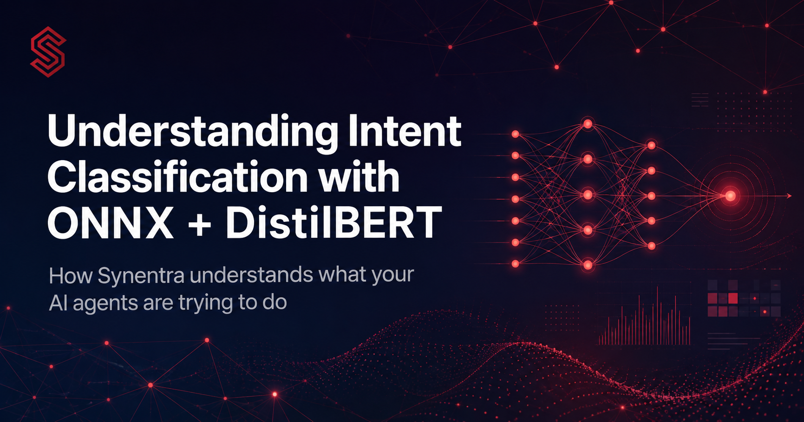
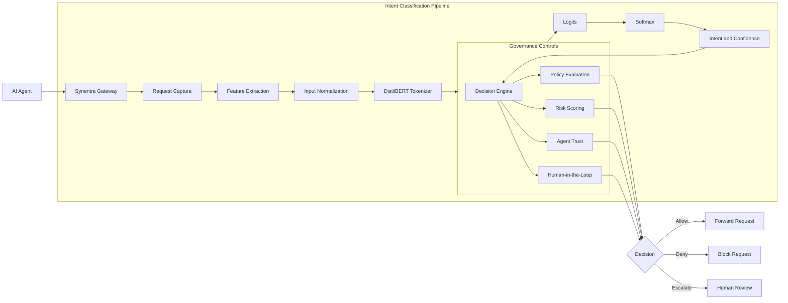
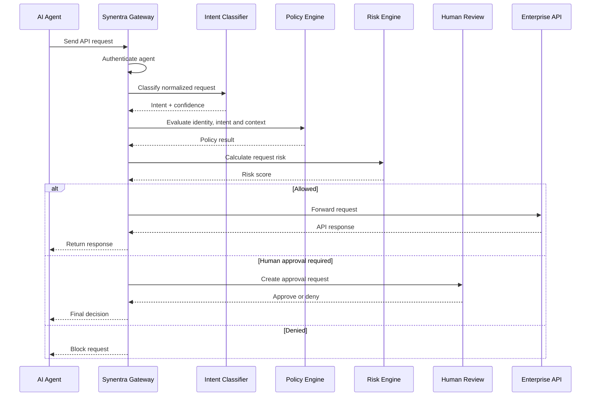

AI agents do not interact with enterprise APIs like traditional applications.

A conventional application follows predefined code paths. An autonomous agent interprets goals, reasons about available tools, creates requests dynamically, and may change its behavior when its model, prompt, context, or environment changes.

That creates a difficult question for every API request:

> **What is the agent actually trying to accomplish?**

Synentra answers that question through real-time semantic intent classification. It combines a fine-tuned DistilBERT model with ONNX Runtime to classify requests locally, producing an intent label and confidence score before the request reaches the target API.

This article explains how that pipeline works, why Synentra uses DistilBERT and ONNX Runtime, how confidence affects governance decisions, and how you can train and deploy a model for your own domain.

<!-- truncate -->

---

## The Core Challenge

Every time an autonomous agent calls an enterprise API, the gateway may need to determine:

* Is the requested action routine or destructive?
* Is the agent authorized to perform this kind of operation?
* Does the request match the agent's declared purpose?
* Is the action unusual for this agent?
* Should a human approve the request first?
* Should the request be denied immediately?

Authentication alone cannot answer these questions.

A valid token tells the gateway **who** the caller is. A role or permission tells it what the caller is generally allowed to access. Neither necessarily explains the meaning of the current request.

Consider these two requests:

```http
POST /api/users/search
Content-Type: application/json

{
  "query": "inactive customers"
}
```

```http
POST /api/users/delete
Content-Type: application/json

{
  "query": "inactive customers",
  "deleteAllMatches": true
}
```

Both requests may come from the same authenticated agent. They may even concern the same customer records.

Their intentions, however, are fundamentally different:

* The first request searches for information.
* The second may delete a large set of customer accounts.

Traditional gateways primarily evaluate properties such as:

* Route
* HTTP method
* Identity
* Role
* Scope
* IP address
* Request rate
* Payload size

These signals remain important, but they do not provide a complete semantic understanding of the requested operation.

Synentra adds another signal:

> **The inferred purpose of the request.**

---

## What Is Intent Classification?

Intent classification is a natural language processing task that assigns a predefined semantic category to an input.

In a conversational system, intents might include:

* `BOOK_FLIGHT`
* `RESET_PASSWORD`
* `CHECK_ORDER_STATUS`

In Synentra, intents represent the type and risk of an operation an AI agent is attempting to perform.

Example intents include:

```text
admin_action
audit
authenticate
authorize
bulk_export
bulk_import
compliance_check
configure
create
destructive_delete
escalate_privileges
export
harmful
health_check
list
maintenance
safe_read
safe_write
soft_delete
suspicious
update
```

The classifier receives a normalized representation of the request and returns an intent label with a confidence score.

```json
{
  "intent": "destructive_delete",
  "confidence": 0.96
}
```

The intent is not itself the final authorization decision.

Instead, it becomes one input to Synentra's decision pipeline, alongside:

* Authentication and identity
* Policy evaluation
* Risk scoring
* Agent trust and history
* Request context
* Human-in-the-loop requirements

A high-confidence `safe_read` classification might be allowed immediately. A `destructive_delete` classification may require human approval. An ambiguous or low-confidence request may be treated as suspicious.

---

## What Synentra Classifies

An API request does not normally contain one clean natural-language sentence. Its meaning is distributed across several fields.

Synentra can construct the classification input from:

* HTTP method
* Route or endpoint
* Query parameters
* Selected request headers
* Request body
* Agent identity
* Declared agent purpose
* Session or workflow context

For example, the original request might be:

```http
POST /api/orders/4821/actions
Synentra-Authorization: Bearer eyJ...
Content-Type: application/json

{
  "action": "refund",
  "amount": 500,
  "reason": "duplicate payment"
}
```

A normalized classifier input could resemble:

```text
method: POST
path: /api/orders/4821/actions
action: refund
amount: 500
reason: duplicate payment
agent: support-agent
```

The model could then produce:

```json
{
  "intent": "safe_write",
  "confidence": 0.94
}
```

A domain-specific model might instead use a more precise label such as `refund_request`.

The correct taxonomy depends on whether you want the model to classify:

1. **Business operations**, such as refunds and order cancellations.
2. **Security-oriented actions**, such as reads, writes, deletions, exports, and privilege escalation.
3. **Both**, using either a combined label set or separate classifiers.

Synentra's governance pipeline generally benefits from security-oriented labels because they can be applied consistently across different enterprise systems.

---

## Why DistilBERT?

BERT introduced a transformer encoder architecture capable of interpreting words in relation to the context on both sides of them.

That contextual understanding matters for intent classification.

Consider the following phrases:

```text
Delete the temporary export file.
```

```text
Export the customer file, then delete all source records.
```

Both include the word `delete`, but the operational risk is not necessarily the same. A contextual language model can learn patterns that distinguish routine cleanup from destructive data modification.

The challenge is that BERT-base is relatively expensive for a gateway that must evaluate every request.

### DistilBERT as a Production Compromise

DistilBERT is created through knowledge distillation. During pre-training, a smaller student model learns to reproduce much of the behavior of a larger BERT teacher model.

Compared with BERT-base, DistilBERT was designed to provide:

* A smaller model
* Lower inference cost
* Faster execution
* Similar performance on many language-understanding tasks
* Straightforward fine-tuning for classification

This makes it a practical choice for an inline governance component, where latency and throughput matter.

| Characteristic                        |   BERT-base |       DistilBERT |
| ------------------------------------- | ----------: | ---------------: |
| Encoder layers                        |          12 |                6 |
| Hidden dimension                      |         768 |              768 |
| Approximate parameters                | 110 million |       66 million |
| Token type IDs                        |   Supported |         Not used |
| Typical deployment cost               |      Higher |            Lower |
| Suitability for inline classification |    Possible | Stronger default |

---

## Why ONNX Runtime?

Models are commonly trained with frameworks such as PyTorch. Training and production inference, however, have different requirements.

Training prioritizes:

* Gradient calculation
* Experimentation
* Model updates
* Debugging flexibility

Gateway inference prioritizes:

* Predictable latency
* Efficient CPU utilization
* Controlled memory usage
* Cross-platform deployment
* Minimal runtime dependencies

ONNX provides a standardized representation of a model's computational graph. ONNX Runtime executes that graph using optimized native implementations.

For Synentra, this offers several benefits.

### Local Inference

The request does not need to be sent to an external model provider.

This helps:

* Keep API payloads inside the deployment boundary
* Avoid external inference latency
* Reduce third-party dependencies
* Support disconnected or restricted environments
* Provide more predictable performance

### Cross-Platform Execution

The same ONNX model can be loaded from a .NET application running on supported Linux or Windows environments.

### Runtime Optimization

ONNX Runtime can optimize the model graph and select optimized kernels for the host platform.

Depending on the deployment, it can use execution providers for:

* CPU
* CUDA
* TensorRT
* DirectML
* OpenVINO
* Other supported accelerators

For many gateway deployments, optimized CPU inference is the simplest and most operationally predictable choice.

### Native .NET Integration

Synentra can load and execute the model directly from C# using the `Microsoft.ML.OnnxRuntime` package.

No Python process or separate inference service is required at runtime.

---

## Synentra's Intent Classification Architecture



The pipeline can be divided into five stages:

1. Request capture
2. Feature extraction and normalization
3. Tokenization
4. ONNX inference
5. Output interpretation and governance

### Stage 1: Request Capture

Synentra intercepts the incoming request before forwarding it to the target API.

Relevant fields may include:

```csharp
public sealed record SemanticRequestContext(
    string Method,
    string Path,
    string? QueryString,
    string? Body,
    string? AgentId,
    string? DeclaredPurpose);
```

Not every header should be passed into the classifier.

Sensitive values such as bearer tokens, cookies, API keys, and cryptographic signatures normally add no useful semantic information and should be excluded.

A safer extraction approach uses an explicit allowlist:

```csharp
private static readonly HashSet<string> SemanticHeaders =
[
    "x-agent-purpose",
    "x-operation-name",
    "content-type"
];
```

This reduces noise and prevents secrets from accidentally entering telemetry, caches, or training datasets.

### Stage 2: Feature Extraction and Normalization

Raw JSON is not always an ideal classification input.

Payloads may contain:

* Random identifiers
* Timestamps
* Large text fields
* Binary data
* Secrets
* Base64 content
* Irrelevant metadata

Synentra should preserve semantically useful structure while removing unstable or sensitive values.

For example:

```json
{
  "customerId": "6dc11870-6ca8-4d96-84ab-89ba01c0b803",
  "action": "refund",
  "amount": 500,
  "requestedAt": "2026-07-15T10:42:31Z"
}
```

could be normalized to:

```text
customerId: <identifier>
action: refund
amount: 500
requestedAt: <timestamp>
```

This helps prevent the model from learning accidental relationships between labels and arbitrary identifiers.

### Stage 3: Tokenization

DistilBERT does not process strings directly. It processes integer token IDs.

The tokenizer:

1. Splits text into subword units.
2. Maps each unit to a vocabulary ID.
3. Adds model-specific special tokens.
4. Truncates or pads the sequence.
5. Produces an attention mask.

Conceptually, an input becomes:

```text
method: POST
path: /api/orders
body: action refund amount 500
```

and is converted into arrays such as:

```text
input_ids:
[101, 4118, 1024, 2695, 4130, 1024, ...]

attention_mask:
[1, 1, 1, 1, 1, 1, ...]
```

The exact IDs depend on the tokenizer vocabulary.

DistilBERT normally requires:

* `input_ids`
* `attention_mask`

Unlike BERT, DistilBERT does not use `token_type_ids`.

#### Sequence Length

The sequence length has a direct effect on inference cost.

A maximum length of 128 tokens may be sufficient for normalized API requests. Longer inputs may require 256 or 512 tokens, but they increase computation and memory use.

Choose the limit based on measured data rather than using the model maximum automatically.

```json
{
  "Semantic": {
    "Providers": {
      "Internal": {
        "MaxLength": 128
      }
    }
  }
}
```

### Stage 4: ONNX Runtime Inference

The model should be loaded once during application startup and reused.

Creating an `InferenceSession` for each request would add unnecessary latency and memory pressure.

```csharp
using Microsoft.ML.OnnxRuntime;

public sealed class IntentInferenceSession : IDisposable
{
    private readonly InferenceSession _session;

    public IntentInferenceSession(
        string modelPath,
        SessionOptions? sessionOptions = null)
    {
        ArgumentException.ThrowIfNullOrWhiteSpace(modelPath);

        if (!File.Exists(modelPath))
        {
            throw new FileNotFoundException(
                "The intent-classification model was not found.",
                modelPath);
        }

        _session = sessionOptions is null
            ? new InferenceSession(modelPath)
            : new InferenceSession(modelPath, sessionOptions);
    }

    public InferenceSession Session => _session;

    public void Dispose()
    {
        _session.Dispose();
    }
}
```

The session can be initialized through dependency injection:

```csharp
builder.Services.AddSingleton<IntentInferenceSession>(serviceProvider =>
{
    var configuration =
        serviceProvider.GetRequiredService<IConfiguration>();

    var modelPath =
        configuration["Semantic:Internal:ModelPath"]
        ?? throw new InvalidOperationException(
            "Semantic:Internal:ModelPath is required.");

    var options = new SessionOptions
    {
        GraphOptimizationLevel =
            GraphOptimizationLevel.ORT_ENABLE_ALL
    };

    return new IntentInferenceSession(modelPath, options);
});
```

Loading the model during startup has an important operational advantage: the application can fail its readiness check immediately when the model is missing or invalid.

It avoids discovering the problem only when the first semantic request arrives.

#### Preparing Input Tensors

A tokenized request can be represented as two tensors:

```csharp
using Microsoft.ML.OnnxRuntime;
using Microsoft.ML.OnnxRuntime.Tensors;

public static IReadOnlyCollection<NamedOnnxValue> CreateInputs(
    long[] inputIds,
    long[] attentionMask)
{
    if (inputIds.Length != attentionMask.Length)
    {
        throw new ArgumentException(
            "Input IDs and attention mask must have equal lengths.");
    }

    var dimensions = new[] { 1, inputIds.Length };

    var inputIdsTensor =
        new DenseTensor<long>(inputIds, dimensions);

    var attentionMaskTensor =
        new DenseTensor<long>(attentionMask, dimensions);

    return
    [
        NamedOnnxValue.CreateFromTensor(
            "input_ids",
            inputIdsTensor),

        NamedOnnxValue.CreateFromTensor(
            "attention_mask",
            attentionMaskTensor)
    ];
}
```

The input names must match the exported model.

Do not assume every ONNX graph uses the same names. Inspect the session metadata or validate the model during startup.

```csharp
foreach (var input in session.InputMetadata)
{
    logger.LogInformation(
        "ONNX input {InputName}: {Dimensions}",
        input.Key,
        string.Join(",", input.Value.Dimensions));
}
```

#### Running Inference

```csharp
public static float[] RunInference(
    InferenceSession session,
    IReadOnlyCollection<NamedOnnxValue> inputs)
{
    using var results = session.Run(inputs);

    var output = results.FirstOrDefault()
        ?? throw new InvalidOperationException(
            "The model returned no outputs.");

    return output
        .AsTensor<float>()
        .ToArray();
}
```

ONNX Runtime objects often wrap native resources. Disposable results should therefore be released promptly.

### Stage 5: Turning Logits into Confidence

A classification model normally outputs one logit for each label.

Suppose the configured labels are:

```text
0 → safe_read
1 → safe_write
2 → destructive_delete
3 → admin_action
4 → suspicious
```

The model might return:

```text
safe_read          -1.30
safe_write          0.82
destructive_delete  5.47
admin_action        1.10
suspicious          0.24
```

Logits are not probabilities. They are transformed with softmax.

For class (i):


where:

* (z_i) is the logit for class (i)
* (P_i) is the resulting probability
* (n) is the number of classes

A numerically stable implementation subtracts the maximum logit before calculating the exponentials:

```csharp
public sealed record IntentPrediction(
    string Intent,
    double Confidence,
    IReadOnlyList<IntentAlternative> Alternatives);

public sealed record IntentAlternative(
    string Intent,
    double Confidence);

public static IntentPrediction ProcessOutput(
    ReadOnlySpan<float> logits,
    IReadOnlyList<string> labels,
    int alternativeCount = 3)
{
    if (logits.Length == 0)
        throw new ArgumentException("Logits cannot be empty.");

    if (logits.Length != labels.Count)
    {
        throw new ArgumentException(
            "The number of logits must match the number of labels.");
    }

    var maxLogit = logits.ToArray().Max();
    var exponentials = new double[logits.Length];

    double sum = 0;

    for (var index = 0; index < logits.Length; index++)
    {
        var value = Math.Exp(logits[index] - maxLogit);
        exponentials[index] = value;
        sum += value;
    }

    var ranked = exponentials
        .Select((value, index) => new IntentAlternative(
            labels[index],
            value / sum))
        .OrderByDescending(result => result.Confidence)
        .ToArray();

    var best = ranked[0];

    return new IntentPrediction(
        best.Intent,
        best.Confidence,
        ranked
            .Skip(1)
            .Take(alternativeCount)
            .ToArray());
}
```

Example result:

```json
{
  "intent": "destructive_delete",
  "confidence": 0.96,
  "alternatives": [
    {
      "intent": "admin_action",
      "confidence": 0.02
    },
    {
      "intent": "safe_write",
      "confidence": 0.01
    }
  ]
}
```

---

## Confidence Is Not Certainty

A confidence score is the model's relative preference among its known labels. It is not proof that the classification is correct.

Several situations can produce misleading confidence:

* The input differs substantially from the training data.
* Important context was omitted.
* Two labels overlap semantically.
* The training set is imbalanced.
* The label taxonomy is poorly defined.
* The model is overconfident.
* The payload contains unfamiliar domain terminology.

Synentra should therefore treat confidence as a governance signal rather than an absolute truth.

A typical decision strategy could be:

|    Confidence | Example handling                             |
| ------------: | -------------------------------------------- |
|     `>= 0.85` | Use the predicted intent normally            |
|   `0.70–0.85` | Combine with stronger risk and policy checks |
|      `< 0.70` | Mark as low confidence or suspicious         |
| Model failure | Fail safely according to configuration       |

The correct thresholds must be selected through validation on your own data.

```json
{
  "Semantic": {
    "ConfidenceThreshold": 0.70,
    "AllowLowConfidence": false
  }
}
```

For destructive operations, you may require both:

* High confidence in the predicted intent
* Explicit policy authorization

For ambiguous requests, you may choose to:

* Deny the request
* Escalate it to a human
* Require additional context
* Apply a stricter policy
* Record it for later model evaluation

---

## From Intent to Governance Decision

Intent classification becomes valuable when it changes what the gateway does.

Consider this policy logic:

```text
Intent: safe_read
Risk: low
Trust: high
Decision: allow
```

```text
Intent: destructive_delete
Risk: high
Trust: medium
Decision: require human approval
```

```text
Intent: escalate_privileges
Risk: critical
Trust: any
Decision: deny
```

```text
Intent: suspicious
Confidence: low
Decision: deny or escalate
```

A conceptual Rego policy might look like:

```rego
package synentra.authorization

default decision := {
  "action": "deny",
  "reason": "No matching authorization rule"
}

decision := {
  "action": "allow",
  "reason": "Trusted read operation"
} if {
  input.intent.label == "safe_read"
  input.intent.confidence >= 0.85
  input.risk.trust_score >= 0.80
}

decision := {
  "action": "hitl",
  "reason": "Destructive operation requires approval"
} if {
  input.intent.label == "destructive_delete"
}

decision := {
  "action": "deny",
  "reason": "Privilege escalation is prohibited"
} if {
  input.intent.label == "escalate_privileges"
}
```

The model explains what the request appears to mean. The policy engine determines whether that meaning is acceptable.

This separation is important:

* The model remains responsible for classification.
* The policy remains responsible for organizational rules.
* The decision engine combines semantic, identity, risk, and trust signals.

---

## Real-World Classification Examples

### Routine Read Operation

```http
GET /api/orders/4821
```

Normalized input:

```text
method: GET
path: /api/orders/<identifier>
operation: retrieve order
```

Possible output:

```json
{
  "intent": "safe_read",
  "confidence": 0.98
}
```

Possible decision:

```json
{
  "action": "allow",
  "reason": "Authorized low-risk read operation"
}
```

### High-Value Refund

```http
POST /api/orders/4821/refund
Content-Type: application/json

{
  "amount": 5000,
  "currency": "USD",
  "reason": "customer request"
}
```

Possible output:

```json
{
  "intent": "safe_write",
  "confidence": 0.91
}
```

The intent alone does not capture the full risk. The amount and agent history may increase the risk score.

Possible combined decision:

```json
{
  "action": "hitl",
  "reason": "High-value refund requires human approval"
}
```

### Bulk Customer Export

```http
POST /api/customers/export
Content-Type: application/json

{
  "scope": "all",
  "includePersonalData": true
}
```

Possible output:

```json
{
  "intent": "bulk_export",
  "confidence": 0.97
}
```

Possible decision:

```json
{
  "action": "deny",
  "reason": "The agent is not authorized to export personal data"
}
```

### Ambiguous Upload

```http
POST /api/orders/4821/documents
Content-Type: application/json

{
  "fileName": "order-summary.pdf",
  "contentReference": "storage://uploads/29d..."
}
```

Possible output:

```json
{
  "intent": "safe_write",
  "confidence": 0.61,
  "alternatives": [
    {
      "intent": "update",
      "confidence": 0.27
    },
    {
      "intent": "suspicious",
      "confidence": 0.12
    }
  ]
}
```

Because the confidence is below the configured threshold, Synentra can map the result to `suspicious` and apply a fail-safe policy.

---

## Training a Custom Intent Model

Synentra's default model is designed around common governance operations. Organizations may still need domain-specific intents.

Examples include:

* `approve_insurance_claim`
* `modify_prescription`
* `release_payment`
* `change_shipping_address`
* `publish_software_release`
* `rotate_production_secret`

A custom model normally follows five stages:

1. Define the label taxonomy.
2. Collect representative examples.
3. Split the data.
4. Fine-tune DistilBERT.
5. Export and validate the ONNX model.

### Step 1: Define a Clear Taxonomy

The label set should represent distinctions that affect governance decisions.

A weak taxonomy might contain:

```text
read
view
retrieve
get
query
```

These labels overlap heavily and may not lead to different policies.

A stronger taxonomy might contain:

```text
safe_read
sensitive_read
bulk_export
safe_write
destructive_delete
admin_action
escalate_privileges
```

Each label should have:

* A precise definition
* Positive examples
* Negative examples
* Boundary cases
* A corresponding governance purpose

For example:

```yaml
destructive_delete:
  description: Permanently removes one or more business records.
  includes:
    - Delete a customer account
    - Purge audit data
    - Remove all matching resources
  excludes:
    - Archive a record
    - Remove a temporary cache entry
    - Revoke a short-lived session
```

### Step 2: Prepare the Dataset

A simple CSV format is easy to inspect and version:

```csv
text,label
"method: GET path: /api/orders/123","safe_read"
"method: GET path: /api/customers/export?scope=all","bulk_export"
"method: DELETE path: /api/customers/123","destructive_delete"
"method: POST path: /api/admin/roles body: grant administrator","escalate_privileges"
"method: PATCH path: /api/orders/123 body: status shipped","update"
```

A JSON Lines format also works well:

```json
{"text":"method: GET path: /api/orders/123","label":"safe_read"}
{"text":"method: DELETE path: /api/customers/123","label":"destructive_delete"}
{"text":"method: POST path: /api/admin/roles body: grant administrator","label":"escalate_privileges"}
```

Your training examples should reflect production variation:

* Different route parameters
* Synonyms
* Short and long payloads
* Different field ordering
* Missing optional fields
* Similar operations with different risk
* Agent-generated wording
* Typographical errors
* Previously misclassified requests

Avoid allowing random identifiers to dominate the dataset. Normalize them before training, just as you will during production inference.

### Step 3: Fine-Tune DistilBERT

The following example demonstrates the main structure using Hugging Face Transformers and Datasets.

```python
from datasets import load_dataset
from transformers import (
    AutoModelForSequenceClassification,
    AutoTokenizer,
    DataCollatorWithPadding,
    Trainer,
    TrainingArguments,
)

MODEL_NAME = "distilbert-base-uncased"
DATA_FILE = "intent-dataset.csv"
OUTPUT_DIR = "artifacts/intent-model"

dataset = load_dataset(
    "csv",
    data_files={"data": DATA_FILE},
)["data"]

labels = sorted(set(dataset["label"]))
label_to_id = {
    label: index
    for index, label in enumerate(labels)
}
id_to_label = {
    index: label
    for label, index in label_to_id.items()
}

dataset = dataset.train_test_split(
    test_size=0.2,
    seed=42,
    stratify_by_column="label",
)

tokenizer = AutoTokenizer.from_pretrained(MODEL_NAME)

def tokenize(batch):
    encoded = tokenizer(
        batch["text"],
        truncation=True,
        max_length=128,
    )

    encoded["label"] = [
        label_to_id[label]
        for label in batch["label"]
    ]

    return encoded

tokenized_dataset = dataset.map(
    tokenize,
    batched=True,
    remove_columns=dataset["train"].column_names,
)

model = AutoModelForSequenceClassification.from_pretrained(
    MODEL_NAME,
    num_labels=len(labels),
    id2label=id_to_label,
    label2id=label_to_id,
)

training_arguments = TrainingArguments(
    output_dir=OUTPUT_DIR,
    learning_rate=2e-5,
    per_device_train_batch_size=16,
    per_device_eval_batch_size=32,
    num_train_epochs=4,
    weight_decay=0.01,
    eval_strategy="epoch",
    save_strategy="epoch",
    load_best_model_at_end=True,
    metric_for_best_model="eval_loss",
    seed=42,
)

trainer = Trainer(
    model=model,
    args=training_arguments,
    train_dataset=tokenized_dataset["train"],
    eval_dataset=tokenized_dataset["test"],
    data_collator=DataCollatorWithPadding(
        tokenizer=tokenizer
    ),
)

trainer.train()

trainer.save_model(OUTPUT_DIR)
tokenizer.save_pretrained(OUTPUT_DIR)
```

This is a starting point, not a complete production training pipeline.

A complete pipeline should also include:

* Dataset validation
* Duplicate detection
* Class balance analysis
* Precision, recall, and F1 metrics
* Confusion matrices
* Threshold evaluation
* Model version metadata
* Reproducible dependency versions
* Artifact integrity checks

### Step 4: Export the Model to ONNX

The modern Hugging Face workflow uses Optimum for ONNX export.

Install the required packages:

```bash
python -m pip install "optimum[onnx]" onnxruntime
```

Export the fine-tuned sequence-classification model:

```bash
optimum-cli export onnx \
  --model artifacts/intent-model \
  --task text-classification \
  artifacts/intent-model-onnx
```

The output directory will normally contain the exported model and related configuration files.

Preserve the label mapping with the model:

```json
{
  "0": "admin_action",
  "1": "bulk_export",
  "2": "destructive_delete",
  "3": "safe_read",
  "4": "safe_write",
  "5": "suspicious"
}
```

The ordering must match the classification head used during training. A mismatched label file can make an otherwise valid model return incorrect intent names.

### Step 5: Validate the Exported Model

Do not deploy the ONNX model merely because export completed successfully.

Compare the original model and ONNX model on the same validation inputs.

Validate:

* Predicted label agreement
* Maximum probability difference
* Input and output tensor names
* Dynamic dimensions
* Maximum sequence length
* Empty and malformed input behavior
* Latency under concurrency
* Memory consumption
* Model startup time

Example validation cases should include:

```text
Routine safe read
Single-record update
Permanent deletion
Bulk export
Privilege escalation
Ambiguous request
Previously unseen endpoint
Empty request body
Maximum supported input length
```

Store the validation report with the model artifact.

---

## Deploying a Custom Model

A model package should normally include:

```text
intent-model/
├── model.onnx
├── labels.json
├── tokenizer.json
├── tokenizer_config.json
├── special_tokens_map.json
├── vocab.txt
└── model-metadata.json
```

Example metadata:

```json
{
  "name": "acme-enterprise-intents",
  "version": "1.3.0",
  "architecture": "distilbert",
  "maxSequenceLength": 128,
  "datasetVersion": "2026-07-10",
  "createdAt": "2026-07-15T09:00:00Z",
  "labels": [
    "safe_read",
    "safe_write",
    "destructive_delete",
    "bulk_export",
    "admin_action",
    "escalate_privileges",
    "suspicious"
  ]
}
```

package them as a compresed `.zip` file.

Configure Synentra to load the model package:

```json
{
  "Semantic": {
    "DefaultProvider": "Internal",
    "ConfidenceThreshold": 0.70,
    "AllowLowConfidence": false,
    "Providers": {
      "Internal": {
        "ModelType": "Community",
        "PackagePath": "/data/models/intent/model.zip",
        "MaxLength": 128
      }
    }
  }
}
```

Mount the model directory into the container:

```bash
docker run \
  --name synentra \
  -p 7080:7080 \
  -v "$(pwd)/intent-model:/data/models/intent:ro" \
  -e Semantic__Providers__Internal__ModelType=Community \
  -e Semantic__Providers__Internal__ModelPath=/data/models/intent/model.zip \
  ghcr.io/synentra/synentra:latest
```

Use a read-only mount unless the running application must update the model files.

---

## What Intent Classification Does Not Replace

Semantic intent classification does not replace:

* Authentication
* Authorization
* Input validation
* Rate limiting
* Network controls
* Audit logging
* Policy evaluation
* Risk scoring
* Human approval
* Target API security

It strengthens these controls by providing semantic context.

A secure decision should combine multiple independent signals:

[
Decision =
f(
Identity,
Policy,
Intent,
Confidence,
Risk,
Trust,
Context
)
]

No single signal should determine every outcome.

---

## Putting It All Together

A complete Synentra request flow can look like this:



The model does not decide whether the agent is trusted.

The policy engine does not need to understand raw natural language.

The risk engine does not need to classify every payload from scratch.

Each component contributes a focused signal to the final decision.

---

## Conclusion

Autonomous agents require gateways to understand more than identity, routes, and HTTP methods.

They require semantic awareness.

Synentra uses DistilBERT and ONNX Runtime to classify the purpose of API requests locally and in real time. The resulting intent and confidence score become governance signals that can influence policy evaluation, risk scoring, trust decisions, and human approval.

The architecture provides several practical advantages:

* Local inference without sending payloads to an external model API
* Efficient transformer execution through ONNX Runtime
* Customizable intent taxonomies
* Domain-specific fine-tuning
* Confidence-aware policy enforcement
* Integration with risk scoring and human-in-the-loop controls
* Versioned and replaceable model artifacts

The most important principle is that intent classification is not an authorization system by itself.

It is one layer in a defense-in-depth architecture.

When semantic understanding is combined with identity, policy, risk, trust, and human oversight, Synentra can make more informed decisions about what autonomous agents should be allowed to do.

---

## References

1. https://huggingface.co/docs/transformers/v4.47.0/en/model_doc/distilbert "DistilBERT · Hugging Face"
2. https://onnxruntime.ai/docs/performance/model-optimizations/quantization.html "Quantize ONNX models | onnxruntime"