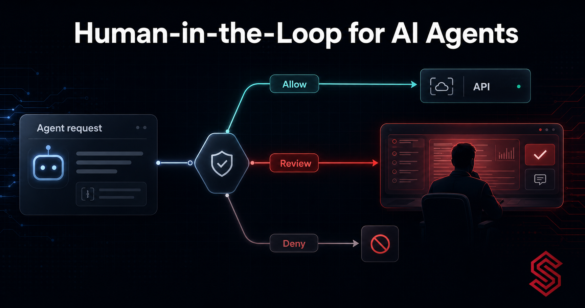
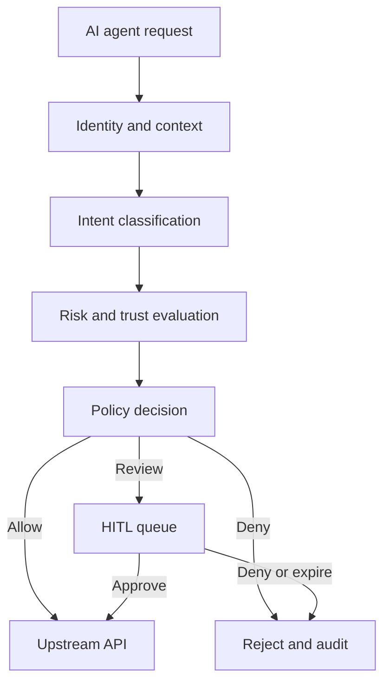
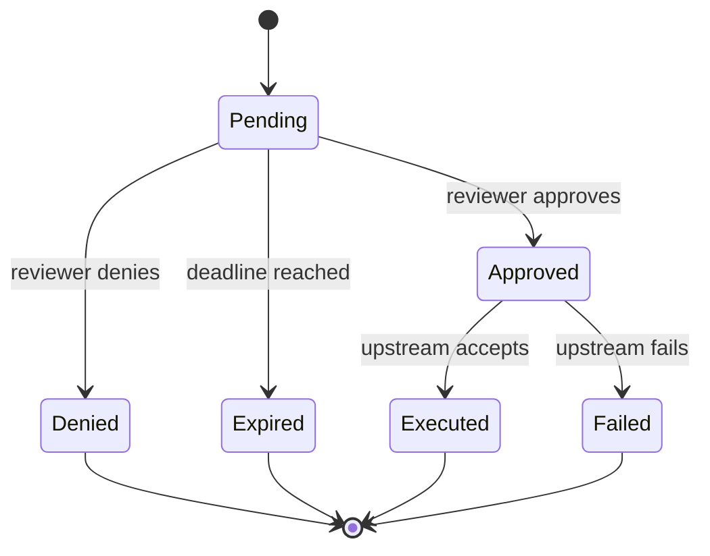

An AI agent can be properly authenticated and still make a request that should not execute without review.

Consider an internal support agent with a valid JWT and permission to call a billing API. Reading an invoice may be routine. Issuing a refund may be acceptable below a defined threshold. Refunding a large amount after an unusual sequence of requests is different. Identity establishes *which agent* is acting; it does not settle whether this particular action should proceed automatically.

The usual responses—allow everything authorized or require approval for every write—both fail in practice. The first gives probabilistic systems too much freedom. The second removes much of the value of automation and teaches reviewers to approve prompts mechanically.

<!-- truncate -->

Human-in-the-loop (HITL) is the control between those extremes. It is not a replacement for authentication, intent classification, risk scoring, or policy. It is a policy outcome used when the available evidence does not justify either an immediate allow or an immediate deny.

This article develops that architecture using Synentra as a concrete open-source implementation. Synentra is an intent-aware governance gateway: it intercepts agent-to-API traffic, classifies intent locally with ONNX and DistilBERT, evaluates contextual policy with OPA, considers risk and agent trust, and can pause selected requests for human review.

## The decision is not binary

Many authorization systems model the result as `allow` or `deny`. Agent governance often needs a third state:

```text
ALLOW   — evidence and policy permit automatic execution
DENY    — policy prohibits execution
REVIEW  — execution is paused until a human decides or the request expires
```

`REVIEW` should be explicit. Treating it as a delayed allow hides an important security state. Treating it as an error encourages clients to retry and potentially create duplicate approval requests.

The human is also not expected to repair every weakness in the preceding pipeline. A request with an invalid identity should be rejected before HITL. An action categorically forbidden by policy should be denied, not offered to an operator as an invitation to override a guardrail. Review is most valuable in the bounded space where an action is permitted in principle but the context makes automatic execution inappropriate.

## A reference architecture

The core flow is:



This separation matters:

1. **Identity and context** establish the authenticated agent, requested resource, method, relevant claims, and request metadata.
2. **Intent classification** estimates what the request is trying to accomplish. In Synentra, local ONNX inference avoids sending classification data to an external model API.
3. **Risk and trust evaluation** adds signals such as historical behaviour, policy violations, external signals, and the agent's accumulated trust.
4. **Policy evaluation** converts those inputs into an enforceable result.
5. **HITL orchestration** persists the pending decision, notifies the configured review channel, waits within a deadline, and records the outcome.
6. **Proxy execution** forwards the original operation only after an allow or approval.

Traditional gateways, service meshes, and policy engines still have important roles here. NGINX or Envoy can provide foundational proxying; Kong and APISIX provide broad API management; OPA provides policy evaluation; a service mesh governs service-to-service communication. Synentra focuses on the agent-to-API decision and can complement those layers rather than requiring their removal.

## Decide what deserves review

A useful review policy starts with the consequence of the action, not the novelty of the technology.

### Review high-impact but conditionally valid actions

Good candidates include:

- financial actions above an automatic threshold;
- destructive changes where recovery is difficult;
- access to unusually sensitive records;
- privilege or configuration changes;
- bulk operations whose individual actions appear harmless but whose aggregate impact is large;
- requests from an agent whose trust has fallen below the automatic-execution threshold;
- valid actions with high risk or ambiguous intent.

### Deny actions that should never happen

Do not route a prohibited privilege escalation to a human merely because HITL exists. A review queue is not a bypass around policy. Define non-negotiable constraints first, and make them deny rules.

### Allow low-impact, well-understood actions

Routine reads and bounded operations should remain automatic when identity, intent, context, trust, and policy agree. Otherwise, the review queue grows until the organization either abandons it or approves requests without analysis.

## Policy as the escalation boundary

The following Rego is an **illustrative policy pattern**, not a copy-and-paste representation of Synentra's exact production input schema. Adapt field names to the schema exposed by your installed version.

```json
{
  "name": "agent-governance-policy",

  "owner": "security-team",
  "createdOn": "2026-08-11T00:00:00Z",
  "default": "Deny",
  "rules": [
    {
      "name": "deny-risk-exceeds-limit",
      "reason": "Risk exceeds policy limit.",
      "priority": 100,
      "effect": "Deny",
      "conditions": [
        {
          "field": "risk.score",
          "operator": "ge",
          "value": 80
        }
      ]
    },
    {
      "name": "hitl-high-impact-refund",
      "reason": "High-impact refund requires human review.",
      "priority": 80,
      "effect": "Hitl",
      "conditions": [
        {
          "field": "intent.label",
          "operator": "eq",
          "value": "refund_request"
        },
        {
          "field": "request.amount",
          "operator": "ge",
          "value": 1000
        },
        {
          "field": "risk.score",
          "operator": "lt",
          "value": 80
        }
      ]
    },
    {
      "name": "allow-routine-read",
      "reason": "Routine read from a trusted agent.",
      "priority": 60,
      "effect": "Allow",
      "conditions": [
        {
          "field": "intent.label",
          "operator": "eq",
          "value": "safe_read"
        },
        {
          "field": "intent.confidence",
          "operator": "ge",
          "value": 0.8
        },
        {
          "field": "agent.trust_score",
          "operator": "ge",
          "value": 70
        },
        {
          "field": "risk.score",
          "operator": "lt",
          "value": 40
        }
      ]
    }
  ]
}
```

The significant design choice is not the exact numeric threshold. It is that each outcome includes a machine-readable effect and a human-readable reason. Thresholds must be calibrated against your threat model, operating data, and tolerance for delay. The values above are examples only.

Avoid a rule such as `if classifier confidence < 0.7, ask a human` as the entire strategy. Low confidence may mean the classifier needs improvement, the input is out of distribution, or the request lacks enough context. Review can be a safe fallback, but repeated low-confidence escalations should become an engineering signal rather than a permanent source of manual work.

## What the reviewer needs to see

A notification that says “Approve request 47?” is not meaningful oversight. A reviewer needs enough context to understand consequence without reconstructing the request from logs.

A review record should present:

- authenticated agent identity;
- target API, method, and resource;
- classified intent and confidence;
- risk score and contributing context;
- current agent trust score;
- matched policy and escalation reason;
- a bounded, redacted request summary;
- creation and expiration times;
- correlation or trace identifier;
- explicit approve and deny actions.

Sensitive payloads require particular care. Synentra's audit capability can record request context, intent, risk, and policy outcome, but organizations still need a retention and redaction design appropriate to their data. “Complete auditability” must not become “copy every secret into every notification.” Put minimum necessary context in Slack or a webhook payload, and keep sensitive details in an access-controlled system.

## The request lifecycle

HITL adds state to a path that may otherwise be stateless. Model that lifecycle deliberately.



Several details follow from this model:

### Preserve the operation safely

The gateway must know exactly what will execute after approval. If the upstream resource can change between request and approval, decide whether approval applies to the original command, a versioned resource, or a newly validated command. For destructive or financial operations, include an idempotency key and, where supported, a version precondition.

### Make decisions idempotent

Two reviewers may click at nearly the same time. A notification may be delivered twice. A client may retry. The first terminal decision should win, and subsequent attempts should return the recorded state rather than execute the request again.

### Expire by default

A pending request should not remain executable indefinitely. On timeout, fail closed unless a carefully documented policy says otherwise. Expiration is a decision outcome and belongs in the audit trail.

### Revalidate when necessary

Approval does not freeze the world. If trust, identity, policy, or the target resource can materially change during the wait, revalidate before forwarding. Human approval should satisfy the review condition, not disable every other control.

## An illustrative scenario: a refund agent

The following scenario is fictional and is included to examine the design; it is not a Synentra customer story or benchmark.

An authenticated support agent receives a request to refund €1,800. The classifier labels the action `refund_request`. The risk engine observes that the amount is above the automatic threshold and that the agent's recent pattern is unusual. OPA returns `review`.

Synentra creates a pending HITL record and sends a redacted summary through the configured Slack or webhook channel. The client receives a pending result with a correlation identifier rather than a successful refund. An authorized reviewer sees the agent, amount, policy reason, intent, risk, trust, and expiry, then approves.

Before forwarding, the gateway confirms that the approval is current and that the operation has not already executed. The upstream API receives the request once. Synentra records the classification, risk, policy, reviewer decision, and upstream outcome for later investigation.

Now change one input: the risk score exceeds the organization's hard-deny threshold. The policy returns `deny`; no approval request is created. This distinction keeps human discretion inside defined limits.