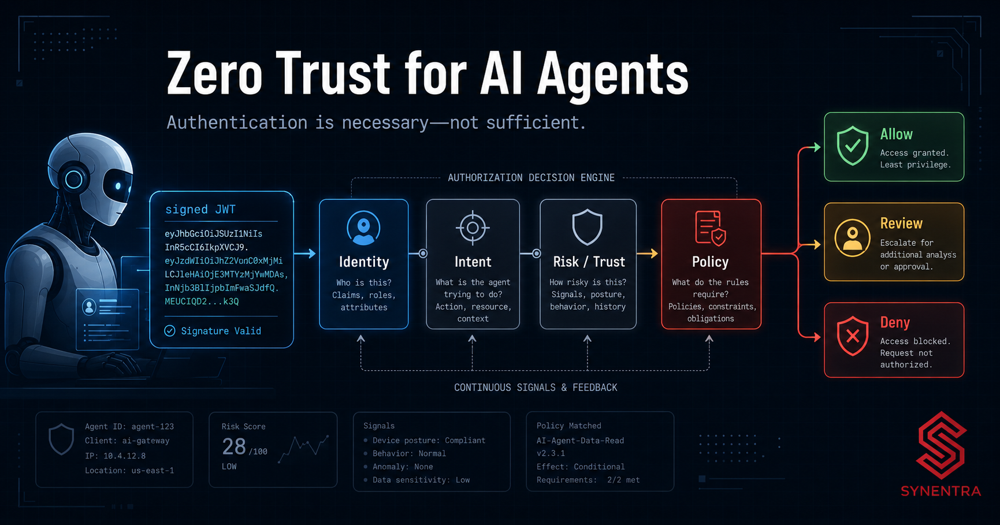
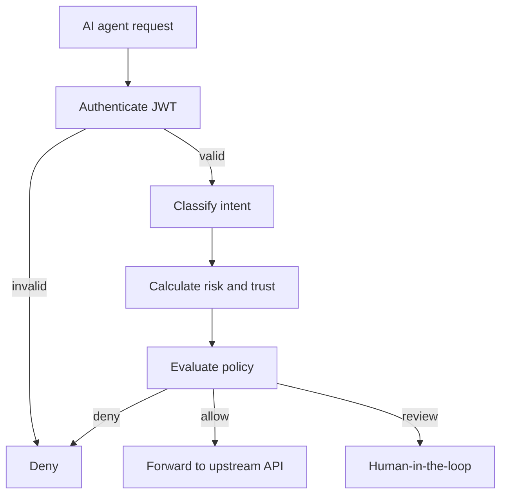

An AI agent presents a valid JWT. Its issuer is trusted, its signature is valid, its audience is correct, and its token has not expired.

The agent then asks a billing API to issue a high-value refund.

Should the request be allowed?

Authentication can establish which workload is making the request. It cannot, by itself, establish whether this action is appropriate now, for this resource, with this inferred purpose, under the current risk conditions. A token answers an identity question. Governance must answer a decision question.

<!-- truncate -->

That distinction becomes important when software can choose tools, construct requests, retry failed actions, and pursue a goal with partial autonomy. A conventional application normally exposes a bounded set of workflows designed in advance. An agent can arrive at the same endpoint through many reasoning paths, including paths its developers did not explicitly encode.

Zero trust is therefore a useful design model for agent-to-API traffic: do not convert one successful authentication event into broad, durable confidence. Verify identity, evaluate the requested action in context, constrain access, and record the decision each time.

This blog develops that model without treating “zero trust” as a product label. It explains where JWT authentication ends, what authorization must add, how probabilistic intent can safely inform deterministic policy, and where human review still belongs.

## The three questions that are often collapsed into one

Agent security discussions frequently combine three separate questions:

1. **Who is calling?** Authentication establishes a workload identity.
2. **What is it trying to do?** Intent classification interprets the semantic purpose of the request.
3. **Should this action proceed?** Authorization combines identity, intent, context, risk, trust, and policy into an outcome.

Keeping these questions separate makes the architecture easier to reason about. It also avoids overloading a JWT with claims that become stale or were never designed to represent runtime behavior.

Consider an internal support agent with permission to call a customer API. A role such as `support-agent` may legitimately allow reads, case updates, and limited refunds. But the role alone cannot distinguish:

- reading a customer record to answer a question;
- exporting many customer records;
- updating a contact address;
- deleting an account;
- issuing a refund outside the normal range.

HTTP method and route add useful information, but not always enough. `POST /actions` could represent several business operations. A free-form payload may contain the semantic clue that separates a routine action from an escalation.

## A zero-trust decision pipeline for agents

A practical design evaluates every proxied action at the point where identity and request context are available.



In Synentra, the reverse proxy is the enforcement point. The gateway can authenticate an agent using JWT, classify intent locally through ONNX Runtime and DistilBERT, calculate risk and agent trust, evaluate policy through OPA, route selected requests to human review, and record the decision for audit and observability.

The important architectural property is not merely that all components exist. It is that their outputs remain explicit inputs to a policy decision. This lets teams inspect why a request was allowed, denied, or held for review.

### 1. Authenticate the workload

JWT validation should establish, at minimum:

- a trusted issuer;
- the intended audience;
- a valid signature;
- acceptable token lifetime;
- an agent identifier that can be mapped to a registered workload.

An illustrative claim set might look like this:

```json
{
  "iss": "https://identity.example.com/realms/agents",
  "aud": "synentra-gateway",
  "sub": "agent-customer-support-01",
  "scope": "customer.read customer.write",
  "exp": 1786204800
}
```

This is an example, not a required Synentra claim schema. Exact claim mappings depend on the identity provider and deployment configuration.

The subject should represent the agent workload rather than a shared application identity. If ten autonomous agents share one subject, their actions become harder to attribute, their trust histories become entangled, and revoking one compromised agent may interrupt all ten.

### 2. Interpret the requested action

Identity claims describe the caller. Intent classification analyzes the request being made. Synentra performs this classification locally using an ONNX model based on DistilBERT, so classification does not require sending the request to an external AI API.

An intent result is probabilistic. A simplified example is:

```json
{
  "label": "destructive_delete",
  "confidence": 0.91,
  "status": "Classified"
}
```

That result should not silently replace conventional authorization. It should become one policy input alongside method, route, identity, scopes, trust, risk, and other context.

Low-confidence results need an explicit failure strategy. Depending on the action, a team might deny, require human review, or fall back to a narrower deterministic rule. Default-allow is usually difficult to justify for destructive or high-impact operations.

### 3. Evaluate risk and trust without confusing them

Risk and trust are related, but they answer different questions.

- **Risk** concerns the current request: how consequential or anomalous is this action?
- **Trust** concerns the agent’s accumulated reputation or history.

A trusted agent can still make a high-risk request. A newly registered or low-trust agent might make a harmless read. Collapsing both into one score hides useful policy information.

Illustrative policy inputs could include:

```json
{
  "agent": {
    "id": "agent-customer-support-01",
    "trustScore": 72
  },
  "request": {
    "method": "POST",
    "path": "/refunds",
    "bodySize": 418
  },
  "intent": {
    "label": "safe_write",
    "confidence": 0.87,
    "status": "Classified"
  },
  "risk": {
    "score": 68
  }
}
```

The values above are an illustrative scenario, not a benchmark or a promised production schema.

### 4. Make policy the decision boundary

Policy converts evidence into an enforceable outcome. The decision should be deterministic for a given input, even when one input—intent confidence—originates from a probabilistic classifier.

An illustrative Rego rule could hold destructive requests for review when intent confidence is sufficiently strong:

```rego
package agent.authz

default decision := "deny"

decision := "allow" if {
  input.identity.authenticated
  input.request.method == "GET"
  input.risk.score < 40
}

decision := "review" if {
  input.identity.authenticated
  input.intent.status == "Classified"
  input.intent.label == "destructive_delete"
  input.intent.confidence >= 0.80
}

decision := "review" if {
  input.identity.authenticated
  input.intent.status != "Classified"
  input.request.method != "GET"
}
```

This code is illustrative. Adapt package names, input fields, thresholds, and outcomes to the policy schema implemented by the deployed Synentra version.

The value of OPA here is separation: policy authors can define decision logic independently from application routing code. OPA is not a competitor to this architecture; it is a policy engine that can serve as a core component within it.

### 5. Forward, deny, or pause

Binary allow/deny decisions are insufficient for some agent workflows. A high-risk request may be legitimate but require confirmation. Synentra supports human-in-the-loop handling for suspicious or high-risk actions through webhook or Slack escalation.

Human review should be selective. If every request requires approval, the agent is no longer meaningfully autonomous and reviewers will develop alert fatigue. If no request can be reviewed, the system has only permit and block—even when uncertainty is the dominant fact.

The policy should therefore define a narrow review envelope, such as:

- destructive actions with adequate classification confidence;
- sensitive writes by low-trust agents;
- actions whose classification failed but whose method or route indicates impact;
- requests with elevated risk that are not unconditionally prohibited.

## Authentication design: workload identity, not human identity by proxy

One tempting implementation is to pass the end user’s token through every component and treat the agent as an invisible intermediary. That may be appropriate in some delegated flows, but it does not fully identify the autonomous workload performing the action.

A stronger model records both actors when available:

- **human or service principal:** on whose behalf the task originated;
- **agent identity:** which autonomous workload selected and executed the action.

This supports clearer audit questions: Who initiated the task? Which agent chose the tool? What intent was classified? Which policy produced the decision? Was a human approval involved?

The precise delegation model depends on the identity provider and application architecture. The general rule is to avoid erasing the agent’s identity behind a broad shared credential.

## Authorization must be narrower than connectivity

Network access and API reachability are not authorization. A gateway, service mesh, or reverse proxy may establish secure transport and routing while a separate policy layer decides whether a particular action is acceptable.

These systems can complement one another:

- NGINX or Envoy can provide foundational proxying and load balancing.
- Kong, APISIX, or a cloud API gateway can manage conventional API concerns.
- Istio or Kuma can secure service-to-service communication.
- OPA can evaluate fine-grained authorization policy.
- Synentra can act as an agent-to-API governance layer where identity, semantic intent, risk, trust, and human oversight meet.

The correct topology depends on existing infrastructure. Adding an agent-aware gateway does not require discarding a service mesh or enterprise API gateway.

## Realistic scenarios

The following are illustrative scenarios, not customer stories.

### Scenario A: valid identity, excessive action

A support agent has a valid token and permission to call a customer-management API. It attempts a bulk export after a user asks for “everything associated with this account.” Authentication succeeds. Route-based authorization may also succeed. Intent classification identifies `bulk_export`; policy requires review because the action could expose substantially more data than a normal lookup.

The lesson: a valid identity does not make every reachable action appropriate.

### Scenario B: ambiguous intent on a sensitive write

An agent calls a generic action endpoint. The classifier returns low confidence between `update` and `destructive_delete`. The request is a write and the agent has limited trust history. Policy sends the request to human review instead of guessing.

The lesson: uncertainty is a policy input, not an implementation error to hide.

### Scenario C: low-risk read from a known agent

A registered research agent requests a permitted read-only endpoint. JWT validation succeeds, intent is classified as `safe_read`, the risk score is low, and policy allows forwarding. The gateway records the inputs and outcome.

The lesson: zero trust does not mean blocking normal work. It means making the basis for trust explicit and scoped to the action.

## Auditability is part of authorization

An authorization system for autonomous agents should preserve enough evidence to reconstruct a decision. Synentra’s audit capability records decision context including payload, intent, risk, and policy outcome, while OpenTelemetry and structured logging support operational visibility.

Teams should still decide deliberately:

- which request and response fields may be logged;
- how secrets and personal data are redacted;
- how long audit records are retained;
- who may query the audit store;
- how model and policy versions are associated with decisions.

“Log everything” is not a safe universal policy. Full payload logging can aid forensics while also creating a sensitive secondary data store. Minimize and protect audit data according to the deployment’s requirements.

## Trade-offs and limitations

### Intent is probabilistic

Classification can be wrong, especially for unfamiliar phrasing, sparse payloads, multilingual inputs, or requests whose meaning depends on external state. Intent should enrich authorization rather than override identity, explicit permissions, and deterministic constraints.

### More signals create more failure modes

Identity providers, classifiers, policy engines, storage, and approval channels can each fail. Define fail-open or fail-closed behavior per action class. A temporary classifier failure on a public read may warrant a different response from failure on account deletion.

### Trust can become self-reinforcing

Historical reputation must not grant permanent immunity. Trust scoring needs bounded influence, decay or review rules appropriate to the implementation, and independent hard limits for prohibited actions.

### Human review introduces latency

HITL improves control for selected actions but adds queueing, availability, and timeout questions. Approval requests need sufficient context, an authenticated reviewer, a clear expiry, and an auditable outcome.

### The gateway is an enforcement point, not a complete security program

Upstream APIs still need secure defaults, input validation, least-privilege credentials, network controls, monitoring, and incident response. A gateway reduces a class of risk; it does not make an unsafe upstream service safe.