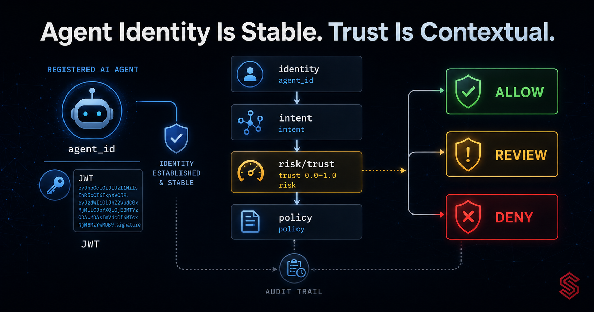
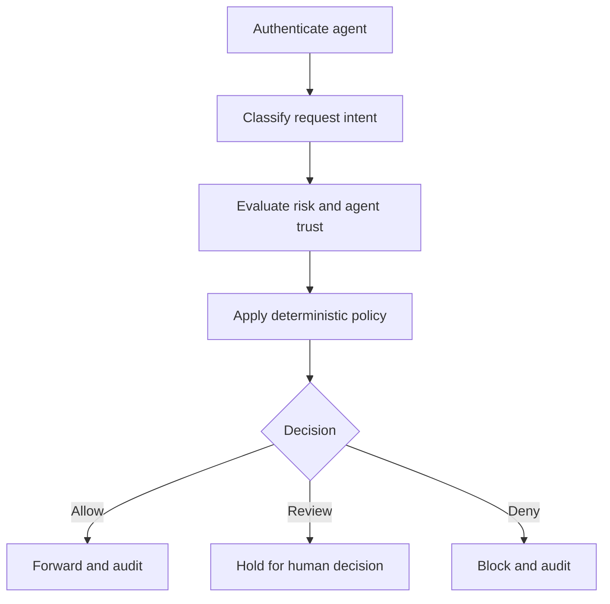

An AI agent presents a valid JWT and asks a billing API to issue a refund. The token is correctly signed, unexpired, and belongs to the expected agent. Is that enough to execute the request?

No—but not because authentication failed.

Authentication did its job: it established a verifiable identity for the caller. The remaining questions are different. Is the refund within the agent's assigned policy? Does the request express the intent the endpoint is meant to serve? Is the action unusually risky for this agent? Has the agent recently produced violations or required repeated human intervention? Should the request be allowed, denied, or held for review?

<!-- truncate -->

This distinction becomes important when software can plan and execute multi-step work. A conventional service identity is often attached to predictable code paths. An autonomous agent may select tools, construct payloads, retry, branch, or reinterpret a goal at runtime. Its identity can remain valid while its current action becomes inappropriate.

Agent governance therefore needs both a stable answer to **who is acting** and changing context about **how this action should be treated now**. In Synentra, agent identity, intent classification, risk scoring, trust scoring, deterministic policy, human-in-the-loop review, and audit records are separate parts of that decision. Keeping those responsibilities separate is the architectural point of this article.

## Outline

1. Identity and trust answer different questions
2. The identity lifecycle of an autonomous agent
3. What a trust score can—and cannot—represent
4. Where trust belongs in the decision pipeline
5. Illustrative policies and scenarios
6. Consistency, caching, and distributed deployment
7. Failure modes, trade-offs, and limitations
8. How Synentra fits with existing gateways and policy engines

## Identity is a security boundary, not a behaviour prediction

Agent identity should be boring in the best possible way. A registered agent receives a unique identity and authenticates with a credential. Synentra supports JWT-based agent authentication, and each request is associated with the agent that initiated it. That identity becomes the durable reference used by policies, rate limits, trust state, and audit events.

The identity layer answers questions such as:

- Which agent sent this request?
- Is the credential valid for that agent?
- Is the agent active, disabled, or quarantined?
- Which owner and policy are associated with it?
- Which audit history belongs to this caller?

It should not attempt to answer whether a particular payload is safe. A valid credential proves possession of the credential under the configured authentication model. It does not prove that the agent's plan is correct, that its tool selection is appropriate, or that a generated request matches the user's authority.

This is the same reason zero-trust designs do not interpret one successful authentication event as permanent authorization. The caller is authenticated, then each requested action is evaluated in context.

For AI agents, that context can include semantic intent and behavioural history in addition to familiar attributes such as method, path, time, and assigned policy.

## A practical agent identity lifecycle

A useful identity design begins before the first proxied request.

### 1. Registration

The agent is registered as its own security principal instead of sharing a generic application identity with every other agent. In Synentra, an agent record includes a unique ID, name, owner, lifecycle status, assigned policy, and trust score. The registration API accepts an agent name, owner identifier, and client secret.

```bash
curl -X POST "http://localhost:7080/agents" \
  -H "Content-Type: application/json" \
  -d '{
    "name": "billing-agent",
    "ownerId": "team-finance",
    "clientSecret": "replace-with-a-strong-secret"
  }'
```

The secret is sensitive and should be handled through the deployment's secret-management process. It is an authentication credential, not a descriptive property of the agent.

### 2. Policy assignment

Identity becomes useful to authorization when the agent is associated with a policy. A billing agent and a documentation agent may call the same gateway, but their permitted actions should not be inferred from their names. The policy assignment is the explicit control.

```bash
curl -X PUT "http://localhost:7080/agents/<agent-id>/policy" \
  -H "Content-Type: application/json" \
  -d '{ "policyName": "billing-policy" }'
```

### 3. Short-lived authentication

The agent obtains a JWT and presents it to Synentra. Short-lived tokens reduce the usefulness of a leaked token, but token lifetime alone does not solve revocation, quarantine, or behavioural risk. Those remain runtime concerns.

### 4. Per-request evaluation

Every request is evaluated using the authenticated agent identity plus request context. Synentra can classify intent locally with ONNX, calculate risk, evaluate policy, and produce an allow, deny, or review outcome.

### 5. Audit and lifecycle action

The decision is recorded with the agent identity. Repeated violations or other configured conditions may contribute to a lower trust posture. Synentra also supports quarantine so an agent can be isolated, and its API includes an operation to lift quarantine after investigation.

This lifecycle matters because an agent is not just a JWT subject. It is a governed principal with ownership, policy, history, state, and an audit trail.

## Trust is a changing signal

Identity should be stable enough to correlate actions. Trust is intentionally dynamic.

Synentra represents agent trust as a score from `0.0` to `1.0`. The product architecture uses behaviour-related information such as policy violations, approval history, and request behaviour to update that posture over time. Low trust can lead to stricter treatment, including increased risk, human review, rate limiting, or quarantine according to configuration and policy.

The score should be interpreted as a compact input to a broader decision—not as a mathematical declaration that an agent is “70% safe.” A value such as `0.70` has meaning only relative to:

- the signals included in the scoring model;
- the update and recovery rules;
- the time window or history considered;
- the policy thresholds applied to it;
- the action being requested; and
- the consequences of a false positive or false negative.

That last point is critical. The same trust score may justify different outcomes for two requests. A low-impact read could remain eligible for automatic execution while a destructive change is sent to review. Trust modifies context; it does not erase the nature of the action.

## Keep identity, intent, risk, trust, and policy separate

These concepts are related, but merging them creates an opaque authorization system.

| Signal | Question answered | Typical characteristics |
|---|---|---|
| Identity | Who is making the request? | Stable, cryptographically authenticated |
| Intent | What is the request trying to accomplish? | Semantic, confidence-bearing |
| Trust | How should this agent's history affect treatment? | Dynamic, agent-specific |
| Risk | How dangerous is this request in its current context? | Request-specific, contextual |
| Policy | What outcome is permitted under explicit rules? | Deterministic and reviewable |

An intent classifier may identify `destructive_delete`, but it should not own the final authorization decision. A risk engine may calculate a high score, but it should not silently redefine the agent's identity. A trust score may decline, but the reason and resulting threshold should remain observable. Policy brings these signals together through rules that security and platform teams can inspect.



This separation creates several advantages:

1. **Auditability:** an operator can see which signal changed the outcome.
2. **Testability:** classification, scoring, and policy can be tested independently.
3. **Failure handling:** low confidence or unavailable dependencies can map to explicit fallback behaviour.
4. **Governance:** deterministic policy remains the place where organisational rules are expressed.

## An illustrative policy boundary

The following Rego fragment is an **illustrative example**, not a claim about a bundled production policy. It demonstrates how intent and trust might enter a deterministic decision without allowing either signal to act alone.

```rego
package agent_governance

default decision := "deny"

decision := "allow" if {
  input.agent.status == "Active"
  input.agent.trustScore >= 0.70
  input.intent.name == "safe_read"
  input.request.method == "GET"
}

decision := "review" if {
  input.agent.status == "Active"
  input.intent.name == "destructive_delete"
  input.agent.trustScore >= 0.50
}
```

The policy expresses three useful ideas:

- an active identity is necessary;
- a benign intent still needs method and trust constraints; and
- a conditionally valid destructive action can be reviewed instead of automatically allowed.

A production policy would also need to define missing attributes, classification confidence, data sensitivity, ownership, environment, and explicit deny conditions. The exact input schema should match the Synentra policy provider and version used in the deployment.

## Three illustrative scenarios

The following scenarios are architectural examples. They are not customer stories or measured production results.

### Scenario A: valid identity, ordinary read

An inventory agent with an active identity requests `GET /v1/products/42`. The intent is classified as `safe_read`; the request matches its assigned policy; risk is low; and the trust score is above the policy threshold.

The policy can allow the request and record the evidence used. Trust contributes to the decision, but the allow outcome also depends on identity, intent, method, path, and policy.

### Scenario B: valid identity, unusual destructive action

The same agent submits `DELETE /v1/products/42`. Its JWT is still valid, but the action differs materially from its normal scope. A `destructive_delete` intent and elevated contextual risk can produce a denial or review even if the agent previously behaved well.

This is why “trusted agent” must never mean “unrestricted agent.” Historical behaviour is not authorization for a new class of action.

### Scenario C: degrading trust after repeated intervention

An operations agent repeatedly produces requests that require human review, and reviewers deny several of them. If approval history is configured as a trust signal, the agent's trust posture may decline. Policy can then apply tighter limits or route more requests to review. At a configured boundary, quarantine can isolate the agent pending investigation.

The engineering challenge is recovery. If trust only decreases, a temporary model or configuration fault can permanently punish the principal. A defensible design needs explicit recovery, operator override, or time-based decay rules—and an audit trail explaining each change.

## Trust and risk should not become the same number

It is tempting to collapse every uncertain signal into one score. That simplifies a dashboard but weakens reasoning.

Trust is primarily about the agent's accumulated posture. Risk is about the current request. An established agent can make a high-risk request; a new or low-trust agent can make a low-impact request. Keeping them separate allows policy to express combinations such as:

- allow low-risk reads for an active agent;
- review high-impact writes when trust is moderate;
- deny prohibited intents regardless of trust;
- apply stricter rate limits to low-trust agents; or
- quarantine an agent when configured behavioural conditions are met.

The policy should also define precedence. A high trust score must not override a hard deny. A low risk score must not reactivate a quarantined identity. A classifier's confidence must not be mistaken for the probability that an action is authorised.

## Distributed consistency and the role of Redis

Trust state and session-related data become operational concerns when more than one gateway instance processes requests.

An in-memory cache is simple for a single instance, but each replica has its own view. If trust, session, policy, or rate-limit data is cached independently, replicas can temporarily make decisions using different state. Redis provides a shared cache provider in Synentra and can reduce that divergence for supported cached data.

That does not make Redis a system of record for every security fact, nor does it remove distributed-systems trade-offs. Architects still need to decide:

- which data is authoritative and which is cached;
- cache time-to-live and invalidation behaviour;
- what happens when Redis is unavailable;
- whether a stale trust value may allow a sensitive action;
- how rate limits behave across replicas; and
- how cache credentials, transport security, persistence, and network access are configured.

For a security-sensitive decision, failure behaviour should be intentional. Failing closed can protect an API but reduce availability. Failing open can preserve availability but accept stale or missing governance state. A third option is degraded mode: permit a narrow set of low-impact operations while denying or reviewing sensitive ones. The appropriate choice depends on the action and threat model.

The companion tutorial, [Using Redis for Session Caching](/blog/using-redis-for-session-caching), shows the documented Docker configuration for selecting Synentra's Redis cache provider.

## Observability: explain the decision, not just the score

A score without provenance is difficult to operate. Synentra records decision context in its audit trail and exposes structured logs and OpenTelemetry signals. For identity and trust, useful operational questions include:

- Which agent made the request?
- What was its lifecycle status and assigned policy?
- What trust value was used for the decision?
- Which intent and confidence were produced?
- Which risk factors contributed?
- Which policy rule produced allow, deny, or review?
- Did a human approve or deny the held request?
- Did the agent's trust posture change afterward?

Not every signal should become a high-cardinality metric label. Agent IDs and request IDs are often better suited to traces and logs than global metric dimensions. Metrics can track aggregate decision counts and latency, while traces and audit records carry per-request detail.

## Trade-offs and limitations

Trust scoring adds useful context, but it also introduces design risk.

### Cold start

A new agent has little or no behavioural history. Assigning high trust by default creates exposure; assigning low trust can make onboarding unusable. A conservative baseline with narrow policy permissions is usually easier to reason about than trying to solve cold start with the score alone.

### Feedback loops

If review outcomes affect trust and low trust causes more reviews, a feedback loop can trap an agent in a degraded state. Recovery rules and operator visibility are necessary.

### Shared identity

If multiple independent agents share one identity, their histories become indistinguishable. One agent's violations can affect every workload using that credential. Unique identities improve attribution and containment.

### Compromised but historically trusted agents

Good history does not protect against credential theft, prompt injection, a malicious tool response, or a newly introduced bug. Current request intent, risk, and policy must still constrain the action.

### Score gaming and incomplete signals

Any scoring system reflects the evidence it observes. An agent may perform many harmless operations before attempting a damaging one, or harmful behaviour may occur outside the gateway. Trust must remain bounded by explicit authorization.

### Probabilistic inputs

Intent classification and anomaly-related signals can be uncertain. Low confidence needs an explicit outcome such as review or deny; silently converting uncertainty into allow is a policy decision whether or not it is documented.

### Privacy and retention

Behavioural history and request payloads can contain sensitive information. Audit detail, retention, access control, and redaction need to be designed for the organisation's requirements. “Log everything” is not automatically a safe compliance strategy.

## Where Synentra fits with existing infrastructure

Traditional API gateways, reverse proxies, cloud API-management products, and service meshes solve important routing, authentication, throttling, and service-to-service concerns. OPA provides a general-purpose policy engine for fine-grained decisions. Synentra is focused on the agent-to-API governance layer: agent identity, semantic intent, contextual risk, trust posture, deterministic policy, human review, and audit.

These layers can be complementary. An organisation may keep its existing ingress gateway or service mesh and place Synentra on the path used by autonomous agents. OPA can remain the deterministic policy engine while Synentra supplies agent-specific decision context. The architectural question is not “Which tool replaces every other tool?” It is “Where should each security responsibility live, and how are failures handled between layers?”

## Design checklist

Before using trust as an authorization signal, answer these questions:

1. Does every independently governed agent have a unique identity?
2. Who owns each identity and can rotate or revoke its credential?
3. Which events change trust, and are those changes auditable?
4. Can a high trust score ever override an explicit deny? It should not.
5. What is the initial posture for a new agent?
6. How does trust recover after a false positive or temporary failure?
7. What happens when the trust store or cache is unavailable?
8. Which actions are allowed, reviewed, or denied at each threshold?
9. How are classifier confidence and missing context handled?
10. Can operators explain a decision without reverse-engineering one composite score?

Identity and trust are most useful when they remain constrained, observable inputs to policy. Authentication establishes the principal. Trust adds history. Intent describes purpose. Risk describes the current action. Deterministic policy decides how those signals translate into an outcome.