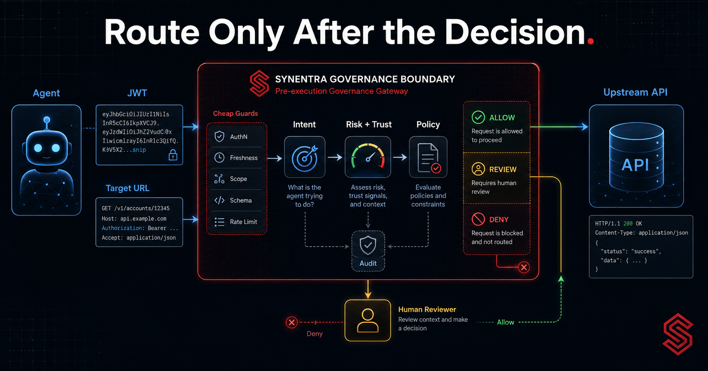
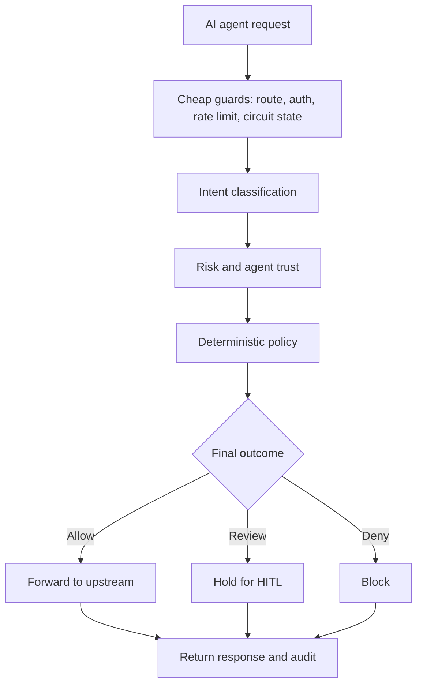

An autonomous agent wants to update a customer record. Its HTTP request looks ordinary:

```http
PATCH /v1/customers/42
Content-Type: application/json

{"creditLimit": 50000}
```

A conventional reverse proxy can terminate TLS, authenticate the caller, apply a rate limit, select an upstream, and forward the request. Those are essential controls. But the proxy still faces an agent-specific question: is this request a routine update, an unauthorized financial change, a confused tool call, or an action that should wait for human approval?

<!-- truncate -->

The HTTP shape alone does not answer that question. `PATCH /v1/customers/42` can represent many intentions depending on the body, the agent, its assigned policy, its recent behaviour, and the surrounding context.

For autonomous software, a reverse proxy can therefore be more than a routing component. It can be the point where identity, semantic intent, contextual risk, agent trust, deterministic policy, human review, and audit converge **before** an action reaches the system of record.

That design is not free. The gateway enters the critical path. It must handle credentials correctly, prevent unsafe routing, preserve HTTP semantics, bound latency and failure, and explain every non-trivial outcome. This article examines those responsibilities using Synentra's reverse-proxy model without pretending that one gateway replaces an organisation's ingress, service mesh, identity provider, or general API-management platform.

---

## A reverse proxy has two planes

It is useful to separate the gateway into a **data plane** and a **decision plane**.

The data plane accepts the HTTP request, reads the target, manages headers and body content, forwards an allowed request, and returns the upstream response. It must be predictable and protocol-correct.

The decision plane evaluates whether forwarding is permitted. For an agent-governance gateway, relevant inputs can include:

- authenticated agent identity and lifecycle state;
- HTTP method, target host, path, query, headers, and body;
- semantic intent and classification confidence;
- request-specific risk;
- the agent's changing trust posture;
- assigned deterministic policy; and
- human-review requirements.

The two planes must meet at one unambiguous boundary: **no upstream connection for a request that has not reached an allow outcome**. A review outcome is not a delayed allow. It is a held request whose execution depends on a separate authorized decision.



Cheap guards belong before expensive semantic work. An invalid token, quarantined agent, exceeded rate limit, malformed target, or open per-host circuit does not need model inference. After those guards, Synentra's current decision order is intent classification, risk and trust evaluation informed by that intent, then deterministic policy. When signals disagree, the final precedence is deny, then human review, then allow.

This ordering keeps optimization separate from authorization. Skipping unnecessary work is safe only when the skipped stage cannot turn the outcome into a stricter decision.

---

## Synentra's proxy contract

Synentra exposes a catch-all proxy route. The full absolute upstream URL is embedded after the `/proxy/` prefix:

```text
<method> http://localhost:7080/proxy/<full-upstream-url>
```

For example:

```bash
curl -X GET \
  "http://localhost:7080/proxy/https://api.example.com/v1/todos/42?include=owner" \
  -H "Synentra-Authorization: Bearer <agent-jwt>"
```

Synentra support for standard HTTP methods including `GET`, `POST`, `PUT`, `PATCH`, `DELETE`, `HEAD`, and `OPTIONS`. Query strings in the target URL are preserved. When an allowed request is forwarded, its method, permitted headers, and body are sent to the upstream service.

Embedding a full target URL makes the agent-side integration direct: one gateway route can govern different upstream APIs without a static route entry for every endpoint. It also creates a serious architectural obligation. A caller-controlled absolute URL is an outbound-routing capability, so policy and network boundaries must constrain where the gateway can connect.

Do not confuse a convenient route format with a safe egress policy.

---

## Identity headers must not leak upstream

The header boundary deserves explicit design.

By default, Synentra's agent JWT is supplied in `Synentra-Authorization`. The configured agent-auth header is consumed by the gateway and excluded from forwarding. `Host` is set from the target URI. Hop-by-hop or transport-managed headers—including `Connection`, `Content-Length`, `Transfer-Encoding`, `Proxy-Connection`, `TE`, `Keep-Alive`, `Upgrade`, and `Trailer`—are also not copied as ordinary end-to-end headers.

That behaviour prevents the upstream API from receiving the gateway credential by accident and lets the HTTP client stack calculate transport details correctly.

---

## The request body is both evidence and payload

For intent-aware governance, the body has two roles:

1. It is evidence used to classify what the request is trying to do.
2. It is the payload that will be sent upstream if allowed.

Those roles create buffering and consistency questions. The decision engine and forwarding path must evaluate and send the same content. Limits are necessary so an agent cannot force unbounded memory or disk use.

---

## Outcome semantics are part of the API

A governed proxy needs more than success and failure. Synentra has the following externally meaningful outcomes:

| Outcome | HTTP behaviour | Meaning |
|---|---|---|
| Allowed | Upstream status and response | The request passed governance and was forwarded |
| Human review | `202 Accepted` with `Location` | The request is held; execution is not yet complete |
| Authentication failure | `401 Unauthorized` | Agent token is missing or invalid |
| Policy or lifecycle block | `403 Forbidden` | Policy denied the request or the agent is not permitted |
| Rate limit | `429 Too Many Requests` | The agent exceeded its configured limit |
| Open upstream circuit | `503 Service Unavailable` | The per-host circuit is open |

The client must not treat `202 Accepted` as a successful upstream mutation. It means the gateway accepted the request into a review workflow. A client can use the `Location` header to check the pending decision according to the HITL API contract.

Likewise, an upstream `404` is different from a gateway `403`. Preserving that distinction improves troubleshooting and prevents clients from retrying denied work as if the resource were merely unavailable.

---

## Rate limits and circuit breakers protect different things

Synentra supports per-agent rate limiting and a per-host circuit breaker.

The rate limiter constrains how much traffic one agent can place on the governance and upstream path. It is an identity-oriented fairness and abuse control.

The circuit breaker responds to upstream failures. When the configured failure threshold is reached for a host, the circuit can open and stop new calls until recovery conditions are met. It protects the upstream and prevents repeated slow failures from consuming gateway resources.

Neither control is an authorization policy. A request under the rate limit can still be prohibited. A healthy upstream can still receive a denied decision. A circuit can be open for a trusted agent.

---

## Three illustrative routing scenarios

The following are architecture examples, not customer stories or measured production results.

### Scenario A: ordinary read through a central gateway

An inventory agent calls:

```text
GET /proxy/https://inventory.internal/v1/items/42
```

The agent JWT is valid. Cheap guards pass. Intent is classified as `safe_read`; contextual risk is low; the active agent's trust posture satisfies policy; and the assigned policy allows the read. The proxy removes its agent-auth header, sets the target host, forwards the request, and records the decision.

### Scenario B: same route shape, different intent

The agent sends:

```text
POST /proxy/https://inventory.internal/v1/items/export
Content-Type: application/json

{"scope":"all","includeSupplierContracts":true}
```

Method and host may be familiar, but the body expresses a broad export. Intent, risk, and policy can produce review or denial instead of forwarding. The proxy route is the same; the governance context is not.

### Scenario C: unhealthy upstream host

Several requests to `billing.internal` fail. The per-host circuit opens. A new request from a valid, high-trust agent is rejected with `503` before an upstream attempt. Authentication and policy may be valid, but reliability state prevents forwarding.

These scenarios illustrate why “routing decision” is overloaded. Selecting the target, authorizing the action, and deciding whether the upstream is currently callable are separate decisions.

---

## Observability without credential leakage

Synentra provides structured logging and OpenTelemetry integration. A useful proxy trace can connect:

- request ID and agent ID;
- canonical target host and path;
- intent and confidence;
- request risk and agent trust;
- policy and final decision;
- HITL request ID when applicable;
- upstream status and duration for allowed requests; and
- circuit-breaker or rate-limit outcome.

Metrics should remain aggregate enough to control cardinality. Host, decision, and status class may be useful dimensions; raw URLs, request IDs, and agent IDs often belong in logs or traces instead.

---

## Deployment patterns

A governed reverse proxy can be placed in several ways:

### Central gateway

Multiple agents send outbound API actions through one Synentra deployment. Policy and audit are centralised, but the gateway becomes a shared dependency and needs careful capacity, isolation, and availability design.

### Per-workload gateway

An agent and gateway are deployed close together. The network path is simple and blast radius can be smaller, but policy distribution and cross-instance audit become more operationally complex.

### Gateway behind existing ingress or service mesh

An existing gateway or mesh continues to handle external ingress, mTLS, traffic management, and general API concerns. Synentra governs the dedicated agent-to-API path. This separation is often clearer than asking one layer to own every responsibility.

---

## Respectful fit with existing infrastructure

NGINX and Envoy are foundational reverse proxies. Kong and Apache APISIX provide broad API-management capabilities and plugin ecosystems. Cloud API gateways integrate closely with their respective platforms. Service meshes such as Istio and Kuma focus on service-to-service traffic, identity, and policy. OPA is a general-purpose policy engine.

Synentra's focus is narrower: governing autonomous agent actions using agent identity, semantic intent, risk and trust, deterministic policy, HITL, and audit before forwarding. It can sit alongside existing infrastructure. OPA can serve as the policy component while another gateway or mesh continues to own ingress and service connectivity.

The right comparison is based on responsibilities, not a universal replacement claim.