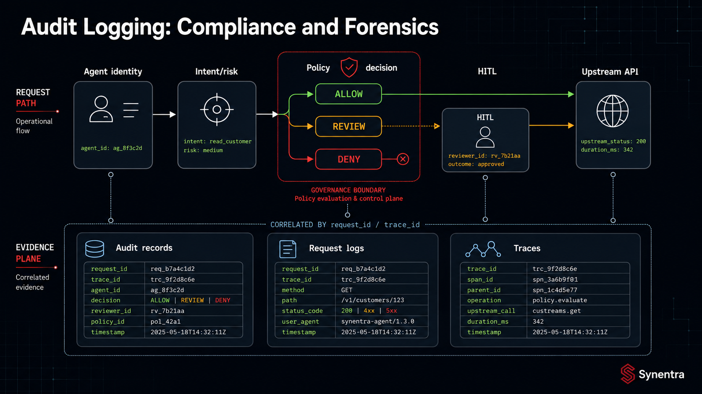
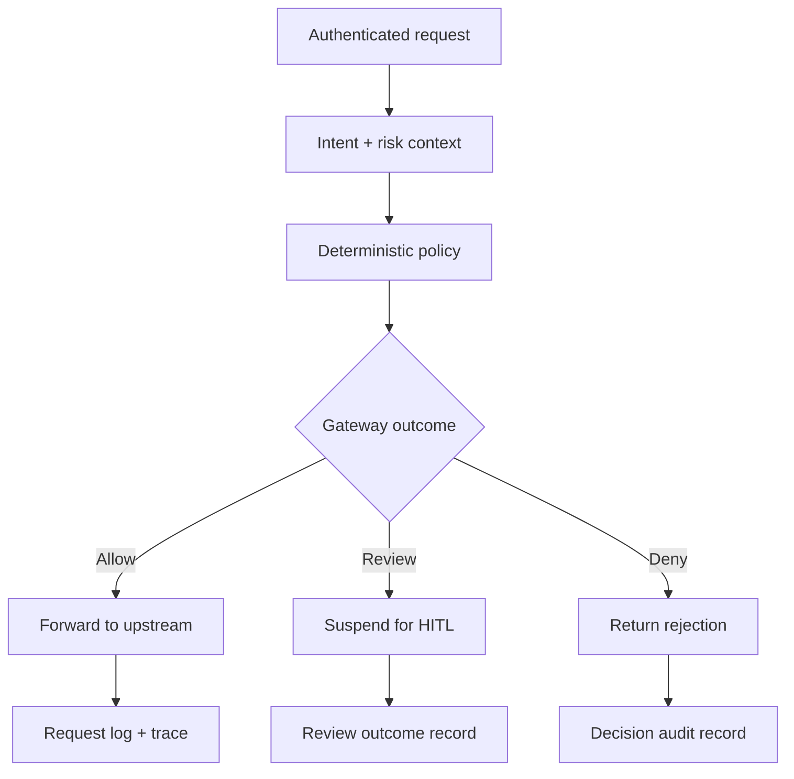

At 02:14 UTC, an autonomous agent sends `DELETE /v1/customers/4821`. The upstream API returns `204 No Content`. At 09:00, an operator asks a simple question: **why was that action allowed?**

An access log can show that a request reached the service. An application log may show that a handler completed. A distributed trace can connect gateway and upstream spans. None of those records necessarily explains which agent acted, what intent was inferred, which policy result applied, what risk was calculated, whether human review occurred, or which final outcome the governance layer selected.

<!-- truncate -->

That gap matters in two different situations:

- During an audit, a team needs evidence that a control operated and that exceptions were reviewed.
- During an incident, responders need to reconstruct a sequence quickly enough to contain harm and understand scope.

Those needs are related, but not identical. Compliance evidence is evaluated against a defined control, scope, retention period, and review process. Forensic evidence must preserve ordering, correlation, context, and credibility. “We log every request” is not a design.

Synentra sits on the request path between an agent and an upstream HTTP API. It associates a request with an agent identity, evaluates intent and risk, applies policy, can hold a request for human review, and records the resulting outcome. This makes the governance gateway a useful evidence boundary—but not a complete compliance program, SIEM, data-retention policy, or proof that every downstream side effect occurred exactly as intended.

The architectural goal is narrower and more defensible: produce decision records that can explain the gateway's behaviour and correlate that behaviour with the rest of the system.

---

## Audit records, operational logs, traces, and metrics

Teams often use “logging” to mean four different things. Keeping them separate prevents both blind spots and unnecessary data collection.

| Signal | Primary question | Typical content | Primary consumer |
|---|---|---|---|
| Decision audit record | Why did the control allow, deny, or hold this action? | Agent, action, intent, risk, policy result, reason, timestamp | Security, governance, incident response |
| Operational log | Is the gateway behaving correctly? | Errors, startup state, retries, dependency failures | Platform engineering, SRE |
| Distributed trace | Where did time and failure occur across services? | Spans, trace IDs, timing, dependency calls | SRE, developers |
| Metric | Is behaviour changing at aggregate scale? | Request rate, latency, decision counts, error rate | SRE, engineering leaders |

The same request may produce all four signals. They should share correlation identifiers, but they do not need identical payloads or retention.

An audit record should be intentionally structured and stable enough to query months later. An operational log can change as implementation details change. A trace is optimised for causal timing. A metric deliberately discards most per-request detail.

Synentra supports decision audit records, structured logging through Serilog, and OpenTelemetry-based observability. Existing API gateways, service meshes, identity providers, application logs, and SIEM platforms remain useful. Synentra's role is to contribute the agent-governance context those systems may not otherwise have—not to replace them.

---

## The questions a decision record should answer

A useful record should let an investigator answer six questions.

### 1. Who acted?

Record the stable agent identifier, not only a mutable display name. If owner, environment, or lifecycle status is relevant, preserve the values used at decision time or retain a reliable way to resolve their historical versions.

Authentication establishes the caller. It does not prove that the action was appropriate. For the identity and trust distinction, see [Deep Dive: Agent Identity and Trust Scores](/blog/agent-identity-and-trust-scores).

### 2. What was requested?

At minimum, capture method and target information with enough precision to distinguish actions. The right level may be host, route template, path, or resource identifier. Query strings and bodies can contain secrets or personal data, so “capture everything” is not automatically the safest choice.

Synentra's audit model associates records with an agent and action/target data. The public project model also exposes decision status, risk, intent, reason, and timestamp. Fields can evolve by version, so an evidence contract should be tested against the deployed build.

### 3. What did the gateway infer?

If semantic classification contributes to the decision, store the inferred intent and, where available, confidence and classification status. A label without its uncertainty can be misleading. A low-confidence classification is materially different from a high-confidence one even when both return the same label.

### 4. Which deterministic control applied?

Record the policy outcome and decision reason. If policy versioning is available in the deployed release, include the version or immutable policy digest. If it is not, store policy artifacts separately with deployment history; do not pretend a mutable policy filename reconstructs historical logic.

### 5. What was the final gateway outcome?

Distinguish at least:

- `Allow`: the gateway permitted forwarding;
- `Deny`: the gateway blocked the request;
- `HITL` or pending review: the gateway suspended execution;
- approved or denied review outcome, when a human decision follows; and
- proxy or upstream failure after an allow decision.

An allow decision is not the same as a successful business transaction. The upstream could reject the request, time out, partially execute it, or accept it asynchronously. Audit language must preserve that distinction.

### 6. Can we correlate the rest of the story?

A request ID and trace ID connect the governance record to gateway logs, traces, upstream records, and incident tickets. Synentra's request logging middleware returns an `X-Request-Id` response header and emits structured request metadata including decision, risk, latency, policy version when present, status code, target URL, decision reason, and error type.

Correlation is more valuable than duplicating every downstream field into the audit table. It also reduces the pressure to retain sensitive payloads in multiple systems.

---

## Where auditing belongs in the pipeline

The audit action should follow the decision closely enough that every terminal outcome has evidence, including requests rejected before forwarding.

The diagram separates three evidence moments:

1. **Decision evidence** explains what Synentra decided before execution.
2. **Review evidence** explains who approved or denied a held action and why.
3. **Execution evidence** explains what happened while forwarding and what response returned.

These moments may use different storage and failure semantics. A synchronous decision audit write provides strong coupling between a decision and its record, but a slow or unavailable database can increase latency or stop traffic. An asynchronous write reduces request-path cost, but introduces queues, delayed durability, duplicate handling, and the possibility that the process fails before the event is persisted.

There is no universal answer. A team must decide whether an audit-storage failure should fail closed, fail open with an emergency alert, or route the event to a durable fallback. That choice belongs in the control design, not in an undocumented exception handler.

---

## Compliance evidence is not automatic compliance

Audit records can support controls such as:

- identifying which agent initiated an action;
- demonstrating that defined actions were denied or held for review;
- recording reviewer decisions;
- investigating policy exceptions;
- producing samples for periodic control testing; and
- proving that monitoring and escalation workflows operated.

They do not, by themselves, establish SOC 2, HIPAA, GDPR, or any other certification or legal conclusion. Compliance depends on the organisation's scope, policies, access controls, retention, risk assessment, training, vendor management, operational evidence, and independent evaluation.

A defensible control statement is specific:

> High-risk agent requests are evaluated by the governance gateway. Requests that match the review policy are suspended before forwarding, and the decision and subsequent reviewer outcome are retained for the defined evidence period.

That statement can be tested. “Synentra makes the system compliant” cannot.

The evidence pipeline also needs ownership. Someone must review failures, approve retention rules, control access, test retrieval, and verify that the deployed schema still contains the required fields. A database full of unreviewed records is storage, not governance.

---

## Illustrative forensic scenarios

The following scenarios are examples, not customer stories or measured production results.

### Scenario A: an allowed destructive action

An agent deletes a record and the upstream confirms success. Responders need to correlate:

1. the authenticated agent identity;
2. the exact gateway request and timestamp;
3. inferred intent and risk;
4. the applied policy result and reason;
5. the forwarding attempt and upstream response; and
6. the upstream application's own business audit record.

If the gateway record says `Allow` but the upstream has no matching request, the investigation changes direction: proxy failure, cancellation, or correlation loss may be involved. If both records exist but the policy artifact changed later, immutable policy history becomes essential.

### Scenario B: a held request approved by a human

The first record should show that the request was not forwarded and entered a pending state. A later record should identify the review outcome and reason. A third execution record may show replay after approval.

Collapsing those into one mutable row can destroy sequence. Append-oriented events usually preserve the investigation better: requested → held → approved → replayed → upstream result.

### Scenario C: a denied request followed by retries

Five denied attempts may indicate a confused agent, a stale plan, malicious automation, or a client that retries every non-2xx response. The audit trail establishes repeated decisions. Metrics reveal the pattern at scale. Operational logs may show token or dependency failures. Agent history and trust state provide additional context.

No single signal explains motive. Forensics is a reconstruction discipline, not label matching.

---

## Privacy, payloads, and minimization

Audit completeness and data minimization pull in opposite directions.

Full payloads can contain access tokens, session cookies, customer data, health information, prompts, tool arguments, or credentials embedded by mistake. Retaining them broadens breach impact and may create new regulatory scope.

A practical capture policy classifies fields:

| Data class | Default treatment | Example |
|---|---|---|
| Correlation | Retain | Request ID, trace ID, timestamp |
| Decision | Retain | Outcome, reason, policy result |
| Identity | Retain with access control | Agent ID, reviewer ID |
| Routing | Retain selectively | Method, route template, target host |
| Sensitive payload | Redact, hash, encrypt, or omit | Tokens, PII, free-form body |
| Debug-only detail | Short retention | Stack trace, dependency message |

Redaction should occur before data reaches broad sinks. Redacting only in the dashboard leaves sensitive values in the database, backup, and replication stream.

---

## How Synentra fits

Synentra contributes governance-specific evidence at the point where agent actions are evaluated. Its architecture combines registered agent identity, local semantic intent classification, risk and trust context, deterministic policy, optional human review, reverse proxying, audit records, Serilog structured logs, and OpenTelemetry observability.

That does not eliminate surrounding controls. Identity-provider events explain credential issuance. Infrastructure logs explain deployment changes. Upstream business audit records explain domain effects. SIEM or data-platform tools provide cross-system search and alerting. Database can provide queryable retention for selected records when operated with appropriate access, backup, and lifecycle controls.

The most credible design assigns each system a clear evidence responsibility and connects them with stable identifiers.