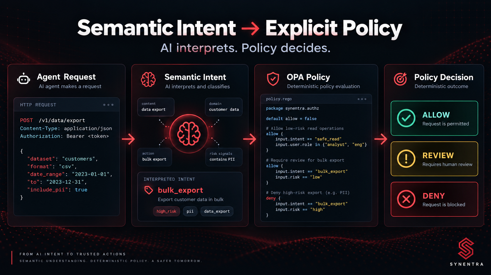
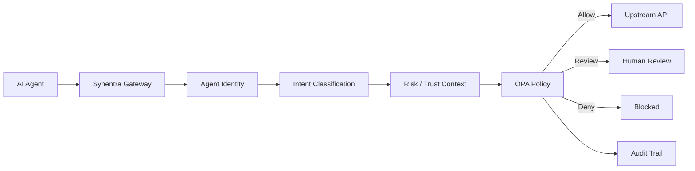

An AI agent sends this request:

```http
POST /v1/customers/1287/refunds
Authorization: Bearer eyJ...
Content-Type: application/json

{
  "amount": 1200,
  "reason": "Customer reported duplicate charge"
}
```

<!-- truncate -->

Traditional authorization can answer useful questions:

- Is the caller authenticated?
- Which identity made the request?
- Does that identity have permission to call this endpoint?
- Is the request rate-limited?
- Does a role or scope permit `POST /refunds`?

Those checks are necessary.

But autonomous agents introduce another question:

> What is the agent actually trying to accomplish?

The same endpoint may be involved in very different workflows. A request could be part of an ordinary customer-support task, an automated bulk operation, an unexpected escalation, or a destructive workflow.

That does not mean an AI model should make the final authorization decision.

A stronger architecture separates two concerns:

1. **Semantic interpretation** estimates what a request means.
2. **Policy enforcement** decides what to do with that information.

This distinction is where Open Policy Agent, or OPA, becomes particularly useful.

Synentra is designed around this separation. Requests from agents pass through a governance gateway where agent identity, semantic intent, contextual information, risk, and trust can contribute to policy evaluation. OPA provides a deterministic policy layer for expressing the resulting governance rules.

The important architectural idea is not "let AI authorize requests."

It is:

> Allow semantic analysis to produce evidence, then let explicit policy decide how that evidence may influence execution.

---

## Authentication Is Necessary, but It Is Not the Whole Decision

Suppose an agent has successfully authenticated.

Its JWT is valid.

Its token has not expired.

Its identity is known.

That establishes **who** is making the request.

It does not automatically establish whether every action performed by that identity should be executed.

Consider an enterprise assistant that normally reads customer records.

The agent might legitimately need:

```text
GET /customers/1287
```

Later, the same agent could attempt:

```text
DELETE /customers/1287
```

An identity-centric policy might say:

```text
agent = customer-support-agent
role  = customer-support
```

But the difference between reading and deleting is significant.

Adding endpoint permissions helps:

```text
customer-support -> GET /customers/*
```

That is better, but autonomous systems can still generate requests whose meaning depends on more than the method and route.

Semantic classification provides another signal.

Instead of evaluating only:

```text
identity + route + method
```

the policy decision can conceptually consider:

```text
identity
+ intent
+ trust
+ risk
+ request context
```

The policy engine still remains responsible for the final rule.

---

## What Semantic Policy Enforcement Means

Semantic policy enforcement is the use of interpreted request meaning as an input to an explicit policy decision.

A simplified model looks like this:

```text
Request
   │
   ▼
Agent identity
   │
   ▼
Intent classification
   │
   ▼
Risk / trust / context
   │
   ▼
OPA policy evaluation
   │
   ├── Allow
   ├── Review
   └── Deny
```

The classifier and the policy engine have very different responsibilities.

### The classifier answers

> What does this request appear to represent?

For example, an illustrative classifier might produce:

```json
{
  "intent": "destructive_action",
  "confidence": 0.91
}
```

The label above is an example, not a statement about Synentra's built-in label set.

### The policy engine answers

> Given this intent, identity, trust level, risk, and context, what action is permitted?

For example:

```text
IF intent is destructive_action
AND trust is below required threshold
THEN require human review
```

The policy remains visible and inspectable.

That separation matters.

---

## Why OPA Fits This Architecture

OPA is a general-purpose policy engine.

Policies are expressed in Rego and evaluated against structured input. The decision logic can therefore remain independent from the application code producing the inputs.

For agent governance, that creates a useful boundary:

```text
Application / gateway
      │
      │ structured decision context
      ▼
     OPA
      │
      │ deterministic policy result
      ▼
Governance decision
```

The gateway can evolve how it determines intent, trust, or risk without requiring every authorization rule to be rewritten inside application code.

Likewise, security teams can reason about rules without embedding those rules throughout request handlers.

This is particularly useful when semantic information is involved because it prevents the classifier itself from becoming the policy.

---

## A Conceptual Synentra Decision Path

Synentra acts as a reverse proxy for agent-to-API requests and combines agent identity, local intent classification, policy evaluation, trust/risk information, auditability, and human-in-the-loop controls.

A useful conceptual model is:



This diagram explains the architectural roles rather than prescribing the exact internal implementation sequence of every Synentra deployment.

The important property is that semantic analysis produces decision context while policy enforcement remains explicit.

---

## Building the Policy Input

OPA evaluates structured data.

For illustration, imagine Synentra supplied this policy input:

```json
{
  "agent": {
    "id": "support-agent-17",
    "authenticated": true,
    "trust_score": 0.82
  },
  "request": {
    "method": "POST",
    "path": "/v1/customers/1287/refunds"
  },
  "semantic": {
    "intent": "financial_write",
    "confidence": 0.94
  },
  "risk_score": 0.38
}
```

**Important:** this JSON shape is illustrative. The strategy documents establish that Synentra policy decisions can use intent, agent trust, contextual information, and risk signals, but they do not specify this exact runtime OPA input contract.

The distinction is important because policies should depend on a deliberate, stable contract rather than accidentally coupling themselves to internal application objects.

---

## A First Intent-Aware Rego Policy

Consider the following illustrative policy:

```rego
package synentra

import rego.v1

default decision := {
    "action": "deny",
    "reason": "No policy rule matched"
}

decision := {
    "action": "allow",
    "reason": "Low-risk read operation from trusted agent"
} if {
    input.intent.label == "safe_read"
    input.agent.trustscore >= 0.70
    input.risk.score < 0.50
}

decision := {
    "action": "review",
    "reason": "Sensitive write requires human review"
} if {
    input.intent.label == "sensitive_write"
    input.risk.score < 0.80
}

decision := {
    "action": "review",
    "reason": "Destructive operation requires human review"
} if {
    input.intent.label == "destructive_action"
}
```

Again, the intent labels are illustrative.

Notice what this policy does **not** do.

It does not ask OPA to understand natural language.

It assumes interpretation has already happened.

OPA receives structured evidence and applies explicit rules.

That is a cleaner separation of responsibilities.

---

## Why Intent Should Usually Be One Signal, Not the Entire Policy

A tempting rule would be:

```rego
allow if {
    input.intent.label == "safe_read"
}
```

That is simple, but it gives semantic classification too much authority.

Intent classification is probabilistic.

Authorization should acknowledge that uncertainty.

A stronger rule might combine:

```text
authenticated identity
AND intended operation
AND trust threshold
AND acceptable risk
AND request constraints
```

For example:

```rego
decision := {
    "action": "allow",
    "reason": "Trusted low-risk read"
} if {
    input.intent.label == "safe_read"
    input.intent.confidence >= 0.80
    input.agent.trustscore >= 0.70
    input.risk.score < 0.40
    input.request.method == "GET"
}
```

Now several independent signals agree.

The policy says, effectively:

> I will treat this request as a safe read only when its semantic interpretation, HTTP behavior, identity state, and contextual signals are consistent.

That is considerably stronger than:

> The classifier said "safe," therefore execute it.

---

## Semantic Intent as an Authorization Constraint

Intent can also narrow existing permissions.

Imagine an agent has API-level permission to invoke:

```text
POST /v1/orders/*
```

That does not necessarily mean every operation reachable through those endpoints should be equally trusted.

A policy could require:

```rego
decision := {
    "action": "allow",
    "reason": "Permitted order update"
} if {
    input.request.method == "POST"
    input.intent.label == "order_update"
    input.agent.trustscore >= 0.75
    input.risk.score < 0.50
}
```

The semantic signal is not replacing authorization.

It is reducing the circumstances under which an existing permission is sufficient.

That distinction is useful when explaining intent-aware governance to security teams.

---

## Handling High-Impact Actions

Some operations should not become fully autonomous merely because the classifier is confident.

For example:

```text
delete account
revoke credentials
approve large payment
change security configuration
export sensitive data
```

A policy can treat the semantic class itself as a reason to introduce human oversight.

Illustrative example:

```rego
decision := {
    "action": "review",
    "reason": "High-impact operation requires approval"
} if {
    input.intent.label == "destructive_action"
}
```

This maps naturally to Synentra's human-in-the-loop capability: suspicious or high-risk operations can be paused and escalated instead of immediately executed.

The interesting architectural property is that "review" can be treated as a real governance result rather than forcing every decision into a binary allow/deny model.

---

## Three-Valued Decisions: Allow, Review, Deny

Traditional authorization often looks like this:

```text
allow | deny
```

Agent governance benefits from another state:

```text
allow | review | deny
```

Why?

Because uncertainty is normal.

A request may be:

- technically permitted,
- semantically plausible,
- but sufficiently risky that automatic execution is inappropriate.

For example:

```rego
decision := {
    "action": "review",
    "reason": "Authenticated request has elevated risk"
} if {
    input.riskscore >= 0.60
    input.riskscore < 0.85
}
```

A stronger threshold could deny automatically.

This gives architects a useful design vocabulary:

```text
low uncertainty + low impact  -> automate
moderate uncertainty/impact   -> review
unacceptable conditions       -> deny
```

The exact thresholds are domain decisions, not universal constants.

---

## What Happens When Confidence Is Low?

This is one of the most important questions in semantic authorization.

Suppose the classifier produces:

```json
{
  "intent": "safe_read",
  "confidence": 0.51
}
```

Should the policy act as though `safe_read` is certain?

Probably not.

Several strategies are possible.

### Strategy 1: Fail closed

Low confidence means deny.

This minimizes execution under uncertainty but can reduce availability.

### Strategy 2: Escalate

Low confidence means human review.

This can work well for high-impact actions but adds operational cost.

### Strategy 3: Fall back to non-semantic policy

Ignore intent and rely on traditional route-, method-, identity-, and scope-based rules.

This can preserve availability while reducing semantic influence.

### Strategy 4: Use confidence tiers

For example:

```text
confidence >= 0.90 -> intent can contribute strongly
0.70–0.90          -> additional constraints
< 0.70             -> review or fallback
```

Those numbers are illustrative, not Synentra defaults.

The broader principle is more important:

> Classification uncertainty must be visible to policy design.

Hiding uncertainty turns a probabilistic prediction into a misleading binary fact.

---

## Combining Intent and Trust

Trust scores introduce another useful dimension.

Two authenticated agents could attempt the same operation while receiving different governance outcomes.

Conceptually:

```text
Agent A
trust = high
intent = safe read
risk = low
→ allow

Agent B
trust = low
intent = safe read
risk = elevated
→ review
```

That does not mean trust should become an unrestricted bypass.

A good policy normally constrains rather than exempts.

For example:

```rego
decision := {
    "action": "allow",
    "reason": "Trusted agent performing low-risk operation"
} if {
    input.intent.label == "safe_read"
    input.agent.trustscore >= 0.80
    input.risk.score < 0.40
}
```

The agent still has to satisfy the intent and risk conditions.

---

## Auditability Is Part of the Design

Semantic governance should be explainable after execution.

If a request was allowed, reviewed, or denied, operators should be able to reconstruct the decision context.

Useful evidence includes:

```text
agent identity
request context
classified intent
classification confidence
risk information
trust information
policy result
decision reason
```

Synentra includes audit trails specifically so governance decisions can be investigated rather than disappearing inside application logic.

This becomes particularly important with semantic inputs.

A useful forensic question is:

> Did the policy make the wrong decision, or did the policy receive the wrong semantic interpretation?

Those are different failure modes.

Without preserving the relevant decision context, they can be difficult to distinguish.

For more background, see this article on [Audit Logging: Compliance and Forensics](/blog/audit-logging-compliance-forensics).

---

## Policy Should Remain Understandable

Semantic context makes policies more powerful, but it can also make them unnecessarily complicated.

Consider a policy depending on:

```text
intent
confidence
trust
risk
time
location
route
method
agent history
tenant
resource classification
```

Such a rule may technically be expressive while becoming difficult to review.

A useful design rule is:

> Use the minimum number of signals required to explain the governance decision.

If a destructive operation always requires human approval, write that directly.

Do not bury it inside a 25-condition rule.

Explicit rules are easier to review, test, and audit.

---

## Policy Evolution Without Application Rewrites

One advantage of separating application behavior from policy is organizational.

Suppose an initial requirement says:

```text
trusted agents may perform safe reads
```

Later, security adds:

```text
except when risk exceeds threshold
```

Later still:

```text
and sensitive environments require review
```

If these rules are hard-coded across request handlers, governance quickly becomes difficult to reason about.

A policy layer creates a more visible decision surface.

The application still generates the necessary inputs, but policy owns the authorization logic.

This is one reason OPA complements gateways rather than replacing them.

Traditional gateways, service meshes, identity providers, and OPA solve different parts of the problem. Synentra's role is to bring AI-agent-specific decision context—especially semantic intent—into that governance path.

---

## Trade-Offs

Intent-aware policy enforcement introduces useful capabilities, but it also introduces new failure modes.

### 1. Classification is probabilistic

A classifier can be wrong.

Policies must therefore decide how much authority semantic predictions deserve.

### 2. More inputs create more complexity

Identity + intent + trust + risk + context can produce highly expressive policies.

They can also produce policies nobody understands six months later.

### 3. Human review adds latency

Escalation is safer for some operations, but it reduces autonomy.

Use it where the consequence justifies the interruption.

### 4. Policy contracts must be stable

If the structured input supplied to OPA changes frequently, policies become fragile.

Treat the policy input as an interface.

### 5. Semantic labels require governance too

Changing intent labels can change authorization behavior.

Classifier lifecycle and policy lifecycle cannot be treated as completely independent.

### 6. Policy engines do not replace upstream security

OPA-based semantic decisions complement authentication, API authorization, network controls, rate limiting, and other security layers.

They do not make those layers unnecessary.

---

## Where Synentra Fits

Synentra is an open-source governance gateway for autonomous AI agents.

Its role is not to replace every component already protecting enterprise APIs.

Instead, it adds an agent-aware governance layer around API interactions:

```text
AI Agent
   ↓
Synentra
   ├── identity
   ├── semantic intent
   ├── risk / trust
   ├── policy
   ├── human review
   └── audit
   ↓
Enterprise API
```

OPA provides the policy mechanism for expressing how those signals should affect execution.

This lets semantic understanding participate in authorization without making the semantic model the authorization authority.

That distinction is fundamental.

---

## Conclusion

Autonomous agents complicate authorization because identity alone cannot always describe what an agent is attempting to do.

Semantic intent provides another signal.

But semantic classification should not silently become the authorization system.

A safer architecture keeps interpretation and enforcement separate:

```text
request
→ semantic evidence
→ explicit policy
→ allow / review / deny
```

OPA provides a practical policy boundary for that architecture.

It lets architects express rules using identity, intent, trust, risk, and contextual information while keeping the final decision inspectable.

The interesting engineering question is therefore not simply:

> Can we classify agent intent?

It is:

> How much authority should that classification receive inside a deterministic governance decision?

That is ultimately a policy question.