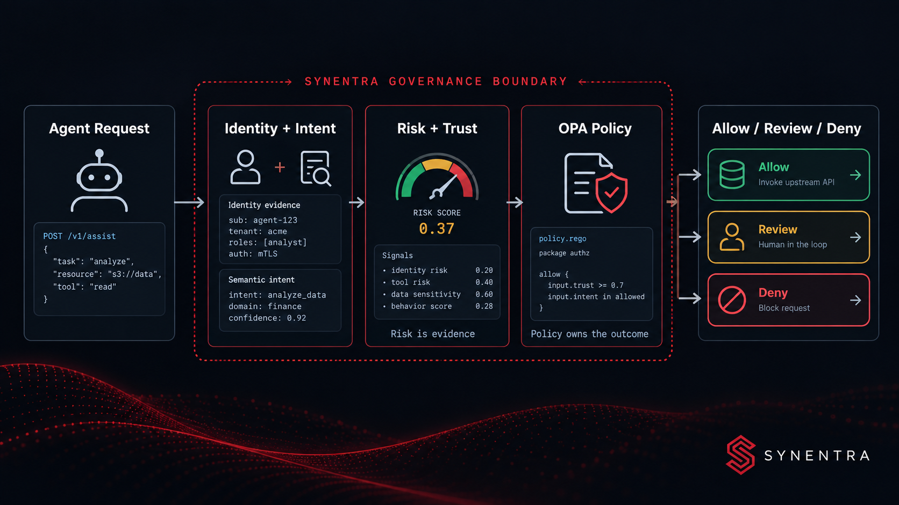
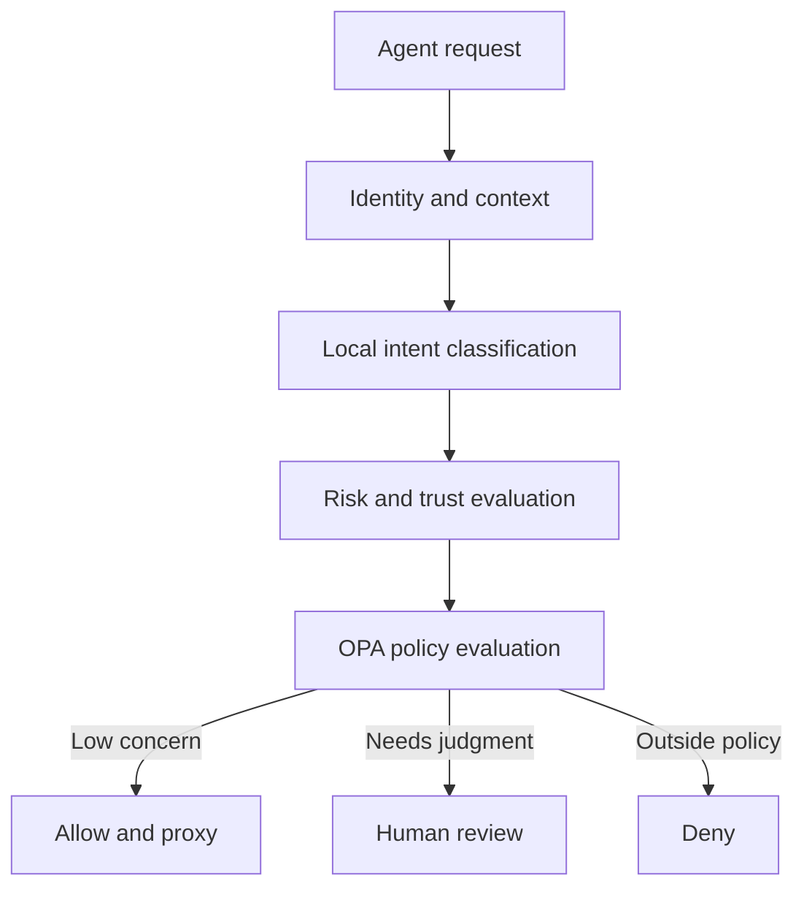

An AI agent presents a valid JWT and asks an internal finance API to create a payment. The identity is authentic. The token is unexpired. The route is permitted by the agent's role.

Should the request execute?

<!-- truncate -->

For a conventional API call, identity and static authorization may be enough. For an autonomous agent, they may be only the beginning. The request could be a normal step in an approved workflow, or it could be the first unusual action after a prompt injection, a faulty plan, compromised credentials, or an unexpected change in operating context.

The request itself contains information that a role check does not capture:

- what the agent appears to be trying to do;
- whether that intent is routine or high impact;
- whether the behavior is consistent with the agent's history;
- whether recent policy violations have reduced confidence in the agent;
- whether external context raises the cost of being wrong.

Real-time risk scoring is a way to assemble those signals before execution. It does **not** prove that a request is malicious or safe. It gives the policy layer a bounded, explainable input that can help choose among outcomes such as allow, require human review, or deny.

That distinction matters. A score can inform authorization. It should not quietly replace authorization.

---

## What a risk score represents

A risk score is a compact representation of evidence available at decision time. A typical system normalizes several signals into a common range and combines them into a score. Conceptually:

```text
risk = f(intent, trust, behavior, policy history, external context)
```

The function may be a weighted model, a ruleset, or a combination of both. The exact formula is less important than the contract around it:

1. Every input has a defined meaning.
2. Missing inputs have explicit behavior.
3. The result is bounded and versioned.
4. The contributing signals are recorded.
5. Policy—not the scoring component—chooses the final action.

In Synentra, the governance gateway intercepts agent requests before they reach an upstream API. It authenticates the agent, classifies request intent locally with ONNX Runtime and DistilBERT, evaluates risk and agent trust, and supplies that context to policy evaluation. Requests that require oversight can enter a human-in-the-loop workflow. The resulting decision and its context are written to the audit trail.



Risk scoring therefore sits between observation and enforcement. It summarizes evidence; OPA policy applies organizational rules to that evidence.

---

## Why identity alone is incomplete

Identity answers “who is calling?” Authorization traditionally adds “which resources may this caller access?” Both remain essential. Neither necessarily captures the meaning or situational impact of an agent-generated operation.

Consider one authenticated agent with permission to call a customer-support API:

| Request | Identity | Route permission | Likely impact |
|---|---|---|---|
| Read a public product FAQ | Valid | Allowed | Low |
| Export a customer's full case history | Valid | Allowed | Higher data exposure |
| Delete a case after a complaint | Valid | Allowed | Destructive and difficult to reverse |
| Repeat exports across many customers | Valid | Allowed | Potentially anomalous |

The same identity and broad API permission appear in all four rows. Their intentions, scope, and consequences are different. A governance layer needs enough context to distinguish them without pretending semantic interpretation is infallible.

This is where intent-aware risk scoring helps. The intent classifier can contribute a semantic label and confidence. Agent trust can represent accumulated reputation. Historical behavior and prior policy violations can contribute evidence about deviation or repeated misuse. External signals can capture operational context that is not present in the request body.

---

## Signal design: keep evidence separate

The easiest risk model to build is a single opaque number. It is also the hardest to audit. A more useful design preserves the individual signal values and their reasons.

### 1. Intent and impact

Intent classification describes the apparent purpose of a request. Reading a status record and deleting a customer account should not begin with the same risk posture, even when both calls are syntactically valid.

Intent is probabilistic. Classification confidence should therefore travel with the label. Low confidence is not the same as high risk, but it increases uncertainty. Policy may respond to uncertainty by requesting human review rather than treating a guessed label as fact.

### 2. Agent trust

Trust is a longer-lived view of the agent. Synentra tracks agent reputation over time; low-trust agents can be constrained or sent for human approval. Trust and request risk should remain distinct:

- **Trust** asks how much confidence the system currently has in the agent.
- **Risk** asks how concerning this specific operation is in this context.

A trusted agent can make a high-impact request. A new or low-trust agent can make a harmless request. Collapsing both concepts too early removes useful policy choices.

### 3. Historical behavior

Behavioral context can identify deviation from an established pattern. Useful questions include:

- Is this operation common for this agent?
- Is the request frequency unusual?
- Has the agent recently accumulated policy violations?
- Is the requested scope larger than its previous operations?

Anomaly is evidence, not guilt. A newly deployed workflow will naturally look unusual. A robust design prevents novelty from becoming an automatic denial.

### 4. Policy-violation history

Repeated denied or escalated actions may justify a different posture for later requests. However, the system must distinguish an agent probing forbidden actions from an agent repeatedly hitting a misconfigured policy. The audit record should let operators investigate that difference.

### 5. External signals

Risk can depend on context outside the request: an incident state, a sensitive operational window, a fraud indicator, or a data-classification lookup. External dependencies introduce their own failure modes. A timeout must never silently become a low-risk value.

---

## A transparent scoring model

A simple weighted model is often easier to operate than a more sophisticated model whose behavior nobody can explain. The following is an **illustrative model**, not Synentra's documented production formula:

```text
score =
    intent_impact      × w1 +
    trust_deficit      × w2 +
    behavior_anomaly   × w3 +
    violation_history  × w4 +
    external_context   × w5
```

Each input is normalized to `0.0–1.0`, and the weights sum to `1.0`. The output is bounded to the same range. The calculation should also return explanations:

```json
{
  "score": 0.71,
  "modelVersion": "risk-model-example-v1",
  "signals": [
    { "name": "intentImpact", "value": 0.90, "reason": "high-impact operation" },
    { "name": "trustDeficit", "value": 0.20, "reason": "established agent" },
    { "name": "behaviorAnomaly", "value": 0.80, "reason": "unusual operation pattern" }
  ]
}
```

This payload is also illustrative; deployments should use their actual Synentra schema. The important pattern is that the score never travels alone. Model version, inputs, and human-readable reasons make a decision reproducible.

---

## Policy owns the outcome

Risk thresholds are policy decisions. Different operations can tolerate different uncertainty. A low-risk health check and a bulk export should not share one universal boundary.

An OPA policy can combine the risk result with intent, trust, and classifier confidence. The following Rego is a conceptual example and must be adapted to the input schema used by the deployment:

```rego
package agent.governance

default decision := "deny"

decision := "review" if {
  input.intent.confidence < 0.70
}

decision := "review" if {
  input.risk.score >= 0.60
  input.risk.score < 0.85
}

decision := "allow" if {
  input.risk.score < 0.60
  input.agent.trust >= 0.70
  input.intent.confidence >= 0.70
}
```

This example deliberately avoids a rule that automatically denies every high score. A real policy might deny some combinations and review others based on intent, resource sensitivity, reversibility, and organizational requirements.

The separation produces several benefits:

- security teams can inspect and test policy independently;
- risk engineers can evolve signals without hard-coding business outcomes;
- the same score can lead to different actions for different resources;
- audit records can show both the evidence and the rule that produced the outcome.

---

## Three illustrative scenarios

These scenarios are examples, not customer stories or measured production results.

### Scenario A: routine knowledge retrieval

An internal research agent reads a document it accesses frequently. The classified intent is low impact, the confidence is high, the agent has established trust, and the behavior matches its history.

The risk evaluator returns a low score with stable-behavior reasons. Policy allows the call, and the reverse proxy routes it upstream. The audit record captures the decision without interrupting the workflow.

### Scenario B: unusual high-impact export

The same agent requests a broad export from a source it rarely queries. Identity is valid, but the intent carries greater data-exposure impact and behavior is unusual.

Policy sends the request to human review. The reviewer sees the agent identity, classified intent, score, contributing signals, and requested operation. The agent is not declared malicious; the system acknowledges that execution deserves human judgment.

### Scenario C: uncertain classification

An agent sends an ambiguous request whose intent confidence is below the accepted threshold. Other signals appear normal.

Treating the top predicted label as certain could authorize the wrong operation. Treating every low-confidence request as malicious would create unnecessary denials. A review path gives the system a safer fallback while producing feedback that may reveal missing labels or poor input quality.

---

## Real-time constraints

“Real time” does not mean “do unlimited analysis synchronously.” Every signal on the critical path consumes latency and adds a dependency.

### Bound the work

Local ONNX inference avoids an external classifier round trip, but it still has a cost. Historical lookups, external signals, policy evaluation, audit logging, and proxy work add more. Each component needs a defined time budget.

### Cache carefully

Stable context such as policy data or slowly changing agent metadata can benefit from caching. Request-specific intent and behavior should not be reused under an overly broad key. A fast stale answer can be more dangerous than a slower correct one.

### Make failures explicit

If a history store or external signal provider is unavailable, the risk engine needs a declared failure posture. Options include:

- require human review;
- use a conservative fallback value;
- deny selected high-impact intents;
- allow low-impact operations under a narrowly defined rule.

The right choice depends on business impact. The wrong choice is to convert “unknown” to “safe” without recording it.

### Keep the audit path useful

Synentra records decisions with request context, intent, risk, and policy outcome. Complete payload logging can help forensics but may also capture sensitive data. Redaction, retention, and access control need deliberate design. Auditability is not permission to retain everything forever.

---

## Trade-offs and limitations

Real-time risk scoring creates leverage, but it also creates new responsibilities.

### Probabilistic input versus deterministic enforcement

Intent classification and anomaly signals can be wrong. OPA policies are explicit, but their decisions are only as appropriate as the inputs and rules they receive. Review paths and confidence-aware policies reduce the cost of uncertainty; they do not eliminate it.

### Explainability versus model complexity

More signals can improve context while making outcomes harder to explain. A smaller, well-defined signal set is often a better starting point than an opaque model with marginally richer inputs.

### Security versus workflow friction

Aggressive review thresholds may look safer but can create approval fatigue. When reviewers routinely approve everything, the control becomes ceremonial. Track the volume and reasons for reviews, then refine policies by intent and impact.

### History versus privacy

Behavioral scoring needs history. History increases retention and access-control obligations. Store the minimum useful evidence, separate derived features from raw payloads where practical, and define deletion rules.

### Customization versus consistency

Different teams may need different risk signals. Unrestricted customization can make scores incomparable and audits confusing. A plugin or extension contract should require bounded outputs, timeouts, version identifiers, reason codes, and deterministic failure behavior.

---

## Where Synentra fits

Traditional gateways such as Kong, APISIX, NGINX, Envoy, and cloud API-management services solve important routing, authentication, throttling, and operational problems. OPA solves policy evaluation. Service meshes such as Istio and Kuma govern service-to-service communication.

Synentra focuses on the agent-to-API decision: it adds local semantic intent classification, risk and trust context, OPA-backed policy enforcement, human review, audit trails, and reverse-proxy execution. These layers can be complementary. An organization can keep its existing gateway or service mesh and use an intent-aware governance layer where autonomous agent actions require more context.

The architectural principle is broader than any one tool:

> Authenticate the caller, interpret the operation, evaluate evidence, apply explicit policy, and route only after the decision.

Risk scoring is useful when it makes uncertainty visible and controllable. It becomes dangerous when a number hides the assumptions behind it.