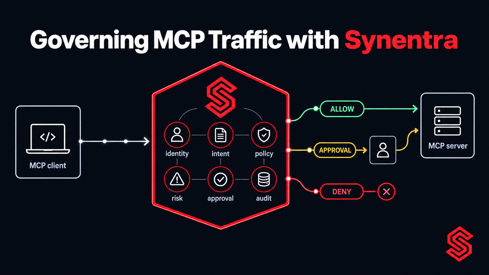
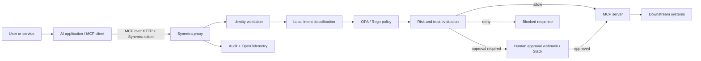

Model Context Protocol (MCP) gives AI applications a standard way to discover context and invoke capabilities. That interoperability is useful—and it sharpens an old security question: **what should happen between an agent deciding to use a tool and the tool actually running?**

An MCP server can expose tools that read data, change records, trigger workflows, or call downstream services. Authentication can establish which client is connecting. It does not, by itself, decide whether a particular action is appropriate for that identity, purpose, resource, and moment.

<!-- truncate -->

This article develops a practical control-plane architecture for HTTP-based MCP servers. Synentra sits on the request path as an authorization and governance reverse proxy. It authenticates an agent token, evaluates request context and inferred intent, applies policy and risk controls, can pause selected actions for human approval, and records the decision. The MCP server remains responsible for implementing MCP and for securing its own downstream credentials.

That boundary matters. Synentra is not presented here as an MCP protocol parser or a replacement for the MCP server's authentication and validation. The integration uses a capability Synentra already provides: governing HTTP API calls through its proxy.

---

## MCP changes the shape of the trust boundary

In a conventional application, developers usually know which UI action leads to which API call. With an agent, the path is more dynamic:

1. A user gives the AI application a goal.
2. The model chooses among available tools.
3. The MCP client sends a request to a server.
4. The server executes code or delegates to another API.

The protocol standardizes the exchange; it does not make every exposed operation equally safe. A read-only lookup and a destructive administrative action can both appear as tools. The official MCP documentation describes tools as model-controlled capabilities and encourages visible approvals and activity logging where appropriate. Its security guidance also warns that session identifiers are not authentication and that token passthrough is forbidden.

Those points imply several independent questions:

- Who is the agent or workload?
- Which upstream user or service initiated the task?
- What is the request trying to accomplish?
- Which MCP endpoint and downstream resource are involved?
- How risky is the action in the current context?
- Should it run now, be denied, or wait for a human?
- Can an operator reconstruct the decision later?

Treating these as one “is authenticated” check compresses distinct security decisions into a single bit.

---

## A layered architecture

For a remote MCP server using Streamable HTTP, the governed path can look like this:



The important design choice is the location of the policy enforcement point. If clients can reach the MCP server directly, the proxy is optional rather than authoritative. Production routing should therefore ensure that governed clients reach the server only through Synentra—for example through private networking, security groups, an ingress policy, or a service mesh rule.

### 1. Identity: authenticate the calling workload

Synentra uses JWT-based agent identity. The client presents its Synentra token in the `Synentra-Authorization` header when calling the proxy. The MCP server may still require its own credentials; do not forward a caller's unrelated access token merely because the next hop accepts one.

This separation avoids confusing three identities:

- the human or service that requested work;
- the agent or MCP client executing it;
- the MCP server's identity toward downstream systems.

In mature deployments, bind those identities through explicit claims and audit metadata. Rotate short-lived tokens, scope them narrowly, and never treat an MCP session identifier as proof of identity.

### 2. Intent: evaluate what the request appears to mean

Method and path are necessary inputs, but agent authorization often needs more context. Two calls to the same endpoint can have different purposes. Synentra can classify request intent locally with its ONNX model and combine that output with deterministic policy.

Intent should be treated as an input, not an oracle. Classification is probabilistic. A robust policy uses it alongside identity, route, method, resource attributes, trust, and risk. High-impact actions should not become safe merely because a model labels them benign.

### 3. Policy: keep hard boundaries deterministic

OPA/Rego policy is appropriate for rules that need to be explicit, reviewable, and testable. An illustrative policy shape might be:

```rego
package synentra.mcp

default allow := false

# Illustrative only: adapt field names to your deployed Synentra policy input.
allow if {
  input.agent.role == "support-reader"
  input.request.method == "POST"
  startswith(input.request.path, "/proxy/")
  input.intent.label == "read_customer_context"
  input.risk.score < 0.4
}

requires_approval if {
  input.intent.label == "modify_customer_record"
}
```

The field names above are intentionally labelled illustrative; use the actual policy input exposed by your Synentra version. The architectural principle is stable: deterministic rules establish the envelope, while inferred intent and risk refine the decision.

### 4. Risk and trust: distinguish possible from appropriate

An agent may be allowed to use an MCP server yet still produce an unusual request. Synentra's risk and trust evaluation can help distinguish routine access from an action that deserves more scrutiny.

Useful signals include the calling identity, requested route, method, classified intent, confidence, and recent trust context. Keep thresholds visible and version-controlled. A score without an operational policy is only a number.

### 5. Human approval: reserve friction for consequential actions

Human-in-the-loop approval is valuable when the cost of a mistaken action is high and the action can tolerate delay. Synentra supports approval flows through webhooks and Slack. Examples might include deleting records, changing permissions, or initiating an external side effect.

Approval is not a universal answer. It creates latency and reviewer load, and reviewers can habituate to noisy prompts. Prefer automatic allow for clearly low-risk actions, automatic deny for known-prohibited actions, and approval for a narrow middle band.

### 6. Audit and telemetry: record the decision path

An MCP server log can tell you which tool ran. A governance log should additionally explain why the request was allowed, denied, or paused. Synentra provides audit logging and OpenTelemetry support so teams can correlate authorization decisions with application and infrastructure traces.

Avoid logging sensitive arguments indiscriminately. Record stable identifiers, policy version, decision, timing, and carefully selected context. Redact secrets and personal data at collection time.

---

## Integrating an HTTP MCP endpoint

Suppose a stateless Streamable HTTP MCP server listens at:

```text
http://mcp-server:3001/mcp
```

Synentra's documented proxy form embeds the full upstream URL in the request path. The conceptual client configuration becomes:

```text
http://localhost:7080/proxy/http://mcp-server:3001/mcp
```

and the client includes:

```http
Synentra-Authorization: Bearer <agent-token>
```

The exact host depends on deployment networking. Inside a shared Docker network, a service name such as `mcp-server` is appropriate. From a container reaching a host process, `host.docker.internal` is common on Docker Desktop; Linux environments may require an explicit host-gateway mapping.

MCP over Streamable HTTP has transport behavior that a generic proxy must preserve. Clients negotiate the protocol, send JSON-RPC requests, and may use response streaming. Stateful servers can issue an `MCP-Session-Id`; clients then send it on subsequent requests. The `MCP-Protocol-Version` header is also used after initialization. These protocol headers are not identity credentials, and an intermediary should not rewrite them into authorization signals.

Start with a stateless MCP server because it reduces routing and recovery complexity. If you need stateful sessions, verify that your topology preserves the session header, supports the required streaming behavior, and routes a session consistently where necessary. Test disconnects, retries, and proxy timeouts—not only the happy path.

---

## A realistic policy scenario

Consider an internal support assistant with two MCP tools:

- `get_case_summary(caseId)` reads a support case;
- `close_case(caseId, reason)` changes its state.

This is an illustrative scenario, not a customer deployment.

Both tools may travel through the same `/mcp` endpoint. A path-only rule therefore cannot distinguish their business impact. At the HTTP layer, Synentra can govern the request using the context it can observe and classify. For precise tool-level controls, design the deployment so the relevant operation is reliably represented in the observable request context, or complement the edge control with authorization inside the MCP server.

A defensible decision matrix is:

| Request class | Identity | Risk | Decision |
|---|---|---:|---|
| Read case context | support-reader | Low | Allow |
| Close a case | support-operator | Medium | Require approval |
| Close a case | support-reader | Any | Deny |
| Unknown or low-confidence intent | Any | Elevated | Deny or review |

This is deliberately fail-closed. Unknown intent does not silently inherit the permissions of the surrounding session.

---

## What Synentra can and cannot see

The main architectural limitation is semantic visibility. Synentra is an HTTP reverse proxy with intent-aware governance; this article does not claim that it natively parses every MCP message or maps MCP tool names to first-class policy attributes.

That has practical consequences:

- A single multiplexed MCP endpoint may hide many tool operations behind one HTTP route.
- Encrypted traffic must terminate where policy can inspect the required context, while preserving end-to-end transport security across trusted hops.
- Streaming and long-running requests need timeout and buffering tests.
- A client that can bypass Synentra can bypass its decisions.
- Authorization at the edge does not remove the need for input validation, rate limits, and least-privilege downstream credentials in the MCP server.

If exact tool arguments determine authorization, enforce that rule in the MCP server or expose a trustworthy attribute that the gateway can evaluate. Defense in depth is preferable to pretending one layer has more information than it does.

---

## Operational rollout

A safe rollout can be incremental:

1. **Inventory endpoints and tools.** Classify reads, writes, destructive actions, and access to sensitive data.
2. **Map identities.** Decide which agent identity represents each workload and how upstream user context is retained.
3. **Start in observation.** Compare expected decisions with audit events before enforcing high-impact rules.
4. **Write narrow policies.** Begin with one MCP server and a small number of intents or routes.
5. **Block bypass paths.** Make the governed route the normal network route.
6. **Test protocol behavior.** Exercise initialization, tool discovery, tool calls, errors, reconnects, and sessions if enabled.
7. **Add approval selectively.** Measure reviewer latency and false-positive burden.
8. **Review logs and traces.** Verify that decisions are explainable without exposing sensitive request data.

Policy tests should cover allow, deny, approval, unknown intent, expired identity, malformed transport headers, and upstream failure. Treat policy changes like application code: review them, test them, and make rollback straightforward.

---

## Alternatives and complements

There is no single mandatory MCP security architecture.

- **Authorization in the MCP server** has the richest tool and argument context. It also couples policy implementation to each server.
- **An API gateway or identity-aware proxy** can provide mature network and authentication controls. Depending on the product, it may not reason about agent intent or risk.
- **Service-mesh policy** can constrain service-to-service communication and identity at the network layer, but usually has limited application semantics.
- **MCP-specific security products and emerging ecosystem controls** may offer protocol-native inspection. Evaluate their supported transport and protocol versions explicitly.

Synentra is best understood as a focused governance layer for agent-originated HTTP calls: local intent classification, deterministic policy, risk and trust, optional human approval, audit, and observability. It can complement controls inside the MCP server rather than replace them.

---

## Design checklist

Before exposing a remote MCP server, verify:

- [ ] Every client has an explicit workload identity.
- [ ] Tokens are audience-bound and are not passed through to unrelated services.
- [ ] Session identifiers are never treated as authentication.
- [ ] The MCP server is not reachable through an unintended bypass route.
- [ ] Low-risk reads, consequential writes, and destructive actions have different policies.
- [ ] Unknown intent and low-confidence classifications have a defined outcome.
- [ ] Approval is limited to actions that justify human latency.
- [ ] Streaming, timeouts, reconnects, and stateful sessions are tested.
- [ ] The MCP server validates inputs and uses least-privilege downstream credentials.
- [ ] Logs explain decisions while redacting secrets and sensitive data.

---

## Conclusion

MCP standardizes connectivity, not trust. The useful security boundary is not simply “can this client connect?” but “should this identified agent perform this action, with this apparent intent and risk, now?”

Putting Synentra in front of an HTTP-based MCP server creates a place to make and record that decision. Keep the claims precise: the proxy governs the HTTP request path; the MCP server still owns protocol semantics, validation, and downstream authorization. With that division of responsibility, teams can add control without redesigning every agent or pretending a gateway understands context it cannot observe.

**Primary CTA:** Follow the hands-on [MCP Integration Tutorial](/docs/tutorials/mcp-integration) to run a minimal MCP server through Synentra and test the governed request path.

---

## References

- [Model Context Protocol: Introduction](https://modelcontextprotocol.io/docs/2026-07-28/getting-started/intro)
- [MCP server concepts](https://modelcontextprotocol.io/docs/2026-07-28/learn/server-concepts)
- [MCP Streamable HTTP transport](https://modelcontextprotocol.io/specification/2026-07-28/basic/transports)
- [MCP security best practices](https://modelcontextprotocol.io/docs/2025-11-25/tutorials/security/security_best_practices)
- [Synentra on GitHub](https://github.com/synentra/synentra)