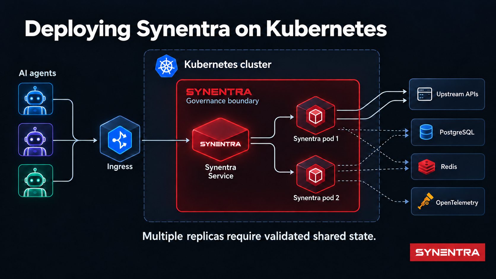
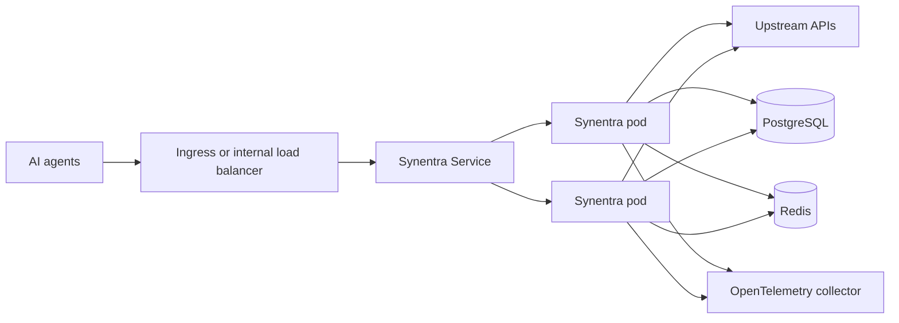

Moving a governance gateway from `docker run` to Kubernetes is not primarily a YAML exercise. The difficult part is deciding what must remain available, consistent, private, and observable while the cluster reschedules pods and rolls out new versions.

Synentra sits between autonomous AI agents and HTTP APIs. It validates agent identity, classifies likely intent, evaluates policy and risk, and then allows, blocks, or pauses a request for human approval. That position makes it part of the request path. A weak deployment can therefore undermine a strong decision model: a bypass route avoids governance, an unhealthy pod receives traffic, a local database is shared incorrectly, or an upgrade loses pending state.

<!-- truncate -->

This guide develops a Kubernetes architecture for Synentra without assuming that Kubernetes solves those application-level decisions automatically. It covers workload placement, health checks, configuration, persistence, secrets, networking, scaling, upgrades, and observability. The companion [Helm Chart Deployment tutorial](/docs/tutorials/helm-chart-deployment) builds a minimal chart from source and installs it on a local cluster.

---

## Start with the request path

The first design question is not “Deployment or StatefulSet?” It is “Can an agent reach the upstream API without passing through Synentra?”



In this topology, Synentra is the policy enforcement point. Network controls should make it the normal and, for governed clients, mandatory route to protected APIs. Kubernetes Services provide discovery and load distribution, but they do not prevent a workload from calling another Service directly. Namespace boundaries alone do not provide that guarantee either.

Use NetworkPolicy where the cluster network plugin enforces it. Permit agent workloads to call Synentra, permit Synentra to call approved upstreams and dependencies, and deny unintended direct paths. Complement cluster policy with cloud security groups, private endpoints, service-mesh authorization, or upstream authentication where appropriate.

The goal is defense in depth, not a claim that one Kubernetes object makes bypass impossible.

---

## Choose the workload model from the state model

Synentra's public container listens on HTTP port `7080` by default. A Kubernetes `Deployment` is a natural starting point because the application process can be replaced and rescheduled. The harder question is what its dependencies do when replicas change.

Synentra supports SQLite or PostgreSQL for data storage and memory or Redis for caching. These combinations have different operational properties.

| Configuration | Suitable starting point | Scaling implication |
|---|---|---|
| SQLite + memory cache | Local evaluation, single replica | Keep one replica; use persistent storage; avoid concurrent writers |
| PostgreSQL + memory cache | Durable shared database | Cache remains pod-local; verify consistency expectations before scaling |
| PostgreSQL + Redis | Multi-replica production evaluation | Shared dependencies remove major local-state constraints, but load and failure testing are still required |

The table describes architectural implications, not a benchmark or availability guarantee.

### Single-replica baseline

For a first cluster deployment, use one replica, a persistent volume for `/data`, and a `Recreate` update strategy. Configure the SQLite connection string to use the mounted path:

```yaml
env:
  - name: System__Database__DefaultProvider
    value: Sqlite
  - name: System__Database__Providers__Sqlite__ConnectionString
    value: Data Source=/data/synentra.db
```

.NET configuration maps double underscores in environment-variable names to nested configuration keys. The `Recreate` strategy avoids running two application pods against one SQLite file during an update. Its trade-off is a period with no ready pod while the old instance stops and the new one starts.

This is a learning and low-scale topology, not high availability.

### Multi-replica topology

Before setting `replicas: 3`, externalize shared state deliberately. Configure PostgreSQL for durable data and evaluate Redis for shared cache or coordination needs. Confirm how pending approvals, trust history, policy data, rate limits, and audit writes behave when consecutive requests land on different pods.

Kubernetes can create three processes. It cannot prove that the application is safe to run concurrently.

Test at least:

- simultaneous requests for the same agent;
- a pod termination during policy evaluation;
- a pod termination while a request awaits human approval;
- database and Redis latency or unavailability;
- rolling updates with old and new versions overlapping;
- duplicate client retries after timeouts.

Only then choose a replica count, disruption budget, and rolling-update policy.

---

## Health probes are routing decisions

Synentra exposes `/health`, and a healthy response resembles:

```json
{
  "status": "Healthy",
  "healthCheckDuration": "00:00:00.0123456"
}
```

Kubernetes uses probes for different decisions:

- **Startup probe:** Has the process had enough time to initialize?
- **Readiness probe:** Should this pod receive new traffic now?
- **Liveness probe:** Is the process stuck badly enough to restart?

A minimal configuration can point all three at `/health`, but that does not make the checks semantically distinct. If the endpoint reports downstream database failure as overall failure, using it for liveness may restart healthy processes during a dependency outage and amplify the incident.

Begin conservatively:

```yaml
startupProbe:
  httpGet:
    path: /health
    port: http
  failureThreshold: 30
  periodSeconds: 2
readinessProbe:
  httpGet:
    path: /health
    port: http
  periodSeconds: 10
livenessProbe:
  httpGet:
    path: /health
    port: http
  initialDelaySeconds: 20
  periodSeconds: 20
```

Then validate the endpoint's behavior under real dependency failures. If one endpoint cannot distinguish “do not route traffic” from “restart the process,” consider a product enhancement for separate readiness and liveness semantics instead of hiding the distinction in Helm values.

---

## Configuration: values, ConfigMaps, and Secrets

Helm values are an interface for generating Kubernetes resources. They are not a secret store.

Divide configuration into three categories:

1. **Non-sensitive runtime settings** can live in version-controlled values or a ConfigMap: port, provider selection, timeouts, and feature switches.
2. **Sensitive settings** belong in Kubernetes Secrets or an external secret-management system: signing material, database credentials, external provider keys, and notification credentials.
3. **Policy artifacts** need an explicit lifecycle: image-bundled, mounted, synchronized through GitOps, or managed through Synentra's APIs according to your operating model.

An environment-variable reference should name an existing Secret rather than embed its value:

```yaml
env:
  - name: System__Database__Providers__Postgres__ConnectionString
    valueFrom:
      secretKeyRef:
        name: synentra-database
        key: connection-string
```

Kubernetes Secrets are encoded, not automatically encrypted in every cluster configuration. Use encryption at rest, restrict RBAC, avoid exposing secrets through rendered Helm output, and prefer workload identity or an external secrets provider when available.

Do not pass credentials through `--set` on a shared terminal or CI log. A command can become a leak surface even if the resulting Pod specification uses a Secret.

---

## Storage choices and failure modes

The documented container paths include `/data` for persistent application data, `/policies` for internal policy definitions, `/app/logs` for file logs, and `/certs` for TLS certificates.

Mount only what the deployment actually uses. For example, if structured logs go to stdout and OpenTelemetry, a persistent `/app/logs` volume may be unnecessary. If policies are delivered by a separate GitOps mechanism, define who owns updates and how running pods observe them.

For the single-replica SQLite baseline:

```yaml
volumeMounts:
  - name: data
    mountPath: /data
volumes:
  - name: data
    persistentVolumeClaim:
      claimName: synentra-data
```

Ask operational questions before choosing a StorageClass:

- Does the volume survive node replacement?
- What is the backup and restore procedure?
- Is `ReadWriteOnce` sufficient for the selected update strategy?
- What happens when the volume cannot attach to the replacement node?
- Is the database file consistent after abrupt termination?

For multi-replica deployments, a shared filesystem is not a substitute for a database designed for concurrent access. Use PostgreSQL rather than mounting the same SQLite file into several pods.

---

## Network exposure and TLS

A `ClusterIP` Service is the safest tutorial default because it exposes Synentra only inside the cluster. Production exposure depends on who the clients are:

- in-cluster agents can call the Service directly;
- private external agents may use an internal load balancer or private ingress;
- public access requires an ingress or gateway with explicit authentication, TLS, limits, and threat controls.

Synentra supports its own HTTP and HTTPS listener configuration. Teams may terminate TLS at an ingress, at Synentra, or at both boundaries. Document the trust assumptions for every hop. If TLS terminates before the pod, secure the internal network and ensure forwarded metadata cannot be spoofed by untrusted clients.

Do not expose PostgreSQL, Redis, administrative endpoints, or observability receivers publicly merely because the main gateway needs an address.

---

## Resource requests are scheduling inputs, not decoration

Local ONNX inference consumes CPU and memory. The correct resource request depends on the model, payload size, enabled policies, storage, concurrency, and latency objective. There is no responsible universal number in this guide.

Start with measurements from a representative workload. Set requests so the scheduler reserves enough capacity for normal operation; set limits only after understanding throttling and out-of-memory behavior. Observe:

- CPU throttling;
- working-set and peak memory;
- startup time;
- request and decision latency;
- queueing under concurrency;
- pod restarts and eviction events.

An illustrative values shape is:

```yaml
resources:
  requests:
    cpu: <measured-request>
    memory: <measured-request>
  limits:
    memory: <validated-limit>
```

The placeholders are deliberate. Copying an untested limit into production is less useful than leaving the decision visible.

---

## Autoscaling requires a meaningful signal

CPU-based Horizontal Pod Autoscaling can add replicas when CPU rises, but it is not automatically the best signal for a governance gateway. A latency increase might come from inference, policy evaluation, a database, a slow upstream API, or pending approvals. Adding pods can help one bottleneck and worsen another.

If you adopt autoscaling:

1. externalize state first;
2. establish a stable single-pod baseline;
3. choose a signal related to saturation, not merely activity;
4. set conservative scale-up and scale-down behavior;
5. load-test database and Redis capacity alongside the gateway;
6. verify that rate and trust semantics remain correct across replicas.

Synentra is a governance gateway, not a general-purpose load balancer. Keep a conventional ingress or load-balancing layer where the platform requires it.

---

## Upgrades and rollback

Helm gives teams a repeatable release record, values layering, and rollback mechanics. It does not guarantee that an application downgrade is safe for its database.

A careful upgrade flow is:

```bash
helm lint ./synentra
helm template synentra ./synentra --namespace synentra -f values-prod.yaml > rendered.yaml
kubectl diff -n synentra -f rendered.yaml
helm upgrade --install synentra ./synentra \
  --namespace synentra \
  --create-namespace \
  -f values-prod.yaml \
  --atomic \
  --timeout 5m
```

Review rendered resources before applying them, especially Secret references, volume claims, security contexts, and image tags. Pin a reviewed image tag or digest rather than allowing an environment to change when `latest` moves.

Use `helm history synentra -n synentra` to inspect revisions. Before `helm rollback`, confirm that application and database changes are backward-compatible. Infrastructure rollback and data rollback are different operations.

---

## Observability for the governance path

Kubernetes tells you whether a pod exists. It does not tell you whether governance decisions are correct.

Synentra supports structured logs, audit records, health endpoints, and OpenTelemetry export. Connect those signals to the platform's observability stack and preserve a request or trace identifier across:

```text
agent → ingress → Synentra → policy / intent / risk → upstream API
```

Useful operational views include:

- request volume by decision: allow, deny, pending review;
- decision and upstream latency distributions;
- intent-classification confidence distribution;
- policy evaluation errors;
- authentication failures and rate-limit responses;
- PostgreSQL and Redis dependency health;
- pod restarts, readiness failures, and rollout duration.

Audit payloads may contain sensitive context. Restrict access, define retention, and redact secrets or personal data as close to collection as possible.

---

## Common deployment mistakes

### Scaling SQLite horizontally

Several pods writing the same SQLite database file is not a PostgreSQL replacement. Keep the baseline at one replica or move to a shared database designed for concurrent workloads.

### Using liveness to report every dependency problem

Restarting the pod during a database outage can create a restart loop. Separate process health from traffic readiness when the application exposes suitable signals.

### Publishing Synentra but leaving a bypass route

If agents can call upstream APIs directly, gateway policy is optional. Enforce the path with network and upstream identity controls.

### Treating Helm values as secret storage

Rendered values can appear in CI output, shell history, release metadata, and support bundles. Reference managed secrets instead.

### Enabling autoscaling before proving state semantics

Replica count is not only a performance setting. It changes concurrency, caching, rate-limit, trust, and failure behavior.

---

## A staged path to production

Use a sequence that makes each new assumption testable:

1. Install one Synentra pod with `ClusterIP`, `/health` probes, and persistent SQLite storage.
2. Route a disposable test agent through the Service.
3. confirm allow, deny, and approval flows plus audit records.
4. Block the direct route to the test upstream.
5. Export logs and traces to the platform stack.
6. Move durable state to PostgreSQL and validate backup/restore.
7. Add Redis only for a clearly understood requirement.
8. Exercise pod termination, node drain, dependency failure, and client retries.
9. Add replicas and rolling updates after state tests pass.
10. Tune requests, limits, disruption policy, and scaling from measured evidence.

The most reliable Kubernetes deployment is not the one with the most objects. It is the one whose failure behavior the team can explain.

---

## Conclusion

Kubernetes provides a strong substrate for running Synentra, but the deployment architecture must preserve the governance boundary that gives the product value. Keep upstream APIs behind that boundary, treat health probes as control-plane decisions, match replica count to the state model, and make upgrades and observability part of the design.

Begin with the smallest topology you can test honestly. Then externalize state, harden network paths, and scale based on measured behavior rather than a copied values file.

**Primary CTA:** Build and validate the baseline with the [Helm Chart Deployment tutorial](/docs/tutorials/helm-chart-deployment).

## References

- [Getting Started with Synentra](/docs/getting-started)
- [Synentra repository](https://github.com/synentra/synentra)
- [Kubernetes documentation](https://kubernetes.io/docs/home/)
- [Helm chart documentation](https://helm.sh/docs/topics/charts/)
- [System Configuration](/docs/configuration/system)
- [Security Configuration](/docs/configuration/security)
- [Observability](/docs/configuration/observability)
- [Reverse Proxy Design for AI APIs](/blog/reverse-proxy-design-for-ai-apis)