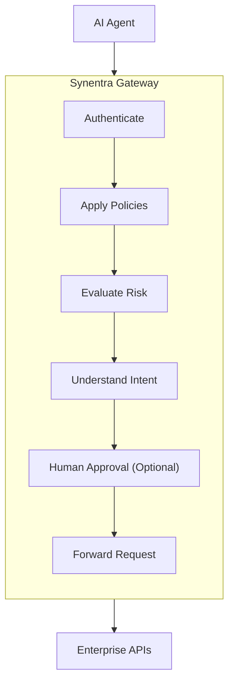

Artificial Intelligence is rapidly evolving from answering questions to **taking actions**.

Modern AI agents can retrieve customer data, modify databases, trigger deployments, send emails, approve workflows, and interact with dozens of enterprise systems without direct human intervention.

While this dramatically increases productivity, it also introduces a new class of security and governance challenges that traditional API gateways were never designed to solve.

---

## What is AI Agent Governance?

AI Agent Governance is the process of ensuring autonomous AI agents operate **safely, securely, and within organizational policies**.

Governance extends beyond authentication and authorization. It focuses on **understanding what an agent intends to do** before allowing access to enterprise resources.

Instead of only asking:

> *"Who is making this request?"*

AI governance also asks:

> *"What is this agent actually trying to accomplish?"*

This additional layer enables organizations to detect risky, unexpected, or malicious behavior before it reaches backend systems.

---

## Why Traditional Security Is No Longer Enough

Traditional API security assumes requests are made by deterministic software or human users.

Typical controls include:

- Authentication
- Authorization
- Rate limiting
- IP filtering
- API keys
- OAuth/JWT validation

These mechanisms verify **identity**, but they do not understand **intent**.

For example:

```
DELETE /customers/123
```

A conventional API gateway can verify:

✅ The JWT is valid.

✅ The client has the `customers.delete` permission.

What it cannot determine is:

- Is this request part of normal cleanup?
- Is the AI deleting the wrong customer?
- Is this accidental?
- Is this the beginning of a destructive sequence?

Identity alone cannot answer these questions.

---

## Why AI Agents Are Different

Unlike traditional software, AI agents make decisions using probabilistic reasoning.

They interpret instructions, break down tasks, and generate actions dynamically.

Characteristics of AI agents include:

- Non-deterministic reasoning
- Dynamic planning
- Tool selection
- Multi-step execution
- Autonomous decision making
- Continuous adaptation

As a result, the same prompt may produce different execution paths depending on available context.

This flexibility is powerful—but also introduces risk.

---

## Common Risks

### Misinterpretation

An agent misunderstands a user's request.

Example:

```
Clean up inactive users.
```

Instead of archiving accounts, the agent permanently deletes customer records.

### Privilege Escalation

The AI attempts operations beyond what was originally intended.

Example:

```
Export customer list
```

becomes

```
Export every customer database.
```

### Cascading Failures

One incorrect action triggers failures across multiple downstream services.

For example:

1. Delete inventory
2. Update ERP
3. Notify shipping
4. Cancel invoices

A single incorrect decision propagates throughout the organization.

### Compliance Violations

An AI agent accesses or exports regulated information without appropriate approval.

Examples include:

- Personally identifiable information (PII)
- Medical records
- Financial transactions
- Customer contracts

---

## Principles of AI Agent Governance

Effective governance is built on several core principles.

### Understand Intent

The system should understand **why** an action is being performed—not merely which endpoint is being called.

### Evaluate Risk

Different actions carry different levels of operational risk.

Reading public documentation is fundamentally different from deleting production data.

Governance systems should calculate risk before execution.

### Apply Policy

Organizational policies should determine whether an action is:

- Allowed
- Denriched with additional verification
- Requires human approval
- Denied

### Keep Humans in Control

Some actions should never execute automatically.

Examples include:

- Deleting production resources
- Exporting sensitive data
- Financial approvals
- Infrastructure changes

Human-in-the-Loop (HITL) workflows provide this additional safeguard.

### Maintain Auditability

Every decision should be recorded.

Audit logs should answer questions such as:

- Who initiated the request?
- Which agent executed it?
- What intent was detected?
- Which policy was evaluated?
- Why was the request allowed or denied?

---

## Governance Pipeline

A simplified governance pipeline looks like this:



Each stage contributes to the final authorization decision.

---

## How Synentra Implements Governance

Synentra introduces multiple governance layers into the request pipeline.

These include:

- Semantic intent classification
- Risk scoring
- Policy evaluation
- Human-in-the-Loop workflows
- Trust scoring
- Comprehensive auditing

Together, these capabilities enable organizations to govern AI agents without modifying existing backend applications.

---

## Benefits

Organizations implementing AI Agent Governance gain:

- Reduced operational risk
- Better regulatory compliance
- Safer autonomous workflows
- Greater visibility into agent behavior
- Human oversight for sensitive operations
- Improved security posture