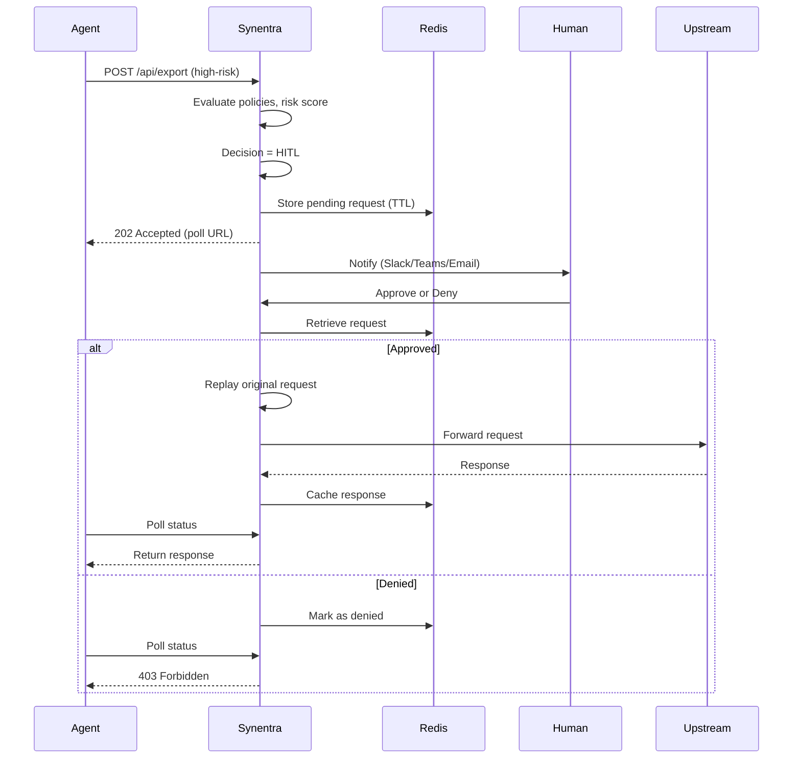

Human-in-the-Loop (HITL) is a critical safety feature in Synentra that allows human operators to review and approve or deny high‑risk agent requests before they are forwarded to upstream APIs.

When an agent attempts an action that exceeds a policy threshold, triggers a high risk score, or is classified as a sensitive intent, Synentra **suspends** the request, notifies human approvers, and waits for a decision before proceeding.

---

## Why HITL is Essential

Autonomous AI agents are powerful, but they can also make mistakes or take actions that have significant consequences. HITL provides a **safety net**:

| Challenge | HITL Solution |
|-----------|---------------|
| Agents may attempt destructive actions (delete, bulk export) without oversight | Suspends these requests for manual review |
| Autonomous decisions may conflict with compliance requirements | Provides an auditable approval trail |
| Semantic classification may have low confidence | Allows humans to intervene when the model is uncertain |
| New or unexpected behaviors emerge | Enables human judgment to guide policy refinement |

HITL ensures that **critical decisions remain under human control**, while still allowing agents to operate autonomously for routine tasks.

---

## How HITL Works

---

## The HITL Lifecycle

### 1. Suspension
When a request triggers HITL, Synentra:
- Generates a unique interaction ID
- Stores the full request context (method, URL, headers, body, agent ID) in Redis
- Returns a `202 Accepted` response to the agent with a `Location` header pointing to the status endpoint

### 2. Notification
Synentra notifies human approvers via:
- **Webhooks** – Slack, Microsoft Teams, PagerDuty, or custom HTTP endpoints
- **Dashboard UI** – an optional web interface for reviewing pending requests
- **CLI** – using the `synentra hitl list` and `synentra hitl approve` commands

### 3. Decision
A human operator can:
- **Approve** – the request is replayed exactly as it was received
- **Deny** – the request is discarded, and the agent receives a denial response
- **Let it expire** – requests automatically expire after a configurable time-to-live (TTL)

### 4. Replay
On approval:
- The original request is reconstructed with all headers and body
- The request is forwarded to the upstream API
- The response is cached so the agent can retrieve it when polling

### 5. Polling
Agents receive a `202 Accepted` status and must poll the status endpoint:
- If approved → receive the original upstream response
- If denied → receive a `403 Forbidden` with the denial reason
- If expired → receive a `410 Gone` indicating the request has timed out

---

## Benefits of HITL

| Benefit | Description |
|---------|-------------|
| **Safe Autonomy** | Agents can act independently, but with human oversight for critical actions |
| **Compliance** | Every approval or denial is audited, providing a clear decision trail |
| **Policy Refinement** | Human decisions can be used to refine policies and trust scores |
| **Risk Mitigation** | High‑risk actions are never executed without human consent |
| **Operational Control** | Teams retain the ability to intervene when needed |

---

## When Does HITL Trigger?

HITL is triggered when **any** of the following conditions are met:

| Condition | Example |
|-----------|---------|
| **Policy Rule** | A policy explicitly requires HITL for certain actions (e.g., `"effect": "hitl"` for `DELETE` operations) |
| **Risk Score** | The computed risk score exceeds the configured `HitlThreshold` (default: 0.8) |
| **Semantic Classification** | The intent is classified as high‑risk (`bulk_export`, `destructive_delete`, etc.) |
| **Low Confidence** | The semantic model has low confidence (< threshold) in its classification |

---

## Audit & Compliance

Every HITL decision is recorded in the audit log:

| Field | Description |
|-------|-------------|
| `agentId` | Which agent made the request |
| `decision` | `Approved` or `Denied` |
| `operatorId` | Who made the decision (if available) |
| `reason` | Why the decision was made (optional) |
| `timestamp` | When the decision was made |
| `requestDetails` | Method, URL, headers, body (redacted if needed) |

This provides a **tamper‑evident trail** for compliance audits.

---

## Human‑in‑the‑Loop: A Smart Safety Net

HITL is not about slowing agents down – it's about giving them **safe autonomy**. It balances the efficiency of autonomous agents with the judgment of human operators, ensuring that critical decisions are never made without oversight.

By integrating HITL into your governance strategy, you can:

- **Deploy agents faster** – with confidence that humans are in control
- **Reduce risk** – without sacrificing autonomy
- **Build trust** – by demonstrating accountability and transparency

In short, HITL transforms agent governance from **"hope it works"** to **"we know it's safe."**