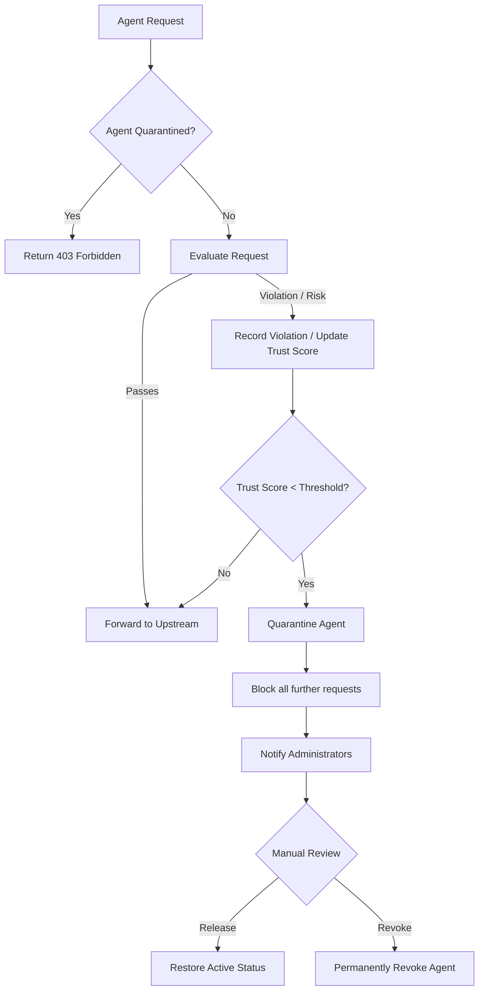

**Quarantine** is a safety mechanism in Synentra that temporarily isolates agents exhibiting suspicious, harmful, or policy‑violating behaviour. Once quarantined, an agent cannot make further requests until a human operator reviews and releases it (or an automatic expiry kicks in).

Quarantine acts as a **circuit breaker** for agent behaviour – it stops a potentially compromised or misbehaving agent from causing damage, while giving operators time to investigate.

---

## Why Quarantine is Essential

Autonomous agents can go rogue for many reasons:

| Cause | Example |
|-------|---------|
| **Compromised credentials** | An attacker steals an agent's JWT and uses it to exfiltrate data |
| **Bugs in agent logic** | An agent enters a loop, making thousands of requests per second |
| **Policy violations** | An agent repeatedly attempts unauthorised actions |
| **Anomalous behaviour** | An agent starts acting outside its normal pattern (e.g., off-hours traffic) |

Without quarantine, these issues would go unnoticed until significant damage occurs. Quarantine provides an **automatic safety net**.

---

## How Quarantine Works

---

## Quarantine Lifecycle

### 1. Detection
An agent enters quarantine when one of the following conditions is met:

- **Trust Score Falls Below Threshold** – Each agent has a dynamic trust score (0.0 – 1.0). When it drops below the configured floor (default: 0.3), the agent is automatically quarantined.
- **Excessive Violations** – If an agent repeatedly triggers `Deny` decisions within a short time window, it may be quarantined.
- **Manual Intervention** – An administrator can manually quarantine an agent via the admin API or CLI.

### 2. Isolation
When quarantined:
- **All requests are blocked** – The agent receives a `403 Forbidden` response for every subsequent request.
- **No further evaluation** – The policy engine and risk scoring are skipped entirely, saving resources.
- **Active sessions are invalidated** – Any JWT issued for the agent may be revoked (optional).

### 3. Review & Action
Human operators can:

- **Release** – Restore the agent to `Active` status, allowing it to resume operations. The trust score remains low but will increase over time if behaviour improves.
- **Revoke** – Permanently disable the agent. Revocation is irreversible and may trigger additional alerts.
- **Leave Quarantined** – If the issue is being investigated, the agent can remain quarantined until a decision is made.

### 5. Automatic Release (Optional)
If configured, an agent may be automatically released from quarantine after a cooldown period (e.g., 1 hour) or when its trust score recovers (e.g., after successful low‑risk requests). This is useful for transient issues like temporary spikes in request rate.

---

## Quarantine vs. Revocation

| State | Description | Reversible? |
|-------|-------------|-------------|
| **Active** | Normal operation – agent can make requests | – |
| **Quarantined** | Temporarily blocked, pending review | Yes (can be released) |
| **Revoked** | Permanently deactivated – agent cannot be used again | No |

> **💡 Tip:** Use quarantine for suspected issues that can be resolved (e.g., misconfigured agent). Use revocation for agents that are definitively compromised or no longer needed.

---

## Benefits of Quarantine

| Benefit | Description |
|---------|-------------|
| **Rapid Incident Response** | Automatically stops an active threat before it can cause damage |
| **Reduced Mean Time to Respond (MTTR)** | Operators are immediately alerted and can act |
| **Protection Against Compromised Agents** | Limits the blast radius of a compromised credential |
| **Policy Enforcement** | Agents that repeatedly violate policies are quickly isolated |
| **Operational Safety** | Gives teams time to investigate without pressure |
| **Automatic & Manual Control** | Balances automation with human judgment |

Quarantine is a **critical safety layer** in Synentra's governance model. It ensures that even when agents go wrong, they are contained quickly and with minimal disruption – giving you the confidence to deploy autonomous agents at scale.