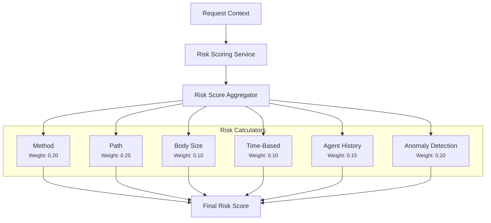

Synentra's **Risk Scoring Engine** evaluates every proxied request against a set of composable, weighted calculators. The resulting score (0.0 – 1.0) is used by the `DecisionEngine` to determine if a request should be allowed, denied, or escalated to a human reviewer.

---

## Architecture



Each calculator returns a score in $[0, 1]$. The aggregator produces a **weighted average** across all calculators:

```
finalScore = Σ(score_i × weight_i) / Σ(weight_i)
```

---

## Calculators

### Method Risk Calculator

Assigns risk based on the HTTP method.

| Method | Risk Score |
|---|---|
| `HEAD`, `OPTIONS` | 0.05 |
| `GET` | 0.10 |
| `POST` | 0.40 |
| `PATCH` | 0.50 |
| `PUT` | 0.60 |
| `TRACE` | 0.70 |
| `DELETE` | 0.90 |
| `CONNECT` | 0.80 |

**Weight:** `0.20`

---

### Path Risk Calculator

Pattern-matches the request path against known high-risk patterns.

| Pattern | Risk Score |
|---|---|
| `/v1/`, `/v2/`, etc. | 0.20 |
| `/internal/` | 0.60 |
| `/config`, `/settings`, `/env` | 0.70 |
| `/admin/` | 0.80 |
| `/delete`, `/remove`, `/drop` | 0.85 |
| `/export`, `/dump`, `/bulk` | 0.90 |
| `/users/all`, `/users/export` | 0.95 |

The highest matching pattern score is used.

**Weight:** `0.25`

---

### Body Size Risk Calculator

Large request bodies may indicate data exfiltration or injection attacks.

**Weight:** `0.10`

---

### Time-Based Calculator

Considers the time of day (UTC) and day of week.

| Condition | Added Risk |
|---|---|
| Weekend (Sat/Sun) | +0.20 |
| Night-time (before 06:00 or after 20:00 UTC) | +0.30 |
| Early morning / late evening (before 08:00 or after 18:00 UTC) | +0.10 |

Maximum contribution capped at `0.50`.

**Weight:** `0.10`

---

### Agent History Calculator

Examines the agent's recent request history (last 5 minutes) for signs of anomalous frequency or error patterns.

**Weight:** `0.15`

---

### Anomaly Detection Calculator

Uses the configured `AnomalyDetector` (backed by the statistical anomaly detector) to score how unusual this request is relative to the agent's baseline behaviour.

**Weight:** `0.20`

---

## Caching

Risk scores are cached per `(agentId, method, path, minute)` to avoid redundant computation during high-frequency bursts. The cache TTL is short (~10 seconds) to remain responsive to changing conditions.

---

## HITL Threshold

If `finalScore > HumanInTheLoop.Threshold` (default: `0.8`), the `DecisionEngine` returns `DecisionResult.Hitl(...)`. See [Human-in-the-Loop](../reference/api/hitl) for the review workflow.
