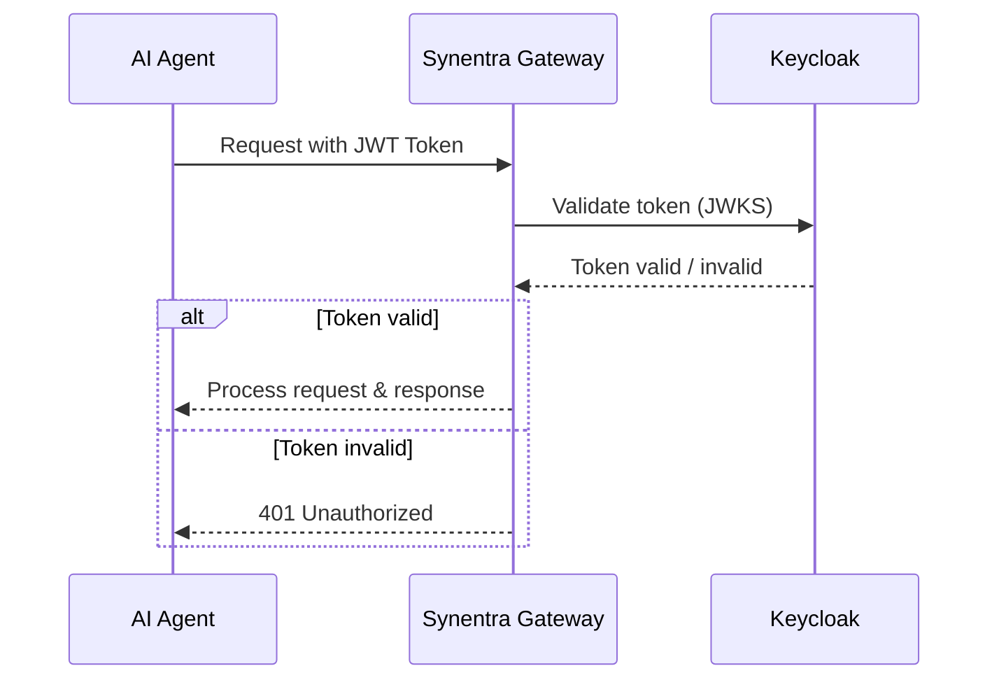

# Agent Authentication with Synentra

This guide demonstrates how to configure JWT-based authentication for AI agents using Keycloak.

## Overview

**What you'll accomplish:**
- Set up a Keycloak identity provider
- Configure Synentra for JWT authentication
- Generate JWT tokens for agents
- Test authenticated requests
- View authentication logs and metrics
- Implement role-based access control (RBAC)

## Prerequisites

- Docker (for Keycloak setup)
- Synentra installed

## Architecture



The AI agent first obtains a JWT from Keycloak (see Step 3). It then sends the token in the Authorization header to Synentra. Synentra validates the token against Keycloak’s public keys before processing the request.

## Step 1: Deploy Keycloak

Create `docker-compose.keycloak.yml`:

```yaml
version: '3.8'

services:
  postgres:
	image: postgres:15-alpine
	container_name: keycloak-postgres
	environment:
	  POSTGRES_DB: keycloak
	  POSTGRES_USER: keycloak
	  POSTGRES_PASSWORD: keycloak_pass
	volumes:
	  - postgres-data:/var/lib/postgresql/data
	networks:
	  - synentra-network

  keycloak:
	image: quay.io/keycloak/keycloak:23.0
	container_name: synentra-keycloak
	command: start-dev
	environment:
	  KC_DB: postgres
	  KC_DB_URL: jdbc:postgresql://postgres:5432/keycloak
	  KC_DB_USERNAME: keycloak
	  KC_DB_PASSWORD: keycloak_pass
	  KC_HOSTNAME: localhost
	  KC_HOSTNAME_PORT: 8080
	  KC_HOSTNAME_STRICT: false
	  KC_HOSTNAME_STRICT_HTTPS: false
	  KC_HTTP_ENABLED: true
	  KEYCLOAK_ADMIN: admin
	  KEYCLOAK_ADMIN_PASSWORD: admin
	ports:
	  - "8080:8080"
	depends_on:
	  - postgres
	networks:
	  - synentra-network

networks:
  synentra-network:
	driver: bridge

volumes:
  postgres-data:
```

Start Keycloak:

```bash
docker-compose -f docker-compose.keycloak.yml up -d

# Wait for Keycloak to start (2-3 minutes)
docker logs -f synentra-keycloak | grep "Running the server"

# Access Keycloak Admin Console: http://localhost:8080
# Username: admin
# Password: admin
```

## Step 2: Configure Keycloak Realm

All commands are executed inside the Keycloak container.

```bash
# Enter the container
docker exec -it synentra-keycloak bash

# Go to the CLI directory
cd /opt/keycloak/bin

# Login as admin
./kcadm.sh config credentials --server http://localhost:8080 --realm master --user admin --password admin

# Create a new realm
./kcadm.sh create realms -s realm=synentra -s enabled=true

# Create a client for Synentra
./kcadm.sh create clients -r synentra \
  -s clientId=synentra-gateway \
  -s enabled=true \
  -s publicClient=false \
  -s directAccessGrantsEnabled=true \
  -s serviceAccountsEnabled=true \
  -s 'redirectUris=["http://localhost:7080/*"]' \
  -s 'webOrigins=["*"]'

# Retrieve the client secret
CLIENT_SECRET=$(./kcadm.sh get clients -r synentra --fields id,clientId,secret | grep -A 3 "synentra-gateway" | grep secret | awk '{print $3}' | tr -d '"')
echo "Client Secret: $CLIENT_SECRET"

# Create roles
./kcadm.sh create roles -r synentra -s name=agent_user
./kcadm.sh create roles -r synentra -s name=agent_admin
./kcadm.sh create roles -r synentra -s name=agent_data_analyst

# Create a test agent user
./kcadm.sh create users -r synentra \
  -s username=agent-001 \
  -s enabled=true \
  -s email=agent001@synentra.io

./kcadm.sh set-password -r synentra --username agent-001 --new-password agent001pass

# Assign the "agent_user" role to the user
USER_ID=$(./kcadm.sh get users -r synentra -q username=agent-001 --fields id | grep '"id"' | awk '{print $3}' | tr -d '",')
ROLE_ID=$(./kcadm.sh get roles -r synentra | grep -A 2 "agent_user" | grep '"id"' | awk '{print $3}' | tr -d '",')
./kcadm.sh add-roles -r synentra --uid $USER_ID --rolename agent_user
```

## Step 3: Get JWT Token from Keycloak

Use the `password` grant to get an access token for `agent-001`.

```bash
# Request token
curl -X POST http://localhost:8080/realms/synentra/protocol/openid-connect/token \
  -H "Content-Type: application/x-www-form-urlencoded" \
  -d "client_id=synentra-gateway" \
  -d "client_secret=$CLIENT_SECRET" \
  -d "username=agent-001" \
  -d "password=agent001pass" \
  -d "grant_type=password" | jq

# Response example:
{
  "access_token": "eyJhbGciOiJSUzI1NiIsInR5cCI...",
  "expires_in": 300,
  "refresh_expires_in": 1800,
  "refresh_token": "eyJhbGciOiJIUzI1NiIsInR5cCI...",
  "token_type": "Bearer"
}
```

Extract the token for later use:

```bash
# Extract token
ACCESS_TOKEN=$(curl -s -X POST http://localhost:8080/realms/synentra/protocol/openid-connect/token \
  -d "client_id=synentra-gateway" \
  -d "client_secret=$CLIENT_SECRET" \
  -d "username=agent-001" \
  -d "password=agent001pass" \
  -d "grant_type=password" | jq -r '.access_token')

echo "Token: $ACCESS_TOKEN"
```

## Step 4: Configure Synentra for Keycloak

Update `appsettings.json` to use Keycloak as the JWT authority:

```json
{
  "System": {
    "Server": {
      "Http": {
        "Port": 7080
      }
    }
  },
  "Security": {
    "AgentAuth": {
      "UseCustomHeader": true,
      "CustomHeaderName": "Synentra-Authorization",
      "FallbackToAuthorization": false,
      "Provider": "Jwt",
      "Jwt": {
        "Authority": "http://localhost:8080/realms/synentra",
        "Audience": "synentra-gateway",
        "RequireHttpsMetadata": false,
        "ValidateIssuer": true,
        "ValidateAudience": true
      }
    }
  }
}
```

Start Synentra:

```bash
dotnet run --project src/Synentra
```

## Step 5: Test Authentication

### 5.1 Request Without Token (Should Fail)

```bash
curl -X POST http://localhost:7080/api/agent/execute \
  -H "Content-Type: application/json" \
  -d '{
	"intent": "query_data",
	"resource": "customers"
  }'
```

Expected response: 401 Unauthorized

```bash
{
  "error": "Unauthorized",
  "message": "No authorization token provided"
}
```

### 5.2 Request With a Valid Token

```bash
curl -X POST http://localhost:7080/api/agent/execute \
  -H "Content-Type: application/json" \
  -H "Authorization: Bearer $ACCESS_TOKEN" \
  -d '{
	"intent": "query_data",
	"resource": "customers"
  }'
```

Expected: 200 OK with response

## Clean Up

```bash
docker-compose -f docker-compose.keycloak.yml down -v
```

## Additional Resources

- [Keycloak Documentation](https://www.keycloak.org/documentation)
- [JWT Best Practices](https://tools.ietf.org/html/rfc8725)