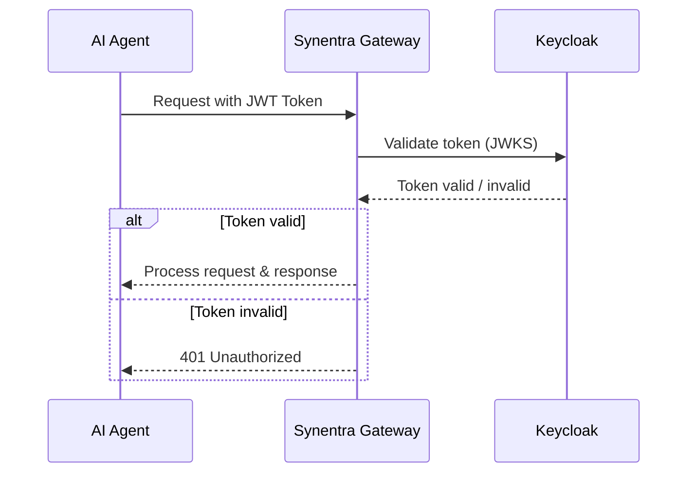

# Agent Authentication with Synentra

This guide demonstrates how to configure JWT-based authentication for AI agents using Keycloak.

## Overview

**What you'll accomplish:**

- Deploy a Keycloak identity provider
- Configure Synentra to validate JWT tokens
- Issue a JWT for an agent
- Authenticate agent requests
- Enforce role-based access control (RBAC)

## Prerequisites

- Docker and Docker Compose installed
- Access to the Synentra container image (`ghcr.io/synentra/synentra`)
- `curl` available on the host

## Architecture



The AI agent obtains a JWT from Keycloak (Step 3), attaches it to the Synentra-Authorization header, and Synentra validates the token against Keycloak’s public keys before forwarding the request.

## Folder Structure

Create the following directory and files:

```
synentra-auth-stack/
│
├── docker-compose.yml
├── appsettings.json
└── keycloak-realm.json
```

## Step 1: Create Configuration Files

### 1.1 Keycloak Realm Definition (keycloak-realm.json)

This file defines the realm, client, roles, and an initial user.

```json
{
  "realm": "synentra",
  "enabled": true,
  "clients": [
    {
      "clientId": "synentra-gateway",
      "enabled": true,
      "protocol": "openid-connect",
      "publicClient": false,
      "directAccessGrantsEnabled": true,
      "serviceAccountsEnabled": true,
      "standardFlowEnabled": false,
      "redirectUris": ["http://localhost:7080/*"],
      "webOrigins": ["*"],
      "secret": "synentra-secret"
    }
  ],
  "roles": {
    "realm": [
      { "name": "agent_user" },
      { "name": "agent_admin" },
      { "name": "agent_data_analyst" }
    ]
  },
  "users": [
    {
      "username": "agent-001",
      "enabled": true,
      "firstName": "Test",
      "lastName": "Agent",
      "email": "agent001@synentra.io",
      "emailVerified": true,
      "credentials": [
        {
          "type": "password",
          "value": "agent001pass",
          "temporary": false
        }
      ],
      "realmRoles": ["agent_user"]
    }
  ]
}
```

### 1.2 Synentra Configuration (appsettings.json)

Configure Synentra to use Keycloak as the JWT authority.

```json
{
  "System": {
    "Server": {
      "Http": {
        "Port": 7080
      }
    }
  },
  "Security": {
    "AgentAuth": {
      "UseCustomHeader": true,
      "CustomHeaderName": "Synentra-Authorization",
      "FallbackToAuthorization": false,
      "TokenIssuance": {
        "Secret": "v3ctr@D3v$K3y!2025#Zx9Lq8Rp4Wm6T",
        "Issuer": "synentra",
        "Audience": "synentra-agents",
        "Expiration": "00:15:00"
      },
      "ExternalIdentity": {
        "Provider": "Jwt",
        "Jwt": {
          "Authority": "http://keycloak:8080/realms/synentra",
          "Audience": "synentra-gateway",
          "RequireHttpsMetadata": false,
          "ValidateIssuer": false,
          "ValidateAudience": false
        }
      }
    }
  }
}
```

## Step 2: Deploy with Docker Compose

Create `docker-compose.yml` with services for PostgreSQL, Keycloak, and Synentra.

```yaml
services:
  postgres:
    image: postgres:15-alpine
    container_name: keycloak-postgres
    environment:
      POSTGRES_DB: keycloak
      POSTGRES_USER: keycloak
      POSTGRES_PASSWORD: keycloak_pass
    volumes:
      - postgres-data:/var/lib/postgresql/data
    networks:
      - synentra-network

  keycloak:
    image: quay.io/keycloak/keycloak:24.0
    container_name: synentra-keycloak
    command: start-dev --import-realm
    environment:
      KC_DB: postgres
      KC_DB_URL: jdbc:postgresql://postgres:5432/keycloak
      KC_DB_USERNAME: keycloak
      KC_DB_PASSWORD: keycloak_pass

      KC_HOSTNAME: keycloak
      KC_HOSTNAME_PORT: 8080
      KC_HTTP_ENABLED: "true"
      KC_HOSTNAME_STRICT: "false"
      KC_HOSTNAME_STRICT_HTTPS: "false"

      KEYCLOAK_ADMIN: admin
      KEYCLOAK_ADMIN_PASSWORD: admin
    ports:
      - "8080:8080"
    depends_on:
      - postgres
    volumes:
      - ./keycloak-realm.json:/opt/keycloak/data/import/realm.json:ro
    networks:
      - synentra-network

  synentra:
    image: ghcr.io/synentra/synentra:latest
    container_name: synentra
    ports:
      - "7080:7080"
    volumes:
      - ./appsettings.json:/app/appsettings.json:ro
    environment:
      ASPNETCORE_URLS: http://+:7080
      ASPNETCORE_ENVIRONMENT: Production
      Security__AgentAuth__ExternalIdentity__Jwt__Authority: http://keycloak:8080/realms/synentra
    depends_on:
      - keycloak
    networks:
      - synentra-network

networks:
  synentra-network:
    driver: bridge

volumes:
  postgres-data:
```

Start the stack:

```bash
docker-compose up -d
```

Wait for Keycloak to become ready (2‑3 minutes). You can monitor the logs:

```bash
docker logs -f synentra-keycloak | grep "Running the server"
```

Access the Keycloak Admin Console at http://localhost:8080 (admin / admin) to verify the realm has been imported.

> Note: Both Keycloak and Synentra are started automatically. If you prefer to run Synentra outside Docker (for development), use dotnet run --project src/Synentra after ensuring the appsettings.json is in place and Keycloak is running.

## Step 3: Obtain a JWT Token

Set the client secret (matches the `keycloak-realm.json`) and request an access token using the password grant.

```bash
export CLIENT_SECRET=synentra-secret

ACCESS_TOKEN=$(curl -s -X POST http://localhost:8080/realms/synentra/protocol/openid-connect/token \
  -H "Content-Type: application/x-www-form-urlencoded" \
  -d "client_id=synentra-gateway" \
  -d "client_secret=$CLIENT_SECRET" \
  -d "username=agent-001" \
  -d "password=agent001pass" \
  -d "grant_type=password" | jq -r '.access_token')

echo "Token: $ACCESS_TOKEN"
```

Example successful response:

```bash
{
  "access_token": "eyJhbGciOiJSUzI1NiIsInR5cCI...",
  "expires_in": 300,
  "refresh_expires_in": 1800,
  "refresh_token": "eyJhbGciOiJIUzI1NiIsInR5cCI...",
  "token_type": "Bearer"
}
```

## Step 4: Test Authentication

### 4.1 Request Without a Token (Must Fail)

```bash
curl -X POST http://localhost:7080/proxy/http://httpbingo.org/anything/user \
  -H "Content-Type: application/json" \
  -d '{
    "intent": "query_data",
    "resource": "customers"
  }'
```

Expected response: 401 Unauthorized

```bash
{
  "Missing or invalid authentication"
}
```

### 4.2 Request With a Valid Token

```bash
curl -X POST http://localhost:7080/proxy/http://httpbingo.org/anything/user \
  -H "Content-Type: application/json" \
  -H "Synentra-Authorization: Bearer $ACCESS_TOKEN" \
  -d '{
    "intent": "query_data",
    "resource": "customers"
  }'
```

Expected: 200 OK with the proxied response body.

## Clean Up

```bash
docker-compose down -v
```

## Additional Resources

- [Keycloak Documentation](https://www.keycloak.org/documentation)
- [JWT Best Practices](https://tools.ietf.org/html/rfc8725)