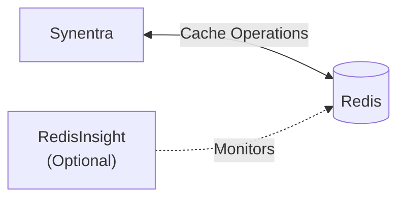

# Redis Cache

Synentra supports Redis as a distributed cache provider for improving performance and reducing repeated computation across multiple gateway instances.

Redis caching is recommended for:

- Production deployments
- Multi-instance Synentra clusters
- High-throughput workloads
- Reducing repeated policy and trust evaluations
- Lower latency and improved scalability

---

## Overview

When Redis is enabled, Synentra stores frequently accessed data in a distributed cache, allowing all gateway instances to share cached entries.

Typical cached data includes:

- Policy evaluation results
- Agent trust information
- Rate limiting data
- Other internal cache entries managed by Synentra

---

## Prerequisites

- A running Redis server
- Synentra installed
- Network connectivity between Synentra and Redis

---

## Architecture



---

## Folder Structure

Create the following directory and files:

```
synentra-cache-redis/
│
├── appsettings.json
└── docker-compose.yml
```

---

## Configure Synentra

Create `appsettings.json` for configure Redis.

```json
{
  "System": {
    "Server": {
      "Http": {
        "Port": 7080
      }
    },
    "Storage": {
      "Cache": {
        "DefaultProvider": "Redis",
        "Providers": {
          "Redis": {
            "Endpoint": "redis",
            "TimeToLive": "1.00:00:00",
            "AbortOnConnectFail": false,
            "ConnectRetry": 5,
            "ConnectTimeout": "00:00:05"
          }
        }
      }
    }
  }
}
```

## Configuration Options

| Option               | Description                                                                    | Default      |
| -------------------- | ------------------------------------------------------------------------------ | ------------ |
| `DefaultProvider`    | Cache provider used by Synentra. Set to `Redis` to enable distributed caching. | `Memory`     |
| `Endpoint`           | Redis server address.                                                          | —            |
| `TimeToLive`         | Default lifetime for cached entries.                                           | `1.00:00:00` |
| `AbortOnConnectFail` | Determines whether startup fails if Redis cannot be reached.                   | `false`      |
| `ConnectRetry`       | Number of connection retry attempts.                                           | `5`          |
| `ConnectTimeout`     | Timeout for establishing a Redis connection.                                   | `00:00:05`   |

---

## Deploy with Docker Compose

Create docker-compose.yml with services for Redis and Synentra.

```yaml
services:
  redis:
    image: redis:7-alpine
    container_name: synentra-redis
    ports:
      - "6379:6379"
    volumes:
      - redis-data:/data
    networks:
      - synentra-network

  redisinsight:
    image: redis/redisinsight:latest
    ports:
      - "5540:5540"
    networks:
      - synentra-network

  synentra:
    image: ghcr.io/synentra/synentra:latest
    container_name: synentra
    ports:
      - "7080:7080"
    volumes:
      - ./appsettings.json:/app/appsettings.json:ro
    environment:
      ASPNETCORE_ENVIRONMENT: Development
    depends_on:
      - redis
    networks:
      - synentra-network

networks:
  synentra-network:
    driver: bridge

volumes:
  redis-data:
```

Start the stack:

```bash
docker-compose up -d
```

If Redis is configured successfully, the application will connect automatically during startup.

You can verify the connection using the application logs.

---

## Connection String Examples

Local Redis

```text
localhost:6379
```

Password protected Redis

```text
localhost:6379,password=YourPassword
```

TLS enabled Redis

```text
redis.example.com:6380,ssl=true,password=YourPassword
```

---

## Inspect Cached Data

Connect to Redis:

```bash
docker exec -it synentra-redis redis-cli
```

List cache keys:

```redis
KEYS synentra:*
```

View a cached value:

```redis
GET <key>
```

Check expiration:

```redis
TTL <key>
```

---

## Monitoring

Useful Redis commands:

View server statistics:

```redis
INFO
```

Memory usage:

```redis
INFO memory
```

Connected clients:

```redis
INFO clients
```

Number of cached keys:

```redis
DBSIZE
```

---

## RedisInsight (Optional)

RedisInsight provides a web-based interface for exploring cache entries, monitoring memory usage, and executing Redis commands.

Start RedisInsight:

```yaml
services:
  redisinsight:
    image: redis/redisinsight:latest
    ports:
      - "5540:5540"
```

After starting RedisInsight, open:

```
http://localhost:5540
```

After connecting to your Redis server, you can:

- Browse cache keys
- Inspect cached values
- Monitor memory usage
- Execute Redis commands
- View server statistics

---

## Troubleshooting

### Unable to connect

Verify:

- Redis is running.
- The connection string is correct.
- Firewalls allow access.
- Synentra can reach the Redis server.

---

### No cache entries appear

Check:

- Redis is connected successfully.
- Synentra is receiving requests.
- The configured cache provider is `Redis`.

---

### Connection timeout

Increase Redis availability by:

- Running Redis on the same network.
- Reducing network latency.
- Using Redis Sentinel or Redis Cluster for production deployments.