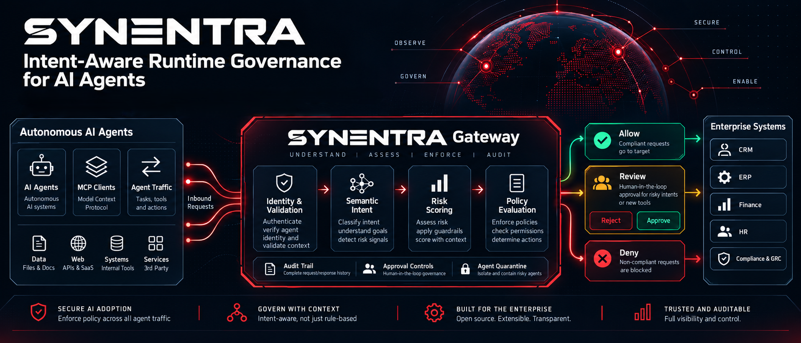

# Synentra — Intent-Aware Runtime Governance for AI Agents

**Synentra** is an open-source gateway for **intent-aware runtime governance and enforcement for AI agents**, built on **.NET 10**.

Synentra sits between autonomous AI agents and the HTTP APIs and tools they interact with. It evaluates request context, classifies likely intent, applies policy and risk controls, and allows, denies, or pauses sensitive actions for human approval.

AI agents can make authenticated and technically valid requests while still taking actions that are unintended, excessive, or dangerous. Synentra adds a governance layer that considers agent identity, request context, likely intent, risk, trust, and historical behavior before deciding whether an action should proceed.



## Key Capabilities

| Capability | Description |
| --- | --- |
| **Semantic Intent Classification** | Classifies the likely intent of a request and returns a confidence score. Local inference keeps request data inside your environment without requiring an external classification API. |
| **Policy Enforcement** | Combines deterministic rules with semantic conditions. Policies can evaluate agent identity and attributes, HTTP method and path, headers and payload, classified intent, confidence, risk score, and historical behavior. |
| **Risk Scoring** | Evaluates configurable contextual signals such as HTTP method, target path, request body characteristics, timing, agent history, anomaly signals, previous policy violations, and previous HITL decisions. |
| **Dynamic Agent Trust** | Agent trust can evolve over time based on observed behavior and can inform governance decisions. |
| **Human-in-the-Loop (HITL)** | High-risk or ambiguous requests can be suspended before reaching the upstream API. Reviewers can inspect request and decision context, approve or deny the action, and record a reason. |
| **HITL Notifications** | Notifies reviewers through Slack, Microsoft Teams, PagerDuty, or generic webhooks. |
| **Agent Quarantine** | Agents that fall below a configured trust threshold can be quarantined until manually reviewed. |
| **Agent Identity and Auditability** | Associates requests and decisions with registered agent identities. Audit records can include request metadata, intent, confidence, risk score, policy result, HITL status, reviewer decision, and final routing outcome. |
| **Request Validation** | Supports validation controls including API version validation, agent authentication, JWT validation, rate limiting, and request-size limits. Requests that fail validation are blocked and recorded. |
| **Observability** | Supports structured application logs, file and console logging, OpenTelemetry export, audit records, health endpoints, and decision and latency telemetry. |

Synentra also supports memory and Redis caching, SQLite and PostgreSQL storage options, and external identity provider integration.

## How Synentra Works

Each inbound request passes through the Synentra governance pipeline.

### 1. Request Validation

Synentra validates the request and its caller using configured authentication, JWT validation, rate limiting, request-size limits, and API version checks.

### 2. Decision Engine

Valid requests are evaluated using configured policies, contextual risk signals, and available semantic context.

- **Policy evaluation** considers the agent, request, environment, and available semantic context. A policy can allow, deny, or require human approval.
- **Risk scoring** evaluates contextual request and behavioral signals.
- **Semantic analysis** classifies likely request intent and returns a confidence score that can inform policies and the final decision.

Intent classification is an estimate of likely intent, rather than proof of an agent's actual objective. Policy and risk controls determine how that evidence affects execution.

### 3. Routing Outcome

| Outcome | Behavior |
| --- | --- |
| **Allow** | Forwards the request to the upstream service. |
| **Pending review** | Suspends the request until a reviewer approves or denies it. |
| **Block** | Rejects the request before it reaches the upstream service. |

Each outcome is recorded for auditing and observability.

## Why Synentra?

Authentication and route authorization are important controls, but teams also need to decide whether a particular agent action should execute in its current context.

Synentra coordinates semantic analysis, risk scoring, policy enforcement, and human approval within the gateway.

| Governance need | How Synentra helps |
| --- | --- |
| Evaluate requests beyond identity, route, and method. | Decisions can also consider likely intent, risk, trust, and historical behavior. |
| Control sensitive or destructive actions before execution. | Configured controls can block requests or suspend them for human approval. |
| Relate an agent's behavior to its governance outcomes. | Agent identity, classifications, policy decisions, and review outcomes are recorded together. |
| Apply common controls across agent integrations. | A centralized gateway coordinates request evaluation, enforcement, auditing, and approval workflows. |
| Keep semantic classification within your environment. | Local inference avoids requiring a cloud classification service. |

### Performance

Synentra is designed for low-latency, local request evaluation. Actual performance depends on hardware, model configuration, payload size, enabled policies, storage and cache providers, logging configuration, and semantic provider.

Published measurements should be assessed together with their test environment and benchmark methodology.

## What Synentra Is Not

Synentra is not intended to replace every component in an AI or API platform. It is not:

- A general-purpose LLM proxy.
- A token accounting or prompt-caching platform.
- An OpenAI API cost-management service.
- A load balancer or canary deployment system.
- A replacement for your identity provider.
- Limited to MCP servers or a specific agent framework.

Synentra governs AI-agent actions against HTTP APIs and can be used with LangChain, Semantic Kernel, custom agents, MCP-based systems, and other frameworks.

## Who Should Use Synentra?

- **Platform engineers** — add a centralized governance layer between AI agents and internal APIs without implementing separate controls in every service.
- **Security architects** — apply policies using agent identity, request context, likely intent, risk, and historical behavior.
- **AI agent developers** — integrate agents with one gateway instead of building policy enforcement, risk evaluation, audit logging, and approval workflows independently.
- **Governance and compliance teams** — use policy decisions, human approvals, and audit records as technical controls that support broader organizational governance and compliance programs.

> Synentra provides technical governance controls. Using Synentra alone does not establish compliance with standards or regulations such as SOC 2 or HIPAA.

## Get Started

Run Synentra with Docker:

```bash
docker run --name synentra -p 7080:7080 ghcr.io/synentra/synentra:latest
```

Synentra will be available at `http://localhost:7080`.

Production deployments require an appropriate security configuration, including token issuance and secret management. Review the [security configuration documentation](/docs/configuration/security) before deploying to production.

Continue with [Getting Started](/docs/getting-started) or explore [policy configuration](/docs/configuration/policy), [semantic configuration](/docs/configuration/semantic), and [HITL configuration](/docs/configuration/hitl).

## License

Synentra is open source and licensed under the **Apache License 2.0**. Some dependencies use other open-source licenses; their notices and attribution requirements are documented in the repository's `THIRD-PARTY-NOTICES.md`.
