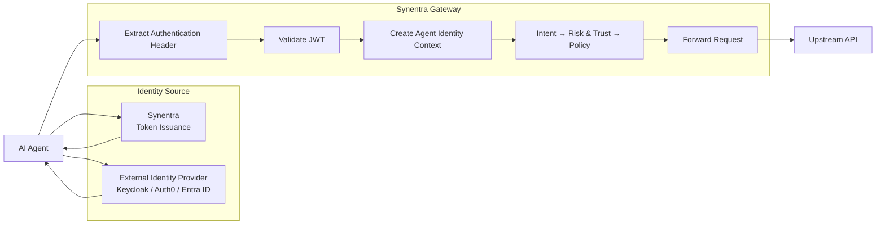

Configure JWT authentication for AI agents using Synentra-issued tokens or an external identity provider.

**Prerequisites**:

* Docker v24 or later
* `curl` or a similar HTTP client
* Basic understanding of JSON Web Tokens
* A running Synentra installation

---

## Overview

Synentra supports two JWT authentication models:

1. **Synentra token issuance**: Synentra authenticates a registered agent and issues a signed access token.
2. **External identity validation**: An external identity provider, such as Keycloak, Auth0, or Microsoft Entra ID, issues the token and Synentra validates it.

In this tutorial, you will learn how to:

* Configure authentication headers
* Configure Synentra-issued JWTs
* Configure an external identity provider
* Send authenticated gateway requests
* Understand the claims available to the governance pipeline
* Troubleshoot common JWT authentication problems

---

## Understand the Authentication Flow

The authentication flow depends on where the agent's JWT is issued.



For each authenticated gateway request, Synentra:

1. Reads the token from the configured authentication header.
2. Validates the token signature.
3. Validates the issuer and audience when enabled.
4. Validates the token lifetime.
5. Resolves the agent identity from the token.
6. Makes the authenticated identity available to the governance pipeline.

---

## Configure Authentication Headers

The `Security.AgentAuth` section controls how Synentra receives authentication tokens.

By default, Synentra expects the token in the custom `Synentra-Authorization` header:

```http
Synentra-Authorization: Bearer <token>
```

Create or update your `appsettings.json`:

```json
{
  "Security": {
    "AgentAuth": {
      "UseCustomHeader": true,
      "CustomHeaderName": "Synentra-Authorization",
      "FallbackToAuthorization": false
    }
  }
}
```

The available options are:

| Property                  |     Type |                    Default | Description                                                                                 |
| ------------------------- | -------: | -------------------------: | ------------------------------------------------------------------------------------------- |
| `UseCustomHeader`         |   `bool` |                     `true` | Reads the agent token from a custom authentication header.                                  |
| `CustomHeaderName`        | `string` | `"Synentra-Authorization"` | Specifies the custom authentication header name.                                            |
| `FallbackToAuthorization` |   `bool` |                    `false` | Also accepts the standard `Authorization: Bearer` header when the custom header is missing. |
| `TokenIssuance`           | `object` |                       `{}` | Configures JWTs issued by Synentra.                                                         |
| `ExternalIdentity`        | `object` |                       `{}` | Configures tokens issued by an external identity provider.                                  |

### Accept Both Authentication Headers

To prefer the Synentra header while also accepting the standard HTTP authorization header, use:

```json
{
  "Security": {
    "AgentAuth": {
      "UseCustomHeader": true,
      "CustomHeaderName": "Synentra-Authorization",
      "FallbackToAuthorization": true
    }
  }
}
```

Agents can then use either:

```http
Synentra-Authorization: Bearer <token>
```

or:

```http
Authorization: Bearer <token>
```

Using a custom header can be useful when Synentra forwards requests to an upstream API that also expects its own `Authorization` header.

---

## Choose an Identity Model

Before configuring JWT authentication, decide who will issue the agent token.

### Option A: Synentra-Issued Tokens

Use this model when:

* Agents are registered directly with Synentra.
* Synentra manages agent authentication.
* You do not need an external OpenID Connect provider.
* You want Synentra to issue short-lived agent access tokens.

### Option B: External Identity Provider

Use this model when:

* Agents already authenticate through Keycloak, Auth0, Entra ID, or another provider.
* Your organization centrally manages identity.
* You need OpenID Connect discovery and signing-key rotation.
* Tokens must be validated against an external authority.

The two configurations serve different purposes:

```text
TokenIssuance
    Synentra creates and signs the JWT.

ExternalIdentity
    Another identity provider creates the JWT.
    Synentra validates it.
```

---

## Configure Synentra Token Issuance

The `TokenIssuance` section configures JWTs generated by Synentra.

Create the following configuration:

```json
{
  "Security": {
    "AgentAuth": {
      "UseCustomHeader": true,
      "CustomHeaderName": "Synentra-Authorization",
      "FallbackToAuthorization": true,
      "TokenIssuance": {
        "Issuer": "synentra",
        "Audience": "synentra-agents",
        "Expiration": "00:15:00"
      }
    }
  }
}
```

The supported properties are:

| Property     |       Type |    Default | Description                                  |
| ------------ | ---------: | ---------: | -------------------------------------------- |
| `Secret`     |   `string` |       `""` | Secret used to sign JWTs issued by Synentra. |
| `Issuer`     |   `string` |       `""` | Value written to the JWT `iss` claim.        |
| `Audience`   |   `string` |       `""` | Value written to the JWT `aud` claim.        |
| `Expiration` | `TimeSpan` | `00:15:00` | Lifetime of an issued access token.          |

### Development Secret Generation

In the `Development` environment, the signing secret can be omitted.

When no secret is configured, Synentra:

1. Generates a cryptographically secure secret.
2. Persists it locally.
3. Reuses it after an application restart.

This prevents all previously issued development tokens from becoming invalid every time Synentra restarts.

The default development secret file is:

```text
~/.synentra-agentauth-selfsigned-secret
```

You can override its location with:

```bash
SYNENTRA_SELF_SIGNED_DEV_SECRET_FILE
```

For example:

```bash
export SYNENTRA_SELF_SIGNED_DEV_SECRET_FILE=/data/secrets/synentra-agentauth.secret
```

You can also provide the development signing secret directly:

```bash
export SYNENTRA_SELF_SIGNED_SECRET="your-development-signing-secret-at-least-32-bytes"
```

Or configure it through `appsettings.json`:

```json
{
  "Security": {
    "AgentAuth": {
      "TokenIssuance": {
        "Secret": "your-development-signing-secret-at-least-32-bytes",
        "Issuer": "synentra",
        "Audience": "synentra-agents",
        "Expiration": "00:15:00"
      }
    }
  }
}
```

> Development secret generation is intended for local development and testing. Do not depend on an automatically generated local secret in production.

### Production Secret Requirement

In a production environment, `TokenIssuance.Secret` must be explicitly configured.

Synentra fails during startup when token issuance is enabled but the production signing secret is unavailable.

A production configuration could look like this:

```json
{
  "Security": {
    "AgentAuth": {
      "UseCustomHeader": true,
      "CustomHeaderName": "Synentra-Authorization",
      "FallbackToAuthorization": false,
      "TokenIssuance": {
        "Secret": "",
        "Issuer": "synentra",
        "Audience": "synentra-agents",
        "Expiration": "00:15:00"
      }
    }
  }
}
```

Provide the secret through an environment variable instead of committing it to the configuration file:

```bash
export Security__AgentAuth__TokenIssuance__Secret="replace-with-a-secure-production-secret"
```

ASP.NET Core converts the double underscores into configuration section separators.

The environment variable above maps to:

```text
Security:AgentAuth:TokenIssuance:Secret
```

---

## Run Synentra with Token Issuance

Create a configuration directory:

```bash
mkdir -p config
```

Save the following as `config/appsettings.json`:

```json
{
  "Security": {
    "AgentAuth": {
      "UseCustomHeader": true,
      "CustomHeaderName": "Synentra-Authorization",
      "FallbackToAuthorization": true,
      "TokenIssuance": {
        "Issuer": "synentra",
        "Audience": "synentra-agents",
        "Expiration": "00:15:00"
      },
      "ExternalIdentity": {
        "Enabled": false
      }
    }
  }
}
```

Create a persistent directory for the automatically generated development secret:

```bash
mkdir -p data/secrets
```

Start Synentra:

```bash
docker stop synentra
docker rm synentra

docker run -d \
  --name synentra \
  -p 7080:7080 \
  -v "$(pwd)/config:/app/config:ro" \
  -v "$(pwd)/data/secrets:/app/data/secrets" \
  -e SYNENTRA_SELF_SIGNED_DEV_SECRET_FILE=/app/data/secrets/agentauth.secret \
  ghcr.io/synentra/synentra:latest
```

Verify that Synentra is running:

```bash
curl -s http://localhost:7080/health
```

Review the startup logs:

```bash
docker logs synentra
```

The logs should indicate that agent authentication and token issuance are configured.

> The exact health-check payload depends on the enabled Synentra health checks. Avoid scripting against fields that are not part of the documented health-check contract.

---

## Register an Agent and Request a Token

When using Synentra token issuance, the agent first authenticates with Synentra and requests an access token.

The general flow is:

```text
Register agent
    ↓
Authenticate agent credentials
    ↓
Receive Synentra-issued JWT
    ↓
Use JWT for gateway requests
```

A Synentra-issued token contains identity and validation claims such as:

| Claim         | Description                                        |
| ------------- | -------------------------------------------------- |
| `sub`         | Registered Synentra agent identifier.              |
| `trust_score` | Agent trust score at the time the token is issued. |
| `iss`         | Configured token issuer.                           |
| `aud`         | Configured token audience.                         |
| `exp`         | Token expiration time.                             |

The precise registration and token endpoint payloads depend on the version of the Agents and Tokens APIs installed with Synentra.

After obtaining a token, store it in an environment variable:

```bash
TOKEN="<synentra-issued-jwt>"
```

Do not commit tokens to scripts, repositories, Docker images, or documentation examples.

---

## Make an Authenticated Gateway Request

Because the default configuration uses a custom authentication header, send the JWT using `Synentra-Authorization`:

```bash
curl -X POST \
  "http://localhost:7080/v1/proxy/http://httpbingo.org/anything/user" \
  -H "Synentra-Authorization: Bearer $TOKEN" \
  -H "Content-Type: application/json" \
  -d '{
    "customer_id": "12345",
    "action": "check_status"
  }'
```

Synentra extracts the agent identity before the request enters the governance pipeline:

```text
JWT validation
    ↓
Agent identity resolution
    ↓
Intent classification
    ↓
Risk and trust evaluation
    ↓
Policy evaluation
    ↓
Allow, deny, or require human approval
```

When `FallbackToAuthorization` is enabled, the standard header also works:

```bash
curl -X POST \
  "http://localhost:7080/v1/proxy/http://httpbingo.org/anything/user" \
  -H "Authorization: Bearer $TOKEN" \
  -H "Content-Type: application/json" \
  -d '{
    "customer_id": "12345",
    "action": "check_status"
  }'
```

---

## Configure an External Identity Provider

To validate tokens issued by an external provider, configure `ExternalIdentity`.

The supported properties are:

| Property   |                           Type | Default | Description                                            |
| ---------- | -----------------------------: | ------: | ------------------------------------------------------ |
| `Enabled`  |                        `bool?` | `false` | Enables external identity validation.                  |
| `Provider` | `ExternalIdentityProviderType` |   `Jwt` | Selects the external identity provider implementation. |
| `Jwt`      |     `JwtIdentityConfiguration` |    `{}` | Contains JWT and OpenID Connect validation settings.   |

The JWT-specific configuration supports:

| Property           |      Type | Default | Description                                    |
| ------------------ | --------: | ------: | ---------------------------------------------- |
| `Authority`        |  `string` |    `""` | OpenID Connect authority URL.                  |
| `Audience`         |  `string` |    `""` | Expected JWT audience.                         |
| `MetadataUrl`      | `string?` |    `""` | Optional explicit OpenID Connect metadata URL. |
| `ValidateIssuer`   |    `bool` | `false` | Enables issuer validation.                     |
| `ValidateAudience` |    `bool` | `false` | Enables audience validation.                   |

### Keycloak Example

The following example validates tokens issued by a Keycloak realm named `synentra`:

```json
{
  "Security": {
    "AgentAuth": {
      "UseCustomHeader": true,
      "CustomHeaderName": "Synentra-Authorization",
      "FallbackToAuthorization": true,
      "ExternalIdentity": {
        "Enabled": true,
        "Provider": "Jwt",
        "Jwt": {
          "Authority": "http://keycloak:8080/realms/synentra",
          "Audience": "synentra-gateway",
          "ValidateIssuer": true,
          "ValidateAudience": true
        }
      }
    }
  }
}
```

When Keycloak runs outside the Docker network, use an authority URL that is reachable from the Synentra container.

For example:

```json
{
  "Authority": "https://identity.example.com/realms/synentra"
}
```

### Explicit Metadata URL

Most OpenID Connect providers publish their metadata at a standard discovery endpoint. Synentra can normally discover it from `Authority`.

When the provider uses a non-standard location, configure `MetadataUrl`:

```json
{
  "Security": {
    "AgentAuth": {
      "ExternalIdentity": {
        "Enabled": true,
        "Provider": "Jwt",
        "Jwt": {
          "Authority": "https://identity.example.com",
          "MetadataUrl": "https://identity.example.com/custom/.well-known/openid-configuration",
          "Audience": "synentra-gateway",
          "ValidateIssuer": true,
          "ValidateAudience": true
        }
      }
    }
  }
}
```

Only configure `MetadataUrl` when the standard discovery address cannot be used.

---

## Run Synentra with External JWT Validation

Create `config/appsettings.json`:

```json
{
  "Security": {
    "AgentAuth": {
      "UseCustomHeader": true,
      "CustomHeaderName": "Synentra-Authorization",
      "FallbackToAuthorization": true,
      "ExternalIdentity": {
        "Enabled": true,
        "Provider": "Jwt",
        "Jwt": {
          "Authority": "https://identity.example.com/realms/synentra",
          "Audience": "synentra-gateway",
          "ValidateIssuer": true,
          "ValidateAudience": true
        }
      }
    }
  }
}
```

Run Synentra:

```bash
docker stop synentra
docker rm synentra

docker run -d \
  --name synentra \
  -p 7080:7080 \
  -v "$(pwd)/config:/app/config:ro" \
  ghcr.io/synentra/synentra:latest
```

Obtain an access token from your identity provider:

```bash
TOKEN="<external-provider-access-token>"
```

Send the request through Synentra:

```bash
curl -X POST \
  "http://localhost:7080/v1/proxy/http://httpbingo.org/anything/user" \
  -H "Synentra-Authorization: Bearer $TOKEN" \
  -H "Content-Type: application/json" \
  -d '{
    "customer_id": "12345",
    "action": "check_status"
  }'
```

Synentra validates the token using the external provider's signing keys and configured validation rules.

---

## Understand External Identity Validation

When external identity validation is enabled, the request follows this flow:

1. The agent obtains a JWT from the external identity provider.
2. The agent sends the token to Synentra.
3. Synentra reads the token from the configured authentication header.
4. Synentra loads the provider metadata and signing keys.
5. Synentra validates the token signature and lifetime.
6. Synentra validates the issuer when `ValidateIssuer` is `true`.
7. Synentra validates the audience when `ValidateAudience` is `true`.
8. The authenticated request continues through the governance pipeline.

A token can therefore be cryptographically valid but still be rejected because it has the wrong issuer or audience.

For example:

```json
{
  "iss": "https://identity.example.com/realms/another-realm",
  "aud": "another-api"
}
```

The token above should be rejected when Synentra expects:

```json
{
  "iss": "https://identity.example.com/realms/synentra",
  "aud": "synentra-gateway"
}
```

---

## Use Identity Information in Governance Decisions

After authentication, the resolved agent identity becomes part of Synentra's request context.

For Synentra-issued tokens, the token includes the registered agent ID and current trust score:

```json
{
  "sub": "a5ca15dc-e73f-48d5-ac44-622ab1ce5d5d",
  "agent_name": "TestAgent",
  "trust_score": 0.85,
  "iss": "synentra",
  "aud": "synentra-agents"
  "exp": 1786200000
}
```

These values can contribute to governance decisions such as:

* Resolving the registered agent
* Loading policies assigned to that agent
* Evaluating the agent's trust history
* Adjusting the request risk score
* Deciding whether human approval is required
* Recording the authenticated agent in the audit trail

---

## Test Authentication Failures

Authentication failures should stop the request before the upstream API is called.

### Test a Missing Token

```bash
curl -i -X GET \
  "http://localhost:7080/v1/proxy/http://httpbingo.org/anything/user"
```

Expected result:

```text
401 Unauthorized
```

### Test the Wrong Header

When `UseCustomHeader` is enabled and `FallbackToAuthorization` is disabled, this request should fail:

```bash
curl -i -X GET \
  "http://localhost:7080/v1/proxy/http://httpbingo.org/anything/user" \
  -H "Authorization: Bearer $TOKEN"
```

Use the configured custom header instead:

```bash
curl -i -X GET \
  "http://localhost:7080/v1/proxy/http://httpbingo.org/anything/user" \
  -H "Synentra-Authorization: Bearer $TOKEN"
```

### Test an Expired Token

An expired JWT contains an `exp` value in the past.

Expected result:

```text
401 Unauthorized
```

The request must not proceed to intent classification, risk evaluation, policy evaluation, or the upstream API.

### Test the Wrong Audience

Configure:

```json
{
  "Audience": "synentra-gateway",
  "ValidateAudience": true
}
```

Then send a token containing:

```json
{
  "aud": "another-service"
}
```

Expected result:

```text
401 Unauthorized
```

### Test the Wrong Issuer

Configure issuer validation:

```json
{
  "ValidateIssuer": true
}
```

Then send a token issued by an unexpected authority.

Expected result:

```text
401 Unauthorized
```

---

## Inspect Authentication Logs

View authentication-related logs:

```bash
docker logs synentra --tail 100
```

Search for identity or JWT messages:

```bash
docker logs synentra 2>&1 | grep -Ei "jwt|authentication|identity|token"
```

Depending on the configured logging level, the logs can show:

* Missing authentication headers
* Invalid token signatures
* Expired tokens
* Issuer validation failures
* Audience validation failures
* External metadata-loading failures
* Agent identity resolution failures

Synentra should not log raw JWTs or signing secrets.

A safe audit event can include identifiers and validation results:

```json
{
  "timestamp": "2026-07-08T10:30:00Z",
  "requestId": "req_abc123",
  "agentId": "agent-support-01",
  "authenticationSource": "SynentraToken",
  "authenticationResult": "Succeeded",
  "intent": "safe_read",
  "riskScore": 0.18,
  "decision": "Allow"
}
```

Sensitive values should be excluded, including:

* Raw access tokens
* Signing secrets
* Private keys
* Complete authorization headers
* Unnecessary personal identity claims

---

## Troubleshooting

### Synentra Does Not Read the Token

Confirm the configured header behavior:

```json
{
  "Security": {
    "AgentAuth": {
      "UseCustomHeader": true,
      "CustomHeaderName": "Synentra-Authorization",
      "FallbackToAuthorization": false
    }
  }
}
```

With this configuration, use:

```bash
-H "Synentra-Authorization: Bearer $TOKEN"
```

The following header will not be accepted:

```bash
-H "Authorization: Bearer $TOKEN"
```

unless `FallbackToAuthorization` is set to `true`.

### The Custom Header Contains the Wrong Format

Correct:

```http
Synentra-Authorization: Bearer eyJhbGciOi...
```

Incorrect:

```http
Synentra-Authorization: eyJhbGciOi...
```

The header value must include the `Bearer` scheme.

### Development Tokens Become Invalid After Restart

Ensure the generated development secret is stored in a persistent location.

For Docker:

```bash
-v "$(pwd)/data/secrets:/app/data/secrets"
-e SYNENTRA_SELF_SIGNED_DEV_SECRET_FILE=/app/data/secrets/agentauth.secret
```

Without persistent storage, deleting and recreating the container can cause Synentra to generate a new secret, invalidating previously issued tokens.

### External Provider Metadata Cannot Be Loaded

Verify that:

* `Authority` is correct.
* The URL is reachable from the Synentra container.
* TLS certificates are trusted.
* The provider exposes OpenID Connect metadata.
* `MetadataUrl` is configured when discovery uses a non-standard endpoint.

Test connectivity from the host:

```bash
curl -i \
  "https://identity.example.com/realms/synentra/.well-known/openid-configuration"
```

For container-network debugging:

```bash
docker exec synentra \
  wget -qO- \
  "https://identity.example.com/realms/synentra/.well-known/openid-configuration"
```

### Audience Validation Fails

Inspect the token's `aud` claim and compare it with:

```json
{
  "Audience": "synentra-gateway",
  "ValidateAudience": true
}
```

The configured audience must match an audience accepted by the token validation implementation.

### Issuer Validation Fails

The token's `iss` claim must correspond to the configured identity authority when issuer validation is enabled.

Be careful with:

* HTTP versus HTTPS
* Trailing slashes
* Realm or tenant paths
* Internal versus externally visible hostnames

For example, these can be treated as different issuer values:

```text
http://keycloak:8080/realms/synentra
https://identity.example.com/realms/synentra
```

Use the issuer value actually written into the provider's access tokens.

---

## Complete Configuration Examples

### With Synentra-Issued Tokens

```json
{
  "Security": {
    "AgentAuth": {
      "UseCustomHeader": true,
      "CustomHeaderName": "Synentra-Authorization",
      "FallbackToAuthorization": false,
      "TokenIssuance": {
        "Secret": "",
        "Issuer": "synentra",
        "Audience": "synentra-agents",
        "Expiration": "00:15:00"
      },
      "ExternalIdentity": {
        "Enabled": false
      }
    }
  }
}
```

Supply the secret externally:

```bash
docker run -d \
  --name synentra \
  -p 7080:7080 \
  -v "$(pwd)/config:/app/config:ro" \
  -e Security__AgentAuth__TokenIssuance__Secret="$SYNENTRA_SIGNING_SECRET" \
  ghcr.io/synentra/synentra:latest
```

### With an External Identity Provider

```json
{
  "Security": {
    "AgentAuth": {
      "UseCustomHeader": true,
      "CustomHeaderName": "Synentra-Authorization",
      "FallbackToAuthorization": true,
      "ExternalIdentity": {
        "Enabled": true,
        "Provider": "Jwt",
        "Jwt": {
          "Authority": "https://identity.example.com/realms/synentra",
          "Audience": "synentra-gateway",
          "ValidateIssuer": true,
          "ValidateAudience": true
        }
      }
    }
  }
}
```

---

## Clean Up

Stop and remove the tutorial container:

```bash
docker stop synentra
docker rm synentra
```

To remove the locally generated development secret:

```bash
rm -f data/secrets/agentauth.secret
```

Removing this file invalidates tokens signed with that development secret.