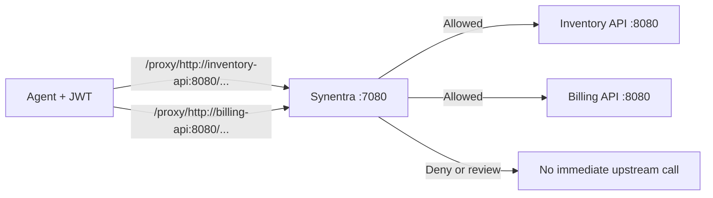

## Objective

Build a local Docker Compose that routes authenticated agent requests through Synentra to two private upstream APIs. You will verify:

- the `/proxy/<full-upstream-url>` route format;
- routing to different upstream service names and paths;
- query-string and JSON-body forwarding;
- removal of the `Synentra-Authorization` header before the upstream call;
- distinct gateway responses for missing authentication; and
- safe teardown of the demo.

The tutorial is isolated and uses a deliberately permissive policy so routing behaviour is easy to observe. That policy is not suitable for production.

---

## Prerequisites

- Docker Engine 24 or later
- Docker Compose v2 (`docker compose`)
- `curl`
- `jq`
- OpenSSL CLI
- Ports `7080` and `8081` available on the host
- A shell compatible with the examples (`bash`, `zsh`, or WSL)
- At least 2 GB of available memory

Verify the tools:

```bash
docker --version
docker-compose version
curl --version
jq --version
openssl version
```

---

## Architecture



Only Synentra publishes a host port. The two echo APIs are reachable inside the Compose network but are not exposed directly to the host.

---

## Step 1: Create the project structure

```bash
mkdir -p synentra-routing-lab/policies
cd synentra-routing-lab
touch compose.yaml upstream.py policies/routing-demo.json
```

The completed directory will contain:

```text
synentra-routing-lab/
├── compose.yaml
├── upstream.py
└── policies/
    └── routing-demo.json
```

## Step 2: Create the local echo API

Place the following code in `upstream.py`:

```python title="upstream.py"
import json
import os
from http.server import BaseHTTPRequestHandler, ThreadingHTTPServer

class Handler(BaseHTTPRequestHandler):
    def _handle(self):
        content_length = int(self.headers.get("Content-Length", "0"))
        raw_body = self.rfile.read(content_length) if content_length else b""

        try:
            body = json.loads(raw_body) if raw_body else None
        except json.JSONDecodeError:
            body = raw_body.decode("utf-8", errors="replace")

        response = {
            "service": os.environ.get("SERVICE_NAME", "unknown-api"),
            "method": self.command,
            "path": self.path,
            "host": self.headers.get("Host"),
            "contentType": self.headers.get("Content-Type"),
            "synentraAuthorizationPresent": "Synentra-Authorization" in self.headers,
            "body": body,
        }

        payload = json.dumps(response, indent=2).encode("utf-8")
        self.send_response(200)
        self.send_header("Content-Type", "application/json")
        self.send_header("Content-Length", str(len(payload)))
        self.end_headers()
        self.wfile.write(payload)

    def do_GET(self):
        self._handle()

    def do_POST(self):
        self._handle()

    def do_PUT(self):
        self._handle()

    def do_PATCH(self):
        self._handle()

    def do_DELETE(self):
        self._handle()

    def log_message(self, format, *args):
        print(f"{self.address_string()} - {format % args}", flush=True)

server = ThreadingHTTPServer(("0.0.0.0", 8080), Handler)
print("Echo API listening on :8080", flush=True)
server.serve_forever()
```

This server echoes the service name, HTTP method, path including query string, host header, content type, presence of the Synentra agent-auth header, and request body. It deliberately does not echo arbitrary header values.

---

## Step 3: Create the routing smoke-test policy

Place the following JSON in `policies/routing-demo.json`:

```json title="policies/routing-demo.json"
{
  "name": "routing-demo",
  "description": "Local-only permissive policy for the Week 33 routing lab",
  "owner": "tutorial",
  "default": "Allow",
  "rules": []
}
```

The policy name matches the filename without `.json`. Its default effect is `Allow`, so an assigned demo agent can exercise the routing path without unrelated policy rules changing the result.

:::warning Local tutorial policy only

Do not use this policy for a real agent or expose this stack to an untrusted network. A production policy should default to deny and explicitly constrain methods, target hosts, paths, intents, risk, trust, and review conditions.

:::

---

## Step 4: Create the Compose topology

Place the following content in `compose.yaml`:

```yaml title="compose.yaml"
services:
  synentra:
    image: ghcr.io/synentra/synentra:latest
    ports:
      - "7080:7080"
    environment:
      System__Storage__Database__DefaultProvider: Sqlite
      System__Storage__Database__Providers__Sqlite__ConnectionString: "Data Source=/data/synentra.db"
      Security__AgentAuth__Provider: SelfSigned
      Policy__Enabled: "true"
      Policy__DefaultProvider: Internal
      Policy__Providers__Internal__Directory: /policies
    volumes:
      - synentra-data:/data
      - ./policies:/policies:ro
    depends_on:
      inventory-api:
        condition: service_healthy
      billing-api:
        condition: service_healthy
    restart: unless-stopped

  inventory-api:
    image: python:3.12-alpine
    environment:
      SERVICE_NAME: inventory-api
    command: ["python", "/app/upstream.py"]
    volumes:
      - ./upstream.py:/app/upstream.py:ro
    healthcheck:
      test:
        - CMD
        - python
        - -c
        - "import urllib.request; urllib.request.urlopen('http://localhost:8080/health')"
      interval: 5s
      timeout: 3s
      retries: 10
    restart: unless-stopped

  billing-api:
    image: python:3.12-alpine
    environment:
      SERVICE_NAME: billing-api
    command: ["python", "/app/upstream.py"]
    volumes:
      - ./upstream.py:/app/upstream.py:ro
    healthcheck:
      test:
        - CMD
        - python
        - -c
        - "import urllib.request; urllib.request.urlopen('http://localhost:8080/health')"
      interval: 5s
      timeout: 3s
      retries: 10
    restart: unless-stopped

volumes:
  synentra-data:
```

The upstream hostnames in later proxy URLs—`inventory-api` and `billing-api`—are Docker Compose service names. Docker's internal DNS resolves them for the Synentra container.

---

## Step 5: Validate and start the stack

Validate the effective Compose configuration before creating containers:

```bash
docker-compose config
```

Expected result: Compose prints the normalized configuration and exits with status `0`.

Start the services:

```bash
docker-compose pull
docker-compose up -d
docker-compose ps
```

Expected status meaning:

```text
SERVICE         STATUS
inventory-api   Up (healthy)
billing-api     Up (healthy)
synentra        Up
```

Container names and timing will differ.

Verify Synentra:

```bash
curl --fail --silent http://localhost:7080/health | jq
```

Expected response shape:

```json
{
  "status": "Healthy",
  "healthCheckDuration": "00:00:00.0123456"
}
```

The duration will vary.

---

## Step 6: Register a dedicated routing agent

Create unique local values so the tutorial can be rerun:

```bash
export AGENT_NAME="routing-agent-$(date +%s)"
export CLIENT_SECRET="$(openssl rand -hex 32)"
```

Register the agent:

```bash
jq -n \
  --arg name "$AGENT_NAME" \
  --arg secret "$CLIENT_SECRET" \
  '{name: $name, ownerId: "team-platform", clientSecret: $secret}' \
  | curl --fail --silent -X POST "http://localhost:7080/agents" \
      -H "Content-Type: application/json" \
      --data-binary @-
```

The API should return `201 Created`. Resolve the new agent ID from the agents list:

```bash
export AGENT_ID="$(
  curl --fail --silent "http://localhost:7080/agents?page=1&pageSize=100" \
    | jq -r --arg name "$AGENT_NAME" \
      '.items[] | select(.name == $name) | .agentId' \
    | head -n 1
)"

test -n "$AGENT_ID" && echo "Agent ID: $AGENT_ID"
```

Expected output:

```text
Agent ID: <uuid>
```

If the command prints nothing, stop and use the troubleshooting section rather than continuing with an empty ID.

---

## Step 7: Assign the policy

```bash
curl --fail --silent -X PUT \
  "http://localhost:7080/agents/${AGENT_ID}/policy" \
  -H "Content-Type: application/json" \
  -d '{"policyName":"routing-demo"}'
```

Expected result: HTTP `200 OK`.

Verify the assignment:

```bash
curl --fail --silent "http://localhost:7080/agents?page=1&pageSize=100" \
  | jq --arg id "$AGENT_ID" \
    '.items[] | select(.agentId == $id) | {agentId, name, status, policyName, trustScore}'
```

Expected shape:

```json
{
  "id": "<uuid>",
  "name": "routing-agent-...",
  "status": "Active",
  "policyName": "routing-demo",
  "trustScore": null
}
```

The trust score shown is an example; use the value returned by your running version.

---

## Step 8: Exchange the credentials for a JWT

```bash
export SYNENTRA_TOKEN="$(
  jq -n \
    --arg agentId "$AGENT_ID" \
    --arg secret "$CLIENT_SECRET" \
    '{agentId: $agentId, clientSecret: $secret}' \
    | curl --fail --silent -X POST "http://localhost:7080/tokens" \
        -H "Content-Type: application/json" \
        --data-binary @- \
    | jq -r '.accessToken'
)"

test -n "$SYNENTRA_TOKEN" && test "$SYNENTRA_TOKEN" != "null" \
  && echo "JWT acquired"
```

Expected output:

```text
JWT acquired
```

Do not print the token or commit it to a file. Synentra's internal JWT is short-lived, so repeat this step if it expires during the lab.

---

## Step 9: Route a GET request to the inventory API

The full absolute upstream URL follows the `/proxy/` prefix:

```bash
curl --fail --silent \
  "http://localhost:7080/proxy/http://inventory-api:8080/v1/items/42?include=owner" \
  -H "Synentra-Authorization: Bearer ${SYNENTRA_TOKEN}" \
  | jq
```

Expected response:

```json
{
  "service": "inventory-api",
  "method": "GET",
  "path": "/v1/items/42?include=owner",
  "host": "inventory-api:8080",
  "contentType": null,
  "synentraAuthorizationPresent": false,
  "body": null
}
```

This verifies four things:

1. Docker DNS selected `inventory-api`.
2. Synentra preserved the target path and query string.
3. The target host was set for the upstream request.
4. The gateway consumed the agent-auth header instead of leaking it upstream.

---

## Step 10: Route a POST request to the billing API

```bash
curl --fail --silent -X POST \
  "http://localhost:7080/proxy/http://billing-api:8080/v1/invoices" \
  -H "Synentra-Authorization: Bearer ${SYNENTRA_TOKEN}" \
  -H "Content-Type: application/json" \
  -d '{"invoiceId":"inv-demo-001","action":"validate"}' \
  | jq
```

Expected response:

```json
{
  "service": "billing-api",
  "method": "POST",
  "path": "/v1/invoices",
  "host": "billing-api:8080",
  "contentType": "application/json",
  "synentraAuthorizationPresent": false,
  "body": {
    "invoiceId": "inv-demo-001",
    "action": "validate"
  }
}
```

The echo proves the method, route, content type, and body arrived at the selected upstream. It does not prove that this permissive policy is appropriate for a real billing API.

---

## Step 11: Verify the authentication boundary

Repeat the inventory request without a token and capture the status:

```bash
curl --silent --output /tmp/synentra-routing-error.txt \
  --write-out '%{http_code}\n' \
  "http://localhost:7080/proxy/http://inventory-api:8080/v1/items/42"
```

Expected status:

```text
401
```

Inspect the upstream logs:

```bash
docker-compose logs inventory-api
```

The unauthenticated request should not produce a new upstream access entry. Authentication failure is handled before forwarding.

---

## Step 12: Test another HTTP method

```bash
curl --fail --silent -X PATCH \
  "http://localhost:7080/proxy/http://inventory-api:8080/v1/items/42" \
  -H "Synentra-Authorization: Bearer ${SYNENTRA_TOKEN}" \
  -H "Content-Type: application/json" \
  -d '{"status":"reserved"}' \
  | jq '{service, method, path, body}'
```

Expected shape:

```json
{
  "service": "inventory-api",
  "method": "PATCH",
  "path": "/v1/items/42",
  "body": {
    "status": "reserved"
  }
}
```

In production, a `PATCH` should be governed by explicit policy rather than the demo's default allow.

---

## Step 13: Inspect the gateway and upstream logs

```bash
docker-compose logs --tail=200 synentra
docker-compose logs --tail=50 inventory-api billing-api
```

Use logs to correlate the gateway request with the correct upstream. Do not copy JWTs, secrets, real payloads, or sensitive query strings into screenshots or issue reports.

## Step 14: Test restart behaviour

Restart Synentra without restarting the upstream APIs:

```bash
docker-compose restart synentra
```

Wait for the health endpoint:

```bash
until curl --fail --silent http://localhost:7080/health >/dev/null; do
  sleep 2
done

echo "Synentra is healthy"
```

Obtain a fresh token if needed, then repeat the inventory GET. The SQLite named volume keeps the registered agent across the container restart.

---

## Troubleshooting

### `docker-compose config` reports an error

Check YAML indentation and confirm all three files exist:

```bash
ls -la compose.yaml upstream.py policies/routing-demo.json
```

### An upstream service is unhealthy

Inspect its logs and run the health probe from inside the container:

```bash
docker-compose logs inventory-api
docker-compose exec inventory-api \
  python -c "import urllib.request; print(urllib.request.urlopen('http://localhost:8080/health').status)"
```

Expected output is `200`.

### The policy assignment returns `404`

Confirm the policy directory is mounted and inspect Synentra startup logs:

```bash
docker-compose config
docker-compose logs --no-color synentra | grep -Ei 'policy|routing-demo'
```

The JSON `name` and assigned `policyName` must both be `routing-demo`.

### The agent ID is empty

List the agents and find the generated name:

```bash
echo "$AGENT_NAME"
curl --fail --silent "http://localhost:7080/agents?page=1&pageSize=100" | jq
```

If more than 100 agents exist, increase the page size or use the documented pagination model.

### Token exchange returns `401`

Confirm the same `AGENT_ID` and `CLIENT_SECRET` values are still present in the current shell. If the secret was lost, delete the tutorial agent and register a new one; Synentra stores the secret hash and does not return the original secret.

### Proxy request returns `401`

Confirm the header name and token:

```text
Synentra-Authorization: Bearer <token>
```

The token may have expired. Repeat Step 8.

### Proxy request returns `403`

Verify the agent is active and assigned to `routing-demo`. A `403` is a governance outcome, not an upstream routing failure.

### Proxy request returns `503`

Inspect Synentra and upstream logs. The documented Proxy API uses `503` when the per-host circuit breaker is open. Confirm the target service is healthy before retrying.

### Proxy request cannot resolve the upstream host

The target must use the Compose service name from Synentra's network:

```text
http://inventory-api:8080/...
http://billing-api:8080/...
```

Do not use `localhost:8080`; inside the Synentra container, `localhost` means the Synentra container itself.

### `synentraAuthorizationPresent` is `true`

Stop the test and confirm the configured agent-auth header for the running version. The documented default `Synentra-Authorization` should be consumed and excluded from forwarding. Capture a minimal redacted reproduction and report it through the appropriate security channel if a credential is exposed.

---

## Cleanup

Delete the tutorial agent while Synentra is running:

```bash
curl --fail --silent -X DELETE \
  "http://localhost:7080/agents/${AGENT_ID}"
```

Clear sensitive shell variables:

```bash
unset SYNENTRA_TOKEN CLIENT_SECRET AGENT_ID AGENT_NAME
```

Stop containers while retaining the SQLite volume:

```bash
docker-compose down
```

To remove the demo volume and all local Synentra data created by this lab:

```bash
docker-compose down --volumes
```

Remove the project directory only after confirming it contains no work you need.