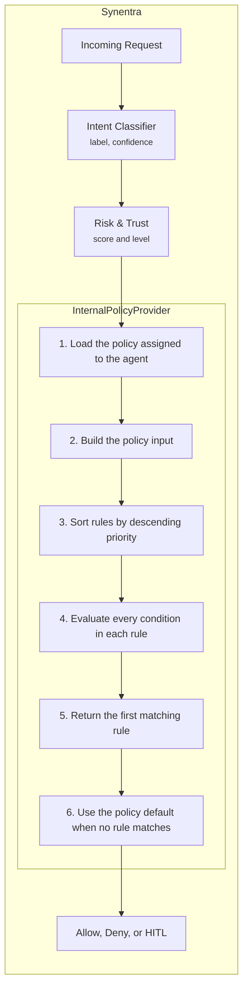

Create custom internal policies that enforce rules based on semantic intent, agent trust, request properties, and calculated risk.

**Prerequisites**:

* Synentra running locally or in Docker
* `curl` or another HTTP client
* Basic understanding of JSON
* An agent registered in Synentra

---

## Overview

Synentra includes a custom internal policy provider that evaluates declarative policy definitions without requiring Open Policy Agent or Rego.

In this tutorial, you will learn how to:

1. Configure Synentra to use `InternalPolicyProvider`
2. Understand the policy evaluation input
3. Create JSON-based policy definitions
4. Write conditions using supported operators
5. Use rule priorities and default decisions
6. Return `Allow`, `Deny`, or `Hitl` decisions
7. Test policy evaluation

---

## Understanding the Internal Policy Architecture

Synentra evaluates intent before applying an internal policy. This allows policy rules to use the classified intent together with risk, trust, and request information.



---

## Configure the Internal Policy Provider

Configure Synentra to use the internal policy provider in `appsettings.json`:

```json
{
  "Policy": {
    "Enabled": true,
    "DefaultProvider": "Internal",
    "Providers": {
      "Internal": {
        "Directory": "policies/"
      }
    }
  }
}
```

The configuration properties are:

| Property                       | Description                                    |
| ------------------------------ | ---------------------------------------------- |
| `Enabled`                      | Enables policy evaluation                      |
| `DefaultProvider`              | Selects the policy provider used by Synentra   |
| `Providers.Internal.Directory` | Directory containing the internal policy files |

The provider name must be:

```text
Internal
```

No OPA server, Rego files, or external policy service is required.

### Linux or Docker Configuration

For Linux or Docker deployments, use a Linux-compatible path:

```json
{
  "Policy": {
    "Enabled": true,
    "DefaultProvider": "Internal",
    "Providers": {
      "Internal": {
        "Directory": "/app/policies"
      }
    }
  }
}
```

Mount the local policy directory into the container:

```bash
docker run -d \
  --name synentra \
  -p 7080:7080 \
  -v "$(pwd)/policies:/app/policies:ro" \
  ghcr.io/synentra/synentra:latest
```

The configured directory inside the container must match the mounted destination:

```text
/app/policies
```

### Environment Variable Configuration

The same configuration can be provided using environment variables:

```bash
docker run -d \
  --name synentra \
  -p 7080:7080 \
  -v "$(pwd)/policies:/app/policies:ro" \
  -e Policy__Enabled=true \
  -e Policy__DefaultProvider=Internal \
  -e Policy__Providers__Internal__Directory=/app/policies \
  ghcr.io/synentra/synentra:latest
```

On Windows PowerShell:

```powershell
docker run -d `
  --name synentra `
  -p 7080:7080 `
  -v "${PWD}/policies:/app/policies:ro" `
  -e Policy__Enabled=true `
  -e Policy__DefaultProvider=Internal `
  -e Policy__Providers__Internal__Directory=/app/policies `
  ghcr.io/synentra/synentra:latest
```

---

## Understand the Policy Input

`InternalPolicy` constructs the following input for every evaluation:

```json
{
  "method": "POST",
  "path": "/api/orders",
  "headers": {
    "content-type": "application/json"
  },
  "agent": {
    "id": "agent-12345",
    "trust_score": 85
  },
  "intent": {
    "label": "safe_write",
    "original_label": "refund_request",
    "confidence": 0.94,
    "status": "Classified"
  },
  "risk": {
    "score": 0.42,
    "level": "Medium"
  }
}
```

The input is built directly from the request, intent-classification result, and risk result. It exposes:

| Field                   | Description                              |
| ----------------------- | ---------------------------------------- |
| `method`                | HTTP request method                      |
| `path`                  | Requested API path                       |
| `headers`               | Request headers                          |
| `agent.id`              | Authenticated agent identifier           |
| `agent.trust_score`     | Current trust score                      |
| `intent.label`          | Normalized intent label used by Synentra |
| `intent.original_label` | Original classifier label                |
| `intent.confidence`     | Intent classification confidence         |
| `intent.status`         | Classification status                    |
| `risk.score`            | Calculated numerical risk score          |
| `risk.level`            | Calculated risk level                    |

These are the fields currently added by `BuildPolicyInput`. The request body, arbitrary JWT claims, timestamps, departments, and HITL approval state are not included by the attached implementation.

A policy condition may reference a field either with or without the `input.` prefix:

```json
{
  "field": "intent.label"
}
```

```json
{
  "field": "input.intent.label"
}
```

Both forms are supported because `PolicyEvaluator` removes the optional `input.` prefix before resolving the nested value.

---

## Understand the Internal Policy Format

The internal provider expects a policy definition containing:

* A policy name
* A default effect
* A collection of rules
* A priority for each rule
* One or more conditions
* An effect for each rule
* An optional decision reason

A representative policy definition looks like this:

```json
{
  "name": "order-management",
  "default": "Deny",
  "rules": [
    {
      "name": "allow-order-status",
      "priority": 100,
      "effect": "Allow",
      "reason": "Order status queries are permitted",
      "conditions": [
        {
          "field": "intent.label",
          "operator": "eq",
          "value": "safe_read"
        }
      ]
    }
  ]
}
```

---

## Create Your First Internal Policy

Create a directory for internal policies:

```bash
mkdir -p policies
```

Create `policies/order-management.json`:

```json
{
  "name": "order-management",
  "default": "Deny",
  "rules": [
    {
      "name": "allow-order-status",
      "priority": 100,
      "effect": "Allow",
      "reason": "Order status queries are permitted",
      "conditions": [
        {
          "field": "intent.label",
          "operator": "eq",
          "value": "safe_read"
        },
        {
          "field": "path",
          "operator": "startswith",
          "value": "https://api.example.com/api/orders"
        }
      ]
    }
  ]
}
```

This policy:

1. Allows requests classified as `safe_read`
2. Requires the path to start with `https://api.example.com/api/orders`
3. Denies every other request through the policy default

All conditions in a rule must evaluate to `true`. If any condition fails, Synentra stops evaluating that rule and moves to the next one.

---

## Assign the Policy to an Agent

Make sure the target agent is assigned the policy name:

```text
order-management
```

A simplified assignment request might look like this:

```bash
curl -X PUT \
  http://localhost:7080/agents/de7dc3ac-ad4d-4274-8128-7938779bf176/policy \
  -H "Content-Type: application/json" \
  -d '{
    "policyName": "order-management"
  }'
```

Use the policy-assignment endpoint supported by your current Synentra API version.

The name assigned to the agent must match the key across all policy files. Otherwise, the provider returns a deny decision:

```text
Policy order-management not found
```

---

## Test the Basic Policy

### Allowed Request

Send an order-status request that should be classified as `safe_read`:

```bash
curl -i -X GET \
  http://localhost:7080/proxy/https://api.example.com/api/orders/12345 \
  -H "Synentra-Authorization: Bearer YOUR_AGENT_TOKEN"
```

Expected policy decision:

```text
Allow
```

Expected reason:

```text
Order status queries are permitted
```

### Denied Request

Send a request that produces a different intent:

```bash
curl -i -X DELETE \
  http://localhost:7080/proxy/https://api.example.com/api/orders/12345 \
  -H "Synentra-Authorization: Bearer YOUR_AGENT_TOKEN"
```

If the intent does not match `safe_read`, no rule matches and the policy default is returned:

```text
Deny
```

---

## Add Trust and Risk Conditions

Replace the policy with a more complete definition:

```json
{
  "name": "order-management",
  "default": "Deny",
  "rules": [
    {
      "name": "deny-high-risk-requests",
      "priority": 300,
      "effect": "Deny",
      "reason": "The request risk score exceeds the permitted threshold",
      "conditions": [
        {
          "field": "risk.score",
          "operator": "ge",
          "value": 0.8
        }
      ]
    },
    {
      "name": "require-approval-for-medium-risk-writes",
      "priority": 250,
      "effect": "Hitl",
      "reason": "Medium-risk write operations require human approval",
      "conditions": [
        {
          "field": "intent.label",
          "operator": "in",
          "value": [
            "safe_write",
            "update",
            "create"
          ]
        },
        {
          "field": "risk.score",
          "operator": "ge",
          "value": 0.5
        }
      ]
    },
    {
      "name": "allow-trusted-small-risk-writes",
      "priority": 200,
      "effect": "Allow",
      "reason": "Trusted agent performing a low-risk write",
      "conditions": [
        {
          "field": "intent.label",
          "operator": "in",
          "value": [
            "safe_write",
            "update",
            "create"
          ]
        },
        {
          "field": "agent.trust_score",
          "operator": "ge",
          "value": 80
        },
        {
          "field": "risk.score",
          "operator": "lt",
          "value": 0.5
        },
        {
          "field": "path",
          "operator": "startswith",
          "value": "https://api.example.com/api/orders"
        }
      ]
    },
    {
      "name": "allow-order-reads",
      "priority": 100,
      "effect": "Allow",
      "reason": "Order read operations are permitted",
      "conditions": [
        {
          "field": "intent.label",
          "operator": "eq",
          "value": "safe_read"
        },
        {
          "field": "path",
          "operator": "startswith",
          "value": "https://api.example.com/api/orders"
        }
      ]
    }
  ]
}
```

This policy follows a deny-first priority strategy:

| Priority | Rule                                  | Result |
| -------: | ------------------------------------- | ------ |
|      300 | Risk score is at least `0.8`          | Deny   |
|      250 | Write intent with risk at least `0.5` | HITL   |
|      200 | Trusted, low-risk write               | Allow  |
|      100 | Order read                            | Allow  |
|  Default | No rule matched                       | Deny   |

---

## How Priority Evaluation Works

The provider sorts rules by descending priority. This means priority affects security behavior.

Consider these two matching rules:

```json
{
  "name": "deny-high-risk",
  "priority": 300,
  "effect": "Deny",
  "conditions": [
    {
      "field": "risk.score",
      "operator": "ge",
      "value": 0.8
    }
  ]
}
```

```json
{
  "name": "allow-trusted-agent",
  "priority": 100,
  "effect": "Allow",
  "conditions": [
    {
      "field": "agent.trust_score",
      "operator": "ge",
      "value": 80
    }
  ]
}
```

A request with a trust score of `90` and a risk score of `0.9` matches both rules. However, the deny rule is evaluated first because its priority is higher.

The resulting decision is:

```text
Deny
```

For safer policies, assign higher priorities to:

1. Explicit deny rules
2. HITL escalation rules
3. Narrow allow rules
4. Broad allow rules

---

## Use Supported Condition Operators

`InternalPolicy` supports the following operators:

| Operator     | Meaning                               | Example                           |
| ------------ | ------------------------------------- | --------------------------------- |
| `eq`         | Equal                                 | Intent equals `safe_read`         |
| `ne`         | Not equal                             | Method is not `DELETE`            |
| `gt`         | Greater than                          | Trust score greater than `80`     |
| `lt`         | Less than                             | Risk score less than `0.5`        |
| `ge`         | Greater than or equal                 | Trust score at least `80`         |
| `le`         | Less than or equal                    | Risk score at most `0.3`          |
| `in`         | Value exists in a collection          | Intent appears in an allowed list |
| `contains`   | String or collection contains a value | Path contains `/admin/`           |
| `startswith` | String starts with a value            | Path starts with `/api/orders`    |
| `endswith`   | String ends with a value              | Path ends with `/export`          |
| `regex`      | String matches a regular expression   | Path matches an API pattern       |

These operators are dispatched by `EvaluateCondition`. Unknown operators evaluate to `false`.

### Equality

```json
{
  "field": "intent.label",
  "operator": "eq",
  "value": "safe_read"
}
```

### Not Equal

```json
{
  "field": "method",
  "operator": "ne",
  "value": "DELETE"
}
```

### Numeric Comparison

```json
{
  "field": "agent.trust_score",
  "operator": "ge",
  "value": 80
}
```

```json
{
  "field": "risk.score",
  "operator": "lt",
  "value": 0.5
}
```

### Membership

```json
{
  "field": "intent.label",
  "operator": "in",
  "value": [
    "safe_read",
    "list",
    "health_check"
  ]
}
```

### Contains

```json
{
  "field": "path",
  "operator": "contains",
  "value": "/admin/"
}
```

String matching for `contains`, `startswith`, and `endswith` is case-insensitive.

### Regular Expression

```json
{
  "field": "path",
  "operator": "regex",
  "value": "^/api/orders/[a-zA-Z0-9-]+$"
}
```

Regular expressions are evaluated case-insensitively with a three-second timeout.

Avoid unnecessarily complex expressions. A regex timeout protects the evaluator, but simpler patterns are easier to review and maintain.

---

## Create Intent-Aware Security Rules

### Block Destructive Intents

```json
{
  "name": "deny-destructive-actions",
  "priority": 1000,
  "effect": "Deny",
  "reason": "Destructive operations are prohibited",
  "conditions": [
    {
      "field": "intent.label",
      "operator": "in",
      "value": [
        "destructive_delete",
        "harmful",
        "escalate_privileges"
      ]
    }
  ]
}
```

### Escalate Suspicious Intents

```json
{
  "name": "review-suspicious-intent",
  "priority": 900,
  "effect": "Hitl",
  "reason": "Suspicious intent requires human review",
  "conditions": [
    {
      "field": "intent.label",
      "operator": "eq",
      "value": "suspicious"
    }
  ]
}
```

### Escalate Low-Confidence Classifications

```json
{
  "name": "review-low-confidence-classification",
  "priority": 850,
  "effect": "Hitl",
  "reason": "Intent classification confidence is below the required threshold",
  "conditions": [
    {
      "field": "intent.confidence",
      "operator": "lt",
      "value": 0.7
    }
  ]
}
```

### Restrict Administrative Paths

```json
{
  "name": "deny-untrusted-admin-access",
  "priority": 800,
  "effect": "Deny",
  "reason": "Administrative endpoints require a trust score of at least 95",
  "conditions": [
    {
      "field": "path",
      "operator": "startswith",
      "value": "https://api.example.com/api/admin"
    },
    {
      "field": "agent.trust_score",
      "operator": "lt",
      "value": 95
    }
  ]
}
```

### Allow Health Checks

```json
{
  "name": "allow-health-checks",
  "priority": 100,
  "effect": "Allow",
  "reason": "Health checks are permitted",
  "conditions": [
    {
      "field": "intent.label",
      "operator": "eq",
      "value": "health_check"
    },
    {
      "field": "method",
      "operator": "eq",
      "value": "GET"
    }
  ]
}
```

---

## Configure a Secure Default

Every policy should define a default decision.

```json
{
  "default": "Deny"
}
```

When no rule matches, the internal policy provider converts the default into an `Allow`, `Hitl`, or `Deny` decision.

For most production policies, use:

```json
{
  "default": "Deny"
}
```

For environments where unmatched requests should be reviewed rather than rejected:

```json
{
  "default": "Hitl"
}
```

Avoid a default of `Allow` unless the policy is intentionally permissive.

---

## Create a Complete Production-Oriented Policy

Create `policies/production-agent-policy.json`:

```json
{
  "name": "production-agent-policy",
  "default": "Deny",
  "rules": [
    {
      "name": "deny-harmful-intents",
      "priority": 1000,
      "effect": "Deny",
      "reason": "The classified intent is prohibited",
      "conditions": [
        {
          "field": "intent.label",
          "operator": "in",
          "value": [
            "harmful",
            "destructive_delete",
            "escalate_privileges"
          ]
        }
      ]
    },
    {
      "name": "deny-critical-risk",
      "priority": 950,
      "effect": "Deny",
      "reason": "The calculated request risk is critical",
      "conditions": [
        {
          "field": "risk.level",
          "operator": "eq",
          "value": "Critical"
        }
      ]
    },
    {
      "name": "review-suspicious-intent",
      "priority": 900,
      "effect": "Hitl",
      "reason": "Suspicious requests require human review",
      "conditions": [
        {
          "field": "intent.label",
          "operator": "eq",
          "value": "suspicious"
        }
      ]
    },
    {
      "name": "review-low-confidence-intent",
      "priority": 850,
      "effect": "Hitl",
      "reason": "The intent classification confidence is too low",
      "conditions": [
        {
          "field": "intent.confidence",
          "operator": "lt",
          "value": 0.7
        }
      ]
    },
    {
      "name": "review-high-risk-writes",
      "priority": 800,
      "effect": "Hitl",
      "reason": "High-risk write operations require approval",
      "conditions": [
        {
          "field": "intent.label",
          "operator": "in",
          "value": [
            "safe_write",
            "update",
            "create",
            "configure"
          ]
        },
        {
          "field": "risk.score",
          "operator": "ge",
          "value": 0.6
        }
      ]
    },
    {
      "name": "allow-trusted-writes",
      "priority": 500,
      "effect": "Allow",
      "reason": "Trusted agent performing a low-risk write",
      "conditions": [
        {
          "field": "intent.label",
          "operator": "in",
          "value": [
            "safe_write",
            "update",
            "create"
          ]
        },
        {
          "field": "agent.trust_score",
          "operator": "ge",
          "value": 85
        },
        {
          "field": "risk.score",
          "operator": "lt",
          "value": 0.6
        },
        {
          "field": "path",
          "operator": "startswith",
          "value": "https://api.example.com/api/orders"
        }
      ]
    },
    {
      "name": "allow-safe-reads",
      "priority": 400,
      "effect": "Allow",
      "reason": "Safe read operation permitted",
      "conditions": [
        {
          "field": "intent.label",
          "operator": "in",
          "value": [
            "safe_read",
            "list",
            "audit",
            "compliance_check",
            "health_check"
          ]
        },
        {
          "field": "method",
          "operator": "in",
          "value": [
            "GET",
            "HEAD"
          ]
        }
      ]
    }
  ]
}
```

---

## Troubleshooting

### Policy Is Not Applied

Check the following:

1. The agent has a policy name assigned.
2. The assigned name matches the dictionary key cross all policies keys.
3. The policy file is mounted into the expected directory.

When no policy name is assigned, the internal policy provider allows the request. Consider whether this behavior matches your production security requirements.

### Policy Is Reported as Not Found

Example result:

```text
Policy production-agent-policy not found
```

Verify:

```bash
ls -la policies
```

Then confirm that the list returns a dictionary containing:

```text
production-agent-policy
```

### A Rule Never Matches

Check:

* The field path uses an available input field.
* The operator is supported.
* String values use the same label and casing expected by the rule.
* Numeric values deserialize to compatible numeric types.
* Every condition in the rule is expected to match.
* A higher-priority rule is not matching first.

Missing fields resolve to `null`, which usually causes the condition to evaluate to `false`.

### Numeric Comparisons Behave Unexpectedly

Avoid comparing an integer field to a JSON value that is unexpectedly deserialized as an incompatible numeric type. Prefer consistent numeric representations:

```json
{
  "field": "agent.trust_score",
  "operator": "ge",
  "value": 80
}
```

```json
{
  "field": "risk.score",
  "operator": "ge",
  "value": 0.8
}
```

The internal policy provider converts JSON numbers to `int` when possible and otherwise to `double`.

---

## Production Considerations

### Use Deny by Default

Prefer:

```json
{
  "default": "Deny"
}
```

This prevents newly introduced or unrecognized intents from being allowed automatically.

### Put Security Rules First

Use higher priorities for:

* Harmful intents
* Privilege escalation
* Destructive actions
* Critical risk levels
* Restricted administrative paths
* Low-confidence classifications

### Keep Allow Rules Narrow

Combine multiple conditions:

```json
{
  "conditions": [
    {
      "field": "intent.label",
      "operator": "eq",
      "value": "safe_write"
    },
    {
      "field": "agent.trust_score",
      "operator": "ge",
      "value": 85
    },
    {
      "field": "risk.score",
      "operator": "lt",
      "value": 0.4
    },
    {
      "field": "path",
      "operator": "startswith",
      "value": "https://api.example.com/api/orders"
    }
  ]
}
```

### Protect Policy Files

In Docker, mount policies as read-only:

```yaml
services:
  synentra:
    image: ghcr.io/synentra/synentra:latest
    ports:
      - "7080:7080"
    volumes:
      - ./policies:/app/policies:ro
    environment:
      Policy__Provider: Internal
      Policy__Directory: /app/policies
```

---

## Clean Up

Stop and remove the Synentra container:

```bash
docker stop synentra
docker rm synentra
```

Remove the tutorial policies:

```bash
rm -rf policies
```