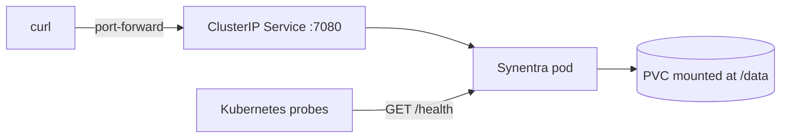

## Objective

Create a small, inspectable Helm chart for Synentra, install it on Kubernetes, verify the `/health` endpoint, perform an upgrade, inspect release history, and clean up.

---

## Prerequisites

- Docker
- `kubectl`
- Helm 3 or 4
- `kind` for the local cluster, or access to another Kubernetes cluster
- `curl`
- Permission to create a namespace, Deployment, Service, and PersistentVolumeClaim

Verify the tools:

```bash
docker version
kubectl version --client
helm version
kind version
```

---

## Architecture



The lab deliberately uses one replica, SQLite, a memory cache, and a `Recreate` update strategy. It is reproducible, but it is not a high-availability production topology.

---

## 1. Create a local cluster

Skip this step if `kubectl` already points to a disposable cluster.

```bash
kind create cluster --name synentra
kubectl cluster-info --context kind-synentra
kubectl get nodes
```

Expected: one or more nodes in `Ready` state.

---

## 2. Create the chart structure

```bash
mkdir -p synentra-chart/templates
cd synentra-chart
touch Chart.yaml values.yaml
touch templates/_helpers.tpl
touch templates/deployment.yaml
touch templates/service.yaml
touch templates/pvc.yaml
```

The final tree will be:

```text
synentra-chart/
├── Chart.yaml
├── values.yaml
└── templates/
    ├── _helpers.tpl
    ├── deployment.yaml
    ├── pvc.yaml
    └── service.yaml
```

---

## 3. Define chart metadata

Put this in `Chart.yaml`:

```yaml
apiVersion: v2
name: synentra
description: Minimal tutorial chart for the Synentra governance gateway
type: application
version: 0.1.0
appVersion: "latest"
```

The chart version describes this tutorial chart. `appVersion` describes the default application version string; it does not select the image unless the templates use it.

---

## 4. Add default values

Put this in `values.yaml`:

```yaml
replicaCount: 1

image:
  repository: ghcr.io/synentra/synentra
  tag: latest
  pullPolicy: IfNotPresent

service:
  type: ClusterIP
  port: 7080

persistence:
  enabled: true
  size: 1Gi
  accessModes:
    - ReadWriteOnce
  storageClassName: ""

resources: {}

podAnnotations: {}
podSecurityContext: {}
containerSecurityContext:
  allowPrivilegeEscalation: false

probes:
  startup:
    failureThreshold: 30
    periodSeconds: 2
  readiness:
    periodSeconds: 10
    timeoutSeconds: 2
    failureThreshold: 3
  liveness:
    initialDelaySeconds: 20
    periodSeconds: 20
    timeoutSeconds: 2
    failureThreshold: 3
```

`latest` matches Synentra's public quick-start example. For controlled environments, replace it with a reviewed tag or digest. Resource values are intentionally empty because the correct CPU and memory settings require measurements from your workload.

---

## 5. Add reusable template names

Put this in `templates/_helpers.tpl`:

```gotemplate
{{- define "synentra.name" -}}
synentra
{{- end }}

{{- define "synentra.fullname" -}}
{{- printf "%s-%s" .Release.Name (include "synentra.name" .) | trunc 63 | trimSuffix "-" -}}
{{- end }}

{{- define "synentra.labels" -}}
app.kubernetes.io/name: {{ include "synentra.name" . }}
app.kubernetes.io/instance: {{ .Release.Name }}
app.kubernetes.io/managed-by: {{ .Release.Service }}
helm.sh/chart: {{ printf "%s-%s" .Chart.Name .Chart.Version | quote }}
{{- end }}
```

---

## 6. Create the Deployment

Put this in `templates/deployment.yaml`:

```gotemplate
apiVersion: apps/v1
kind: Deployment
metadata:
  name: {{ include "synentra.fullname" . }}
  labels:
    {{- include "synentra.labels" . | nindent 4 }}
spec:
  replicas: {{ .Values.replicaCount }}
  strategy:
    type: Recreate
  selector:
    matchLabels:
      app.kubernetes.io/name: {{ include "synentra.name" . }}
      app.kubernetes.io/instance: {{ .Release.Name }}
  template:
    metadata:
      labels:
        app.kubernetes.io/name: {{ include "synentra.name" . }}
        app.kubernetes.io/instance: {{ .Release.Name }}
      annotations:
        {{- toYaml .Values.podAnnotations | nindent 8 }}
    spec:
      automountServiceAccountToken: false
      securityContext:
        {{- toYaml .Values.podSecurityContext | nindent 8 }}
      containers:
        - name: synentra
          image: "{{ .Values.image.repository }}:{{ .Values.image.tag }}"
          imagePullPolicy: {{ .Values.image.pullPolicy }}
          securityContext:
            {{- toYaml .Values.containerSecurityContext | nindent 12 }}
          ports:
            - name: http
              containerPort: 7080
              protocol: TCP
          env:
            - name: System__Server__Http__Port
              value: "7080"
            - name: System__Database__DefaultProvider
              value: Sqlite
            - name: System__Database__Providers__Sqlite__ConnectionString
              value: "Data Source=/data/synentra.db"
            - name: System__Cache__DefaultProvider
              value: Memory
          startupProbe:
            httpGet:
              path: /health
              port: http
            failureThreshold: {{ .Values.probes.startup.failureThreshold }}
            periodSeconds: {{ .Values.probes.startup.periodSeconds }}
          readinessProbe:
            httpGet:
              path: /health
              port: http
            periodSeconds: {{ .Values.probes.readiness.periodSeconds }}
            timeoutSeconds: {{ .Values.probes.readiness.timeoutSeconds }}
            failureThreshold: {{ .Values.probes.readiness.failureThreshold }}
          livenessProbe:
            httpGet:
              path: /health
              port: http
            initialDelaySeconds: {{ .Values.probes.liveness.initialDelaySeconds }}
            periodSeconds: {{ .Values.probes.liveness.periodSeconds }}
            timeoutSeconds: {{ .Values.probes.liveness.timeoutSeconds }}
            failureThreshold: {{ .Values.probes.liveness.failureThreshold }}
          resources:
            {{- toYaml .Values.resources | nindent 12 }}
          volumeMounts:
            - name: data
              mountPath: /data
      volumes:
        - name: data
{{ if .Values.persistence.enabled }}
          persistentVolumeClaim:
            claimName: {{ include "synentra.fullname" . }}
{{ else }}
          emptyDir: {}
{{ end }}
```

Why `Recreate`? This baseline stores SQLite on a `ReadWriteOnce` volume. Avoid overlapping application pods during an upgrade. The trade-off is brief unavailability.

---

## 7. Create the Service

Put this in `templates/service.yaml`:

```gotemplate
apiVersion: v1
kind: Service
metadata:
  name: {{ include "synentra.fullname" . }}
  labels:
    {{- include "synentra.labels" . | nindent 4 }}
spec:
  type: {{ .Values.service.type }}
  selector:
    app.kubernetes.io/name: {{ include "synentra.name" . }}
    app.kubernetes.io/instance: {{ .Release.Name }}
  ports:
    - name: http
      port: {{ .Values.service.port }}
      targetPort: http
      protocol: TCP
```

`ClusterIP` keeps the gateway inside the cluster. Use an ingress or private load balancer only after defining TLS, authentication, and network policy.

---

## 8. Create the PersistentVolumeClaim

Put this in `templates/pvc.yaml`:

```gotemplate
{{- if .Values.persistence.enabled }}
apiVersion: v1
kind: PersistentVolumeClaim
metadata:
  name: {{ include "synentra.fullname" . }}
  labels:
    {{- include "synentra.labels" . | nindent 4 }}
spec:
  accessModes:
    {{- toYaml .Values.persistence.accessModes | nindent 4 }}
{{ with .Values.persistence.storageClassName }}
  storageClassName: {{ . | quote }}
{{ end }}
  resources:
    requests:
      storage: {{ .Values.persistence.size }}
{{- end }}
```

An empty `storageClassName` value omits the field and lets the cluster's default StorageClass handle provisioning.

---

## 9. Lint and render before installation

```bash
helm lint .
helm template synentra . --namespace synentra > rendered.yaml
kubectl apply --dry-run=server -f rendered.yaml
```

Expected Helm result:

```text
1 chart(s) linted, 0 chart(s) failed
```

Inspect the render:

```bash
grep -nE 'kind:|image:|mountPath:|path: /health' rendered.yaml
```

Do not commit `rendered.yaml` if later versions contain resolved secrets.

---

## 10. Install Synentra

```bash
helm upgrade --install synentra . \
  --namespace synentra \
  --create-namespace \
  --wait \
  --timeout 5m
```

Expected result includes:

```text
STATUS: deployed
REVISION: 1
```

Verify the resources:

```bash
kubectl get deploy,pod,service,pvc -n synentra
kubectl rollout status deployment/synentra-synentra -n synentra --timeout=5m
```

Expected:

- Deployment `synentra-synentra` available;
- one pod in `Running` state and ready;
- ClusterIP Service on port `7080`;
- PVC in `Bound` state.

---

## 11. Verify the health endpoint

Start port forwarding in one terminal:

```bash
kubectl port-forward -n synentra service/synentra-synentra 7080:7080
```

In another terminal:

```bash
curl --fail --silent --show-error http://localhost:7080/health
```

A healthy instance returns a response similar to:

```json
{
  "status": "Healthy",
  "healthCheckDuration": "00:00:00.0123456"
}
```

The duration will differ. Stop the port-forward with `Ctrl+C` when finished.

---

## 12. Inspect logs and probe state

```bash
kubectl logs -n synentra deployment/synentra-synentra --tail=100
kubectl describe pod -n synentra -l app.kubernetes.io/name=synentra
```

Look for:

- the HTTP listener on port `7080`;
- no repeated restarts;
- successful startup, readiness, and liveness probes;
- the `/data` mount;
- no secret values in logs.

---

## 13. Perform a safe chart upgrade

Change the chart `version` in `Chart.yaml` from `0.1.0` to `0.1.1`. Then run:

```bash
helm lint .
helm upgrade synentra . \
  --namespace synentra \
  --wait \
  --timeout 5m
helm history synentra -n synentra
```

Expected history:

```text
REVISION  UPDATED                  STATUS      CHART            APP VERSION
1         ...                      superseded  synentra-0.1.0   latest
2         ...                      deployed    synentra-0.1.1   latest
```

This metadata-only chart change may still recreate the pod because chart labels change. Confirm the PVC remains bound and the health endpoint recovers.

---

## 14. Inspect rollback mechanics

For this lab, rolling back chart revision 1 is safe because no database schema or application image changed:

```bash
helm rollback synentra 1 -n synentra --wait --timeout 5m
helm history synentra -n synentra
```

In production, never assume Helm rollback also makes a database downgrade safe. Check migration compatibility first.

---

## 15. Clean up

```bash
helm uninstall synentra -n synentra
kubectl delete namespace synentra
kind delete cluster --name synentra
```

If you used an existing cluster, omit the final `kind delete` command. Confirm your cluster's reclaim policy before deleting a namespace that contains real data.

---

## Production adaptations

This tutorial is intentionally small. Before production:

1. Pin the image to a reviewed tag or digest.
2. Move from SQLite to PostgreSQL before evaluating multiple replicas.
3. Evaluate Redis where shared cache or coordination is required.
4. Store credentials in managed Secrets; do not place them in values files.
5. Measure and set resource requests and limits.
6. Validate a non-root security context against the current image.
7. Add NetworkPolicy and prevent agent-to-upstream bypass routes.
8. Configure TLS and private exposure.
9. Export OpenTelemetry signals and collect audit records safely.
10. Test node drain, dependency outages, client retries, backup, and restore.

---

## Troubleshooting

### PVC remains `Pending`

Check available StorageClasses:

```bash
kubectl get storageclass
kubectl describe pvc synentra-synentra -n synentra
```

Set `persistence.storageClassName` to a valid class for your cluster, or configure a default StorageClass.

### Pod reports `ImagePullBackOff`

Inspect the event:

```bash
kubectl describe pod -n synentra -l app.kubernetes.io/name=synentra
```

Verify network access to GHCR, the repository name, the selected tag, and any registry authentication required by your environment.

### Readiness probe fails

Check logs and call the endpoint from inside the cluster:

```bash
kubectl logs -n synentra deployment/synentra-synentra
kubectl run curl-check --rm -it --restart=Never \
  --image=curlimages/curl \
  -n synentra -- \
  curl --fail http://synentra-synentra:7080/health
```

If the image starts slowly on the available node, adjust the startup probe based on measured startup time rather than weakening liveness indefinitely.

### Container cannot write the SQLite file

Inspect the volume and container user:

```bash
kubectl exec -n synentra deployment/synentra-synentra -- id
kubectl exec -n synentra deployment/synentra-synentra -- ls -ld /data
```

Adjust the volume ownership through a tested pod security context or storage provisioner behavior. Do not solve the issue by granting broad privileges without understanding the image user.

### Helm reports an invalid template

Render with debugging:

```bash
helm template synentra . --namespace synentra --debug
```

YAML indentation and whitespace around template blocks are common causes.

### Port `7080` is already in use

Forward another local port:

```bash
kubectl port-forward -n synentra service/synentra-synentra 17080:7080
curl http://localhost:17080/health
```

### Upgrade is stuck

Inspect release and pod state:

```bash
helm status synentra -n synentra
kubectl get events -n synentra --sort-by=.lastTimestamp
kubectl describe deployment synentra-synentra -n synentra
```

With `Recreate`, the old pod must terminate before the replacement becomes ready.

---

## FAQ

### Is this an official Synentra chart?

No. It is a minimal tutorial chart built from Synentra's documented container, port, health endpoint, configuration keys, and persistent path. Check the repository and documentation for current official deployment artifacts before publishing or reusing it.

### Why is the default replica count one?

The tutorial uses SQLite and memory cache. Multiple replicas require a shared-state design and testing; changing the number alone does not create high availability.

### Why use a Deployment instead of a StatefulSet?

The Synentra process is replaceable; the lab's durable state lives on a PVC. A StatefulSet is not required merely because storage exists. Production topology should follow the actual storage and identity requirements.

### Should the Service be a LoadBalancer?

Not by default. `ClusterIP` minimizes exposure. Choose ingress or load-balancer access only after defining the client network, TLS, authentication, and bypass controls.

### Can I use PostgreSQL and Redis?

Synentra supports both. Supply their documented configuration through non-secret values and Secret references, then test failure and concurrency behavior before scaling replicas.

### Can Helm manage my secrets?

Helm can render Secret objects, but values and release workflows may expose sensitive input. Prefer references to existing or externally managed Secrets.