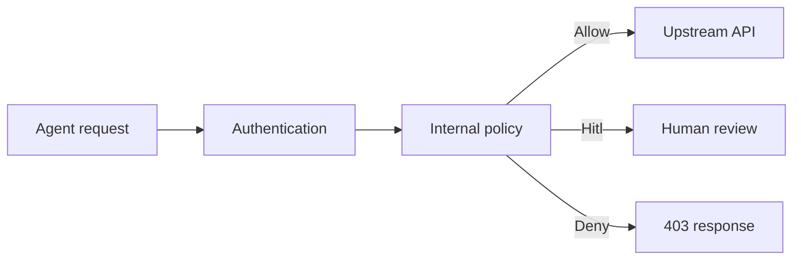

AI agents rarely need unrestricted access to every operation exposed by an API. A customer-operations agent, for example, may need to read customer records, request approval before deleting them, and stay completely outside administrative endpoints.

:::info
The complete source code for this tutorial is available in the [Synentra sample](https://github.com/synentra/synentra/tree/main/samples/internal-policy-allow-review-deny).
:::

In this tutorial, you will build a complete Synentra sample from scratch and configure the internal policy provider to enforce exactly that boundary:

| Request | Decision | Result |
| --- | --- | --- |
| `GET /v1/customers` | `Allow` | Forwarded to the upstream API |
| `DELETE /v1/customers` | `Hitl` | Suspended for human review |
| `GET /v1/admin/stats` | `Deny` | Blocked before reaching the upstream API |

The sample also records decision evidence in SQLite and attaches an `X-Request-Id` header for request correlation.

## How the request is governed



Synentra authenticates the agent first, then evaluates the policy assigned to that agent. Only an `Allow` decision reaches the upstream API. A `Hitl` decision suspends the request, while a `Deny` decision stops it at the gateway.

## Prerequisites

Before you begin, install:

- Docker with Docker Compose v2
- `curl`
- Git

The Compose configuration builds Synentra from the repository source. Start from the root of a local Synentra repository clone.

## 1. Create the sample structure

From the Synentra repository root, create the directories used by the sample:

```bash
mkdir -p internal-policy-allow-review-deny/config
mkdir -p internal-policy-allow-review-deny/data
mkdir -p internal-policy-allow-review-deny/policies
mkdir -p internal-policy-allow-review-deny/upstream/mappings

cd internal-policy-allow-review-deny
touch data/.gitkeep
```

The completed structure will look like this:

```text
internal-policy-allow-review-deny/
├── compose.yml
├── config/
│   └── appsettings.json
├── data/
│   └── .gitkeep
├── policies/
│   └── customer-governance.json
└── upstream/
    └── mappings/
        ├── delete-customers.json
        ├── get-admin-stats.json
        └── get-customers.json
```

## 2. Create the Docker Compose configuration

Create `compose.yml`:

```yaml title="compose.yml"
services:
  synentra:
    build:
      context: ../..
      dockerfile: .docker/Dockerfile
    container_name: synentra-sample-internal-policy
    ports:
      - "7081:7080"
    volumes:
      - ./config/appsettings.json:/app/appsettings.json:ro
      - ./policies:/app/policies:ro
      - ./data:/data
    depends_on:
      - upstream-api
    networks:
      - synentra-sample

  upstream-api:
    image: wiremock/wiremock:3.9.1
    container_name: synentra-sample-internal-upstream
    command: ["--verbose"]
    ports:
      - "18081:8080"
    volumes:
      - ./upstream:/home/wiremock:ro
    networks:
      - synentra-sample

networks:
  synentra-sample:
    driver: bridge
```

Synentra is exposed at `http://localhost:7081`, and WireMock is exposed at `http://localhost:18081`. Inside the Docker network, the governed upstream URL is `http://upstream-api:8080`.

## 3. Configure Synentra

Create `config/appsettings.json`:

```json title="config/appsettings.json"
{
  "System": {
    "Server": {
      "Http": {
        "Port": 7080
      }
    },
    "Storage": {
      "Database": {
        "DefaultProvider": "Sqlite",
        "Providers": {
          "Sqlite": {
            "ConnectionString": "Data Source=/data/synentra.db"
          }
        }
      },
      "Cache": {
        "DefaultProvider": "Memory",
        "Providers": {
          "Memory": {
            "TimeToLive": "24:00:00"
          },
          "Redis": {
            "Endpoint": "redis:6379"
          }
        }
      }
    },
    "RateLimit": {
      "Enabled": true,
      "DefaultRequestsPerMinute": 120
    }
  },
  "Security": {
    "AgentAuth": {
      "UseCustomHeader": true,
      "CustomHeaderName": "Synentra-Authorization",
      "FallbackToAuthorization": false,
      "TokenIssuance": {
        "Issuer": "synentra-sample",
        "Audience": "synentra-agents",
        "Secret": "synentra-sample-secret-1234567890-abcdef",
        "Expiration": "00:30:00"
      }
    },
    "AgentQuarantine": {
      "Enabled": true,
      "TrustScoreFloor": 0.3
    }
  },
  "Semantic": {
    "Enabled": false,
    "ConfidenceThreshold": 0.7,
    "AllowLowConfidence": false,
    "DefaultProvider": "Internal"
  },
  "Policy": {
    "Enabled": true,
    "DefaultProvider": "Internal",
    "Providers": {
      "Internal": {
        "Directory": "/app/policies"
      }
    }
  },
  "HumanInTheLoop": {
    "Enabled": true,
    "Threshold": 0.8,
    "TimeoutSeconds": 1800,
    "MaxPendingRequests": 100
  }
}
```

This configuration:

- stores Synentra data in SQLite at `/data/synentra.db`;
- uses an in-memory cache;
- issues gateway JWTs with a 30-minute lifetime;
- reads agent credentials from the `Synentra-Authorization` header;
- enables agent quarantine with a trust-score floor of `0.3`; and
- disables semantic classification so this tutorial stays focused on deterministic policy evaluation.

:::warning Sample credentials
The JWT signing secret and agent secret in this tutorial are for local demonstration only. Replace them with securely managed secrets before using a similar configuration outside a development environment.
:::

## 4. Create the internal policy

Create `policies/customer-governance.json`:

```json title="policies/customer-governance.json"
{
  "name": "customer-governance",
  "description": "Allow safe customer reads, require review for destructive customer actions, and block admin endpoints.",
  "owner": "platform-security",
  "createdOn": "2026-01-01T00:00:00Z",
  "default": "Deny",
  "rules": [
    {
      "name": "deny-admin-endpoints",
      "reason": "Admin routes are blocked for this agent policy.",
      "priority": 300,
      "effect": "Deny",
      "conditions": [
        {
          "field": "input.path",
          "operator": "startsWith",
          "value": "/v1/admin"
        }
      ]
    },
    {
      "name": "review-customer-delete",
      "reason": "Customer deletion requires human approval.",
      "priority": 200,
      "effect": "Hitl",
      "conditions": [
        {
          "field": "input.method",
          "operator": "eq",
          "value": "DELETE"
        },
        {
          "field": "input.path",
          "operator": "startsWith",
          "value": "/v1/customers"
        }
      ]
    },
    {
      "name": "allow-customer-read",
      "reason": "Read-only customer access is allowed.",
      "priority": 100,
      "effect": "Allow",
      "conditions": [
        {
          "field": "input.method",
          "operator": "eq",
          "value": "GET"
        },
        {
          "field": "input.path",
          "operator": "startsWith",
          "value": "/v1/customers"
        }
      ]
    }
  ]
}
```

The rules use descending priorities:

1. `deny-admin-endpoints` has priority `300` and blocks every path starting with `/v1/admin`.
2. `review-customer-delete` has priority `200` and routes customer deletion to human review.
3. `allow-customer-read` has priority `100` and permits read-only customer access.

The default decision is `Deny`. Any request that does not match an explicit rule is therefore blocked.

## 5. Create the mock upstream API

WireMock uses one mapping file for each endpoint.

Create `upstream/mappings/get-customers.json`:

```json title="upstream/mappings/get-customers.json"
{
  "request": {
    "method": "GET",
    "urlPath": "/v1/customers"
  },
  "response": {
    "status": 200,
    "headers": {
      "Content-Type": "application/json"
    },
    "jsonBody": {
      "customers": [
        {
          "id": "c-001",
          "name": "Contoso"
        },
        {
          "id": "c-002",
          "name": "Fabrikam"
        }
      ]
    }
  }
}
```

Create `upstream/mappings/delete-customers.json`:

```json title="upstream/mappings/delete-customers.json"
{
  "request": {
    "method": "DELETE",
    "urlPath": "/v1/customers"
  },
  "response": {
    "status": 204,
    "headers": {
      "Content-Type": "application/json"
    }
  }
}
```

Create `upstream/mappings/get-admin-stats.json`:

```json title="upstream/mappings/get-admin-stats.json"
{
  "request": {
    "method": "GET",
    "urlPath": "/v1/admin/stats"
  },
  "response": {
    "status": 200,
    "headers": {
      "Content-Type": "application/json"
    },
    "jsonBody": {
      "system": "ok",
      "uptime": "72h"
    }
  }
}
```

The mock admin endpoint intentionally returns `200`. When the governed request receives `403`, you can see that Synentra—not the upstream API—blocked it.

## 6. Start Synentra and the upstream API

Start the two services in the background:

```bash
docker compose up -d
```

The sample exposes:

| Service | Address | Purpose |
| --- | --- | --- |
| Synentra | `http://localhost:7081` | Agent management and governed proxy |
| WireMock | `http://localhost:18081` | Mock customer API |

Confirm that both containers are running:

```bash
docker compose ps
```

## 7. Register an agent

Register the customer-operations agent:

```bash
curl -sS -X POST http://localhost:7081/Agents \
  -H "Content-Type: application/json" \
  -d '{
    "name": "customer-ops-agent",
    "ownerId": "platform-team",
    "clientSecret": "sample-secret-001"
  }'
```

Copy the `agentId` from the response. The remaining examples use `<agentId>` as a placeholder.

## 8. Assign the policy

Assign `customer-governance` to the new agent:

```bash
curl -i -X PUT http://localhost:7081/Agents/<agentId>/policy \
  -H "Content-Type: application/json" \
  -d '{"policyName":"customer-governance"}'
```

Synentra should return `204 No Content`.

The assignment binds the agent's authenticated requests to the policy you reviewed above. Registering an agent alone does not grant access.

## 9. Mint a gateway token

Exchange the agent ID and secret for a JWT:

```bash
curl -sS -X POST http://localhost:7081/Tokens \
  -H "Content-Type: application/json" \
  -d '{
    "agentId": "<agentId>",
    "clientSecret": "sample-secret-001"
  }'
```

Copy `accessToken` from the response. Use it in the `Synentra-Authorization` header for each governed request.

## 10. Verify the ALLOW path

Request the customer list through Synentra:

```bash
curl -i http://localhost:7081/proxy/http://upstream-api:8080/v1/customers \
  -H "Synentra-Authorization: Bearer <accessToken>"
```

The request matches `allow-customer-read`. Expect:

- `200 OK`;
- an `X-Request-Id` response header; and
- the customer list returned by the upstream service.

```json
{
  "customers": [
    { "id": "c-001", "name": "Contoso" },
    { "id": "c-002", "name": "Fabrikam" }
  ]
}
```

This is the only path in the tutorial that reaches the upstream API immediately.

## 11. Verify the REVIEW path

Send a destructive customer request:

```bash
curl -i -X DELETE \
  http://localhost:7081/proxy/http://upstream-api:8080/v1/customers \
  -H "Synentra-Authorization: Bearer <accessToken>" \
  -H "Content-Type: application/json" \
  -d '{"instruction":"Delete inactive customers"}'
```

The request matches `review-customer-delete`. Expect:

- `202 Accepted`;
- a `Location: /hitls/<id>` header; and
- a response indicating that approval is pending.

Synentra suspends the request instead of forwarding it immediately. The HITL record identified by `<id>` can be used by an approval workflow to inspect and resolve the request.

## 12. Verify the DENY path

Try to access the administrative route:

```bash
curl -i \
  http://localhost:7081/proxy/http://upstream-api:8080/v1/admin/stats \
  -H "Synentra-Authorization: Bearer <accessToken>"
```

The request matches `deny-admin-endpoints`. Expect `403 Forbidden` with the policy reason:

```text
Admin routes are blocked for this agent policy.
```

Although WireMock has a successful response configured for `/v1/admin/stats`, Synentra does not forward this request. This makes it possible to verify that the denial happens at the governance boundary rather than in the upstream service.

## 13. Inspect the decision evidence

Synentra persists audit records in `data/synentra.db`. Inspect the most recent decisions with a temporary SQLite container:

```bash
docker run --rm \
  -v "${PWD}/data:/data" \
  keinos/sqlite3:latest \
  sqlite3 /data/synentra.db \
  "SELECT Id, AgentId, Action, Status, RiskScore, Reason, Timestamp FROM AuditLogs ORDER BY Id DESC LIMIT 10;"
```

The results should include statuses for the allowed request, denied request, and pending HITL transition.

Next, inspect the structured gateway logs:

```bash
docker compose logs synentra --tail 200
```

Look for fields such as:

- `request_id` or `trace_id`;
- `decision`;
- `risk_score`;
- `decision_reason`; and
- `target_url`.

Use the `X-Request-Id` returned to the caller to correlate an API response with the corresponding request and audit evidence.

## What you built

You created a least-privilege governance path for an AI agent:

- authentication establishes which agent is calling;
- a per-agent internal policy defines its permitted boundary;
- safe reads are allowed;
- destructive changes require human review;
- administrative routes are denied; and
- every outcome produces evidence for investigation and audit.

The important design choice is the default-deny posture: new or unmatched operations do not silently inherit access. They remain blocked until you add an intentional policy rule.

## Troubleshooting

### Synentra does not start

Check that the Compose build context resolves to the Synentra repository root:

```bash
docker compose config
docker compose logs synentra
```

### The policy is not found

Confirm that `policies/customer-governance.json` exists and that the policy directory is mounted at `/app/policies`:

```bash
docker compose exec synentra ls -la /app/policies
```

The value assigned to the agent must match the policy's `name`: `customer-governance`.

### A proxied request is unauthorized

Check that you are using the gateway JWT returned by `/Tokens`, not the agent's client secret, and that the request includes:

```text
Synentra-Authorization: Bearer <accessToken>
```

The sample disables fallback to the standard `Authorization` header.

### The database is locked or contains old state

Stop the services before resetting the SQLite files.

## Clean up

Stop the containers:

```bash
docker compose down
```

To remove all generated database state and start again:

```bash
docker compose down -v --remove-orphans
rm -f ./data/synentra.db ./data/synentra.db-shm ./data/synentra.db-wal
```