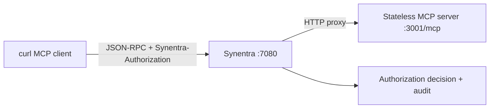

## Objective

Build a minimal stateless MCP server, run it in Docker, and send MCP JSON-RPC requests through Synentra's HTTP reverse proxy using a Synentra agent token. You will verify initialization, tool discovery, and a tool call without assuming a native MCP-specific Synentra adapter.

:::info
The complete source code for this tutorial is available in the [MCP Integration Sample sample](https://github.com/synentra/synentra/tree/main/samples/mcp-integration).
:::

---

## Prerequisites

- Docker with Compose v2
- `curl`
- A running Synentra instance and a valid Synentra agent token
- The current Synentra documentation for creating an agent/token in your deployment
- Ports `3001` and `7080` available locally

> Synentra's token issuance flow can change by version. This tutorial deliberately does not invent an administrative endpoint. Create an agent token using your deployed version's documented workflow, then export it as shown below.

---

## What you will build



The demo server exposes one harmless tool, `echo`. It uses the official MCP C# SDK. Stateless mode keeps the exercise reproducible and avoids session-affinity requirements.

---

## 1. Create the project

```bash
mkdir synentra-mcp-demo
cd synentra-mcp-demo
dotnet new web -n McpDemo
cd McpDemo
dotnet add package ModelContextProtocol.AspNetCore
```

Replace `Program.cs` with:

```csharp
using ModelContextProtocol.Server;
using System.ComponentModel;

var builder = WebApplication.CreateBuilder(args);

builder.Services
    .AddMcpServer()
    .WithHttpTransport(options => options.Stateless = true)
    .WithToolsFromAssembly();

var app = builder.Build();

app.MapGet("/health", () => Results.Ok(new { status = "healthy" }));
app.MapMcp("/mcp");

app.Run("http://0.0.0.0:3001");

[McpServerToolType]
public static class DemoTools
{
    [McpServerTool, Description("Returns the supplied message unchanged.")]
    public static string Echo(
        [Description("Message to return")] string message)
        => message;
}
```

Create `Dockerfile`:

```dockerfile
FROM mcr.microsoft.com/dotnet/sdk:10.0 AS build
WORKDIR /src
COPY . .
RUN dotnet publish -c Release -o /app

FROM mcr.microsoft.com/dotnet/aspnet:10.0
WORKDIR /app
COPY --from=build /app .
USER $APP_UID
EXPOSE 3001
ENTRYPOINT ["dotnet", "McpDemo.dll"]
```

---

## 2. Create the Compose topology

Create `compose.yaml` next to the `Dockerfile`:

```yaml
services:
  mcp-server:
    build: .
    ports:
      - "3001:3001"
    networks: [agent-net]

  synentra:
    image: ghcr.io/synentra/synentra:latest
    ports:
      - "7080:7080"
    volumes:
      - ./config/appsettings.json:/app/appsettings.json:ro
      - ./policies:/app/policies:ro
    networks: [agent-net]

networks:
  agent-net:
```

The Synentra repository documents the image and port above. Pin a reviewed image digest in production; `latest` is used here only to keep the quickstart aligned with the public example.

If your Synentra instance already runs elsewhere, remove the `synentra` service and adjust `SYNENTRA_URL` and the upstream host accordingly.

---

## 3. Start the services

```bash
docker compose up --build -d
docker compose ps
curl --fail http://localhost:3001/health
```

Expected health output:

```json
{"status":"healthy"}
```

Inspect startup logs if either service is unhealthy:

```bash
docker compose logs mcp-server
docker compose logs synentra
```

---

## 4. Set the governed endpoint

Export your token and endpoints:

```bash
export SYNENTRA_TOKEN='<your-agent-token>'
export SYNENTRA_URL='http://localhost:7080'
export MCP_UPSTREAM='http://mcp-server:3001/mcp'
export MCP_PROXY_URL="${SYNENTRA_URL}/proxy/${MCP_UPSTREAM}"
```

Why `mcp-server` rather than `localhost`? Synentra runs inside the Compose network, so the upstream hostname must resolve from the Synentra container. If Synentra runs directly on your host, set `MCP_UPSTREAM=http://localhost:3001/mcp` instead.

Do not put the Synentra token in the URL, shell history, source control, or the MCP payload.

## 5. Initialize MCP through Synentra

The following request uses the Streamable HTTP transport's JSON-RPC initialization. It asks for JSON and Server-Sent Events because a compliant server can select either response form.

```bash
curl --fail-with-body -i \
  -X POST "$MCP_PROXY_URL" \
  -H "Synentra-Authorization: Bearer $SYNENTRA_TOKEN" \
  -H 'Content-Type: application/json' \
  -H 'Accept: application/json, text/event-stream' \
  --data-binary '{
    "jsonrpc": "2.0",
    "id": 1,
    "method": "initialize",
    "params": {
      "protocolVersion": "2025-11-25",
      "capabilities": {},
      "clientInfo": {"name": "synentra-mcp-tutorial", "version": "1.0.0"}
    }
  }'
```

Expected result:

- HTTP success from the governed path;
- a JSON-RPC result containing server information and capabilities;
- possibly an `MCP-Session-Id` header if you changed the server to stateful mode.

The supplied server is stateless, so no session header is required. If your SDK version selects a different supported MCP protocol version, update the example to the version returned during negotiation.

---

## 6. Send the initialized notification

```bash
curl --fail-with-body -i \
  -X POST "$MCP_PROXY_URL" \
  -H "Synentra-Authorization: Bearer $SYNENTRA_TOKEN" \
  -H 'MCP-Protocol-Version: 2025-11-25' \
  -H 'Content-Type: application/json' \
  -H 'Accept: application/json, text/event-stream' \
  --data-binary '{
    "jsonrpc": "2.0",
    "method": "notifications/initialized"
  }'
```

A notification does not carry a JSON-RPC response body. An HTTP success or accepted response is expected.

---

## 7. Discover the tool

```bash
curl --fail-with-body -sS \
  -X POST "$MCP_PROXY_URL" \
  -H "Synentra-Authorization: Bearer $SYNENTRA_TOKEN" \
  -H 'MCP-Protocol-Version: 2025-11-25' \
  -H 'Content-Type: application/json' \
  -H 'Accept: application/json, text/event-stream' \
  --data-binary '{
    "jsonrpc": "2.0",
    "id": 2,
    "method": "tools/list",
    "params": {}
  }'
```

Expected payload shape (ordering and schema details may differ by SDK version):

```json
{
  "jsonrpc": "2.0",
  "id": 2,
  "result": {
    "tools": [
      {
        "name": "echo",
        "description": "Returns the supplied message unchanged."
      }
    ]
  }
}
```

---

## 8. Call the tool

```bash
curl --fail-with-body -sS \
  -X POST "$MCP_PROXY_URL" \
  -H "Synentra-Authorization: Bearer $SYNENTRA_TOKEN" \
  -H 'MCP-Protocol-Version: 2025-11-25' \
  -H 'Content-Type: application/json' \
  -H 'Accept: application/json, text/event-stream' \
  --data-binary '{
    "jsonrpc": "2.0",
    "id": 3,
    "method": "tools/call",
    "params": {
      "name": "echo",
      "arguments": {"message": "governed MCP request"}
    }
  }'
```

Expected result contains a text content item with:

```text
governed MCP request
```

If the policy denies or pauses the request, expect the Synentra response for that decision instead of the MCP tool result. That is the control point this tutorial is demonstrating.

---

## 9. Verify enforcement

First omit the Synentra credential:

```bash
curl -i \
  -X POST "$MCP_PROXY_URL" \
  -H 'Content-Type: application/json' \
  -H 'Accept: application/json, text/event-stream' \
  --data-binary '{"jsonrpc":"2.0","id":4,"method":"tools/list","params":{}}'
```

Expected: the request is rejected by Synentra rather than executed by the MCP server.

Then confirm the direct endpoint still works only as a development diagnostic:

```bash
curl --fail-with-body -sS \
  -X POST http://localhost:3001/mcp \
  -H 'Content-Type: application/json' \
  -H 'Accept: application/json, text/event-stream' \
  --data-binary '{
    "jsonrpc":"2.0",
    "id":5,
    "method":"initialize",
    "params":{
      "protocolVersion":"2025-11-25",
      "capabilities":{},
      "clientInfo":{"name":"direct-check","version":"1.0.0"}
    }
  }'
```

Production lesson: do not publish port `3001` to untrusted networks. Remove its `ports` entry and keep the MCP server reachable only from the internal network and Synentra.

---

## 10. Observe and clean up

Inspect Synentra's audit output and configured OpenTelemetry destination. Verify that you can correlate the agent identity, target, decision, and timing without logging the bearer token or sensitive tool arguments.

Stop the lab:

```bash
docker compose down --remove-orphans
```

---

## Troubleshooting

### `401` or `403` from Synentra

Confirm `SYNENTRA_TOKEN` is present, unexpired, and issued for the agent expected by your policy. The header name is `Synentra-Authorization`, not the standard `Authorization` header used by some upstream services.

### `502`, connection refused, or DNS failure

The upstream URL is resolved from Synentra's network namespace. In Compose, use `http://mcp-server:3001/mcp`. If Synentra runs on the host, use the address reachable from that process. Verify with `docker compose logs synentra`.

### `404` from the MCP server

Confirm `app.MapMcp("/mcp")` and that `MCP_UPSTREAM` ends in `/mcp`. SDK releases can change overloads; use the current official C# SDK documentation if your installed package rejects this form.

### `406 Not Acceptable`

Send both accepted MCP response types:

```http
Accept: application/json, text/event-stream
```

### Protocol version error

The version in this tutorial matches the referenced MCP specification. If the installed SDK supports a different version, use the version negotiated in the initialize response and send it in `MCP-Protocol-Version` on later requests.

### Stateful server loses its session

This tutorial uses stateless mode. If you enable state, capture the `MCP-Session-Id` returned at initialization and include it on subsequent requests. Ensure the proxy preserves the header and your deployment handles affinity or shared state. Never use the session ID as authentication.

### Requests work directly but fail through the proxy

Check Synentra policy, agent identity, proxy URL construction, container DNS, and audit events. A denial may be the expected policy result rather than a connectivity failure.